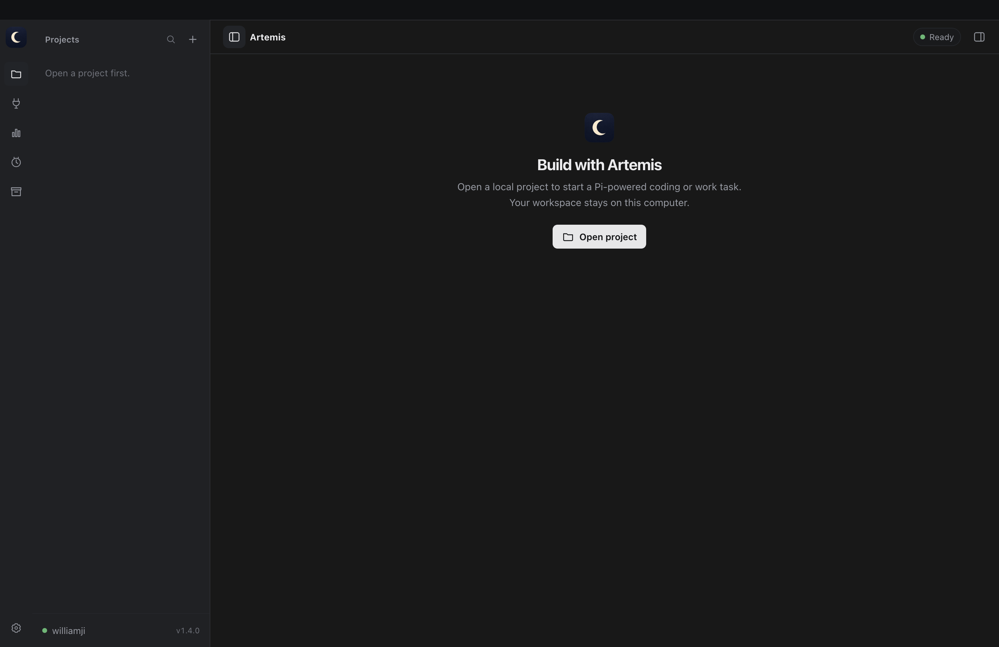
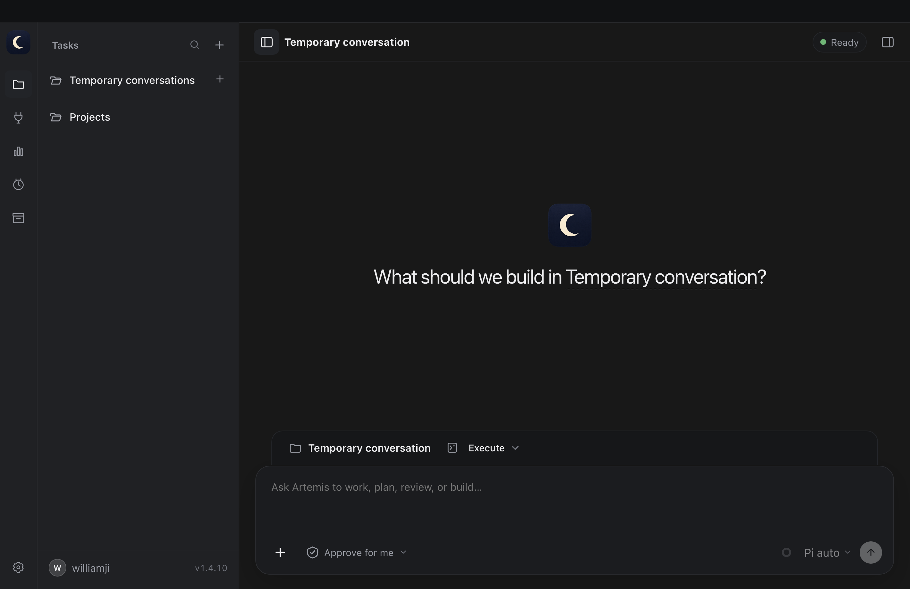
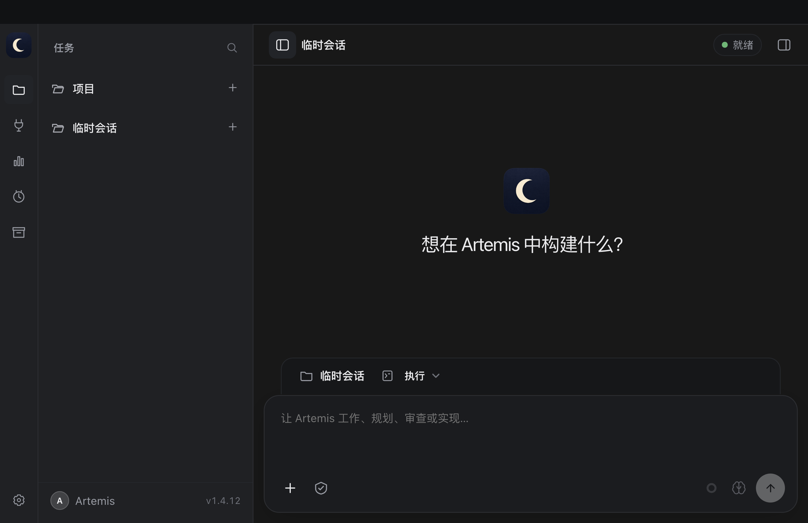
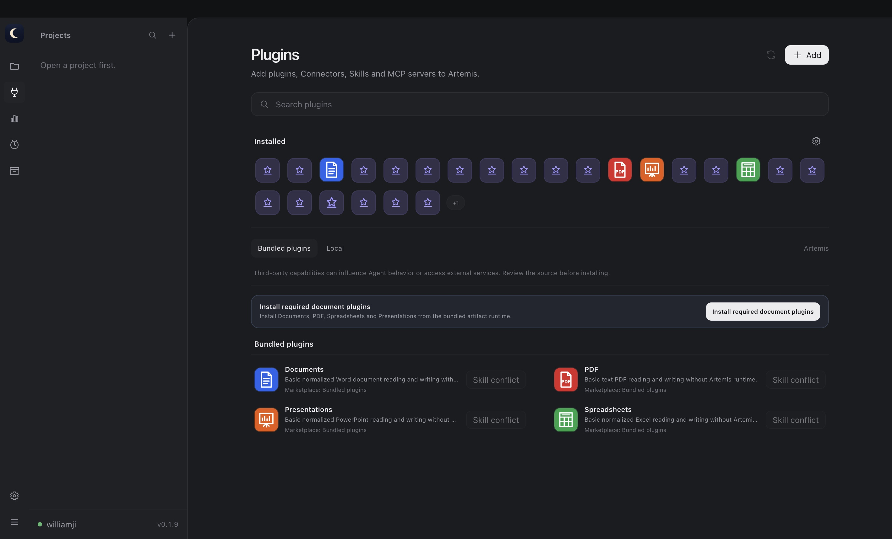
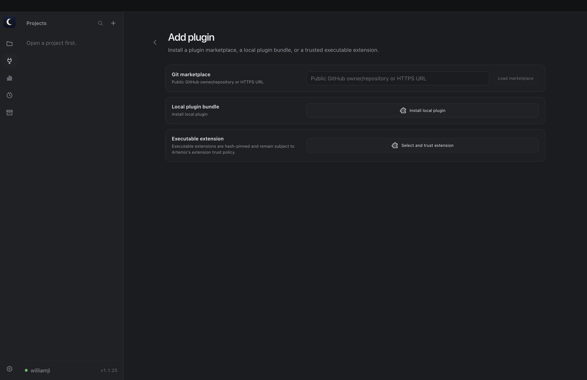
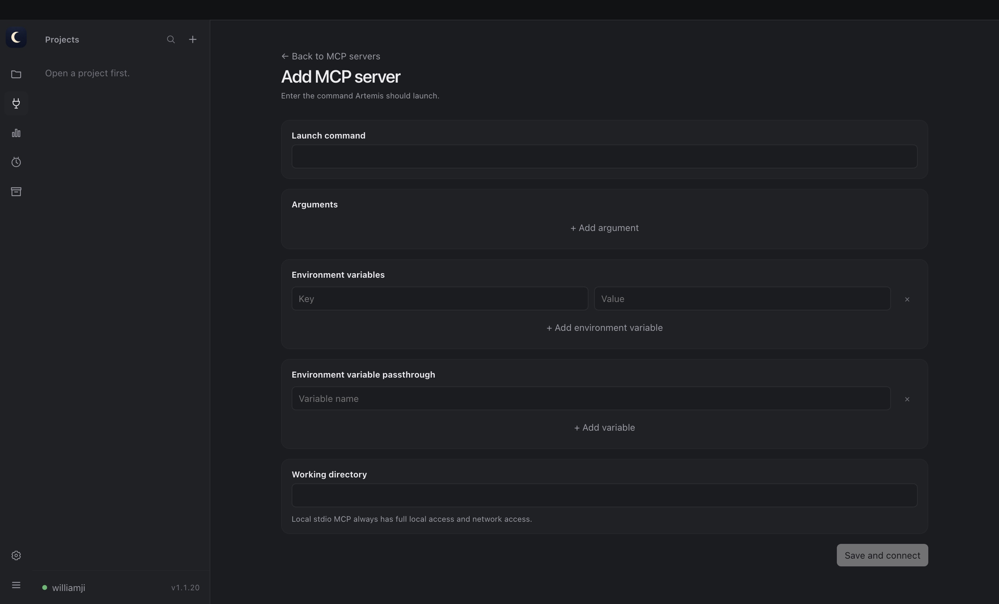
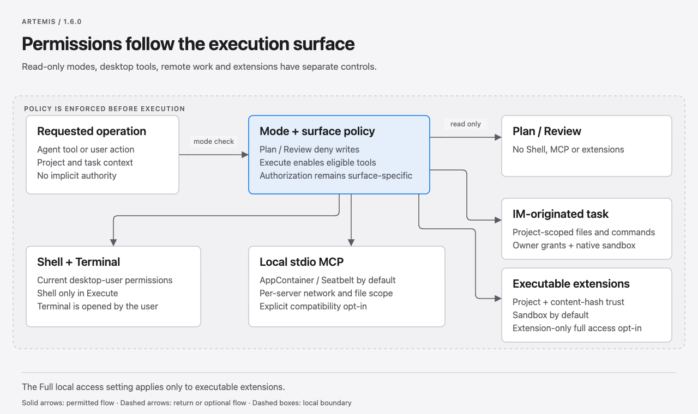
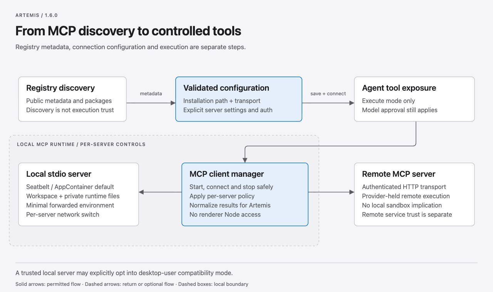
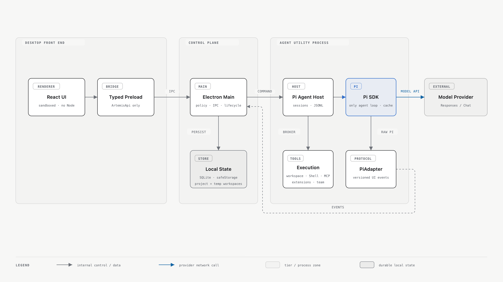

<div align="center">


# Artemis

### Local Agent workflows for software development and everyday work.

**A Windows and macOS desktop Agent powered by Pi for coding, research, documents, connected services, and recurring work:\
persistent tasks, guarded execution modes, Git-native Review, real terminals, automations, reusable memory, Skills, MCP, and parallel Agents.**

<p>
  <a href="https://github.com/EurekaRaider/Artemis/actions/workflows/ci.yml"></a>
  <a href="https://www.electronjs.org/"></a>
  <a href="https://react.dev/"></a>
  <a href="https://pi.dev/"></a>
</p>

<p>
  
  
  
  
</p>

[Product preview](#product-preview) · [Plugins](#plugin-marketplace-and-capability-center) · [Quick start](#quick-start) · [Workspace](#desktop-workspace-and-task-lifecycle) · [Permissions](#execution-permissions-and-trust-boundary) · [Architecture](#architecture) · [Documentation](#documentation)

</div>

---

<p align="center"><sub>macOS welcome workspace · dark theme</sub></p>



<p align="center">
  <strong>Local-first</strong>&nbsp;&nbsp;·&nbsp;&nbsp;
  <strong>Replay-safe</strong>&nbsp;&nbsp;·&nbsp;&nbsp;
  <strong>Explicit trust</strong>&nbsp;&nbsp;·&nbsp;&nbsp;
  <strong>Pi-powered</strong>
</p>

<br />

## 01 / System overview

### Built for work, not just code

Artemis is an independent local desktop Agent for software development and
everyday work. Repository-backed projects support coding and Git workflows,
while projectless Temporary chats support research, documents,
spreadsheets and presentations; persistent project tasks can also run recurring
automations. Pi runs the single agent loop; Electron owns lifecycle, policy and
persistence; the Renderer consumes only Artemis's versioned protocol. Projects,
conversation projections, review state and reusable experience stay local, and
credentials are protected with operating-system encryption.

<table>
  <tr>
    <td width="50%" valign="top">
      <h3>Fast across long-running work</h3>
      <p><strong>Long-running task history does not have to make the workspace feel long-running.</strong></p>
      <ul>
        <li>Task events are loaded on demand, merged replay-safely, reduced incrementally and cached for recently viewed tasks.</li>
        <li>Streaming events are grouped into animation-frame batches, avoiding one full React update for every token or tool delta.</li>
        <li>Settings, Resources and Terminal are split into lazy panels and prefetched after the main workspace becomes interactive.</li>
        <li>Review requests are race-safe, and panel transitions keep stale diff responses from replacing the selected scope.</li>
        <li>Connection failures before visible output reconnect inside the same turn, while interrupted partial output stops safely instead of replaying the prompt.</li>
      </ul>
    </td>
    <td width="50%" valign="top">
      <h3>Explicit boundaries by design</h3>
      <p><strong>Read-only modes, user-authorized integrations and extension trust have distinct boundaries.</strong></p>
      <ul>
        <li>Plan and Review deny writes before an executor or filesystem call runs and do not expose Shell, MCP or executable extensions.</li>
        <li>The approved platform Shell and integrated Terminal run with desktop-user permissions; local stdio MCP servers use AppContainer or Seatbelt by default with per-server network and compatibility controls.</li>
        <li>Executable extensions require project and content-hash trust; they use the native sandbox unless extension-only full local access is enabled.</li>
        <li>API keys, OAuth records, bearer tokens and PKCE material use Electron <code>safeStorage</code>.</li>
      </ul>
    </td>
  </tr>
</table>

<table>
  <tr>
    <td width="50%" valign="top">
      <p><strong>01</strong>&nbsp;&nbsp;/&nbsp;&nbsp;AGENT WORKSPACE</p>
      <p>Persistent projects and Local tasks, projectless Temporary chats, a resizable two-level conversation sidebar with persistent drag-and-drop ordering, per-conversation model/thinking/context settings, collapsible history, draft-on-first-send task creation, confirmed deletion, streaming Markdown, thinking/tool cards, structured workflow choices, prompt history, attachments, grouped approvals, plans, queued turns, steering, cancellation, forking and stateful Goals.</p>
    </td>
    <td width="50%" valign="top">
      <p><strong>02</strong>&nbsp;&nbsp;/&nbsp;&nbsp;WORKSPACE TOOLS</p>
      <p>Review, Terminal, Browser, Markdown, Files and child-Agent tabs; editable files with syntax highlighting; rich/source Markdown; locale-aware external browsing without Node, preload or local-file access; explicit opening of Agent-created HTML.</p>
    </td>
  </tr>
  <tr>
    <td width="50%" valign="top">
      <p><strong>03</strong>&nbsp;&nbsp;/&nbsp;&nbsp;GUARDED MODES</p>
      <p>Plan for read-only investigation and planning, Execute for software development and everyday work, and Review for read-only inspection. Plan and Review reject writes before execution.</p>
    </td>
    <td width="50%" valign="top">
      <p><strong>04</strong>&nbsp;&nbsp;/&nbsp;&nbsp;GIT WORKFLOW</p>
      <p>Task-checkout-aware Git state with coalesced, metadata-signature-gated repository refresh, searchable local and remote branches, branch creation/publishing, and a shared Compare/Review base; plus last-turn, unstaged, staged and branch diffs, inline comments, file/hunk stage and unstage, recoverable revert and race-safe scope switching.</p>
    </td>
  </tr>
  <tr>
    <td width="50%" valign="top">
      <p><strong>05</strong>&nbsp;&nbsp;/&nbsp;&nbsp;REUSABLE CONTEXT</p>
      <p>Persistent Goals with six lifecycle states, optional Token budgets, accumulated Token/time progress, event-driven continuation and constrained model tools; editable global <code>AGENTS.md</code>, selective project-first memory, <code>/goal</code>, <code>/init</code>, multiple <code>/skill</code> selections and category-based import of global instructions, Skills and MCP from Codex, OpenCode and Claude without copying models or credentials.</p>
    </td>
    <td width="50%" valign="top">
      <p><strong>06</strong>&nbsp;&nbsp;/&nbsp;&nbsp;MODELS &amp; RESOURCES</p>
      <p>Pi model catalog, thinking/context controls, model-aware Prompt Cache policy, custom OpenAI-compatible Chat Completions and Responses providers, encrypted credentials, Skills, full-permission MCP stdio/HTTP with OAuth 2.1 + PKCE, and trusted Pi extensions.</p>
    </td>
  </tr>
  <tr>
    <td colspan="2" valign="top">
      <p><strong>07</strong>&nbsp;&nbsp;/&nbsp;&nbsp;OPERATIONS</p>
      <p>Local automations, daily/weekly/cumulative Token insights with a local profile picture, per-model filtering and breakdowns, combined cache-hit Tokens and reporting coverage, fork-safe usage accounting, OS user identity, 14-language/system-language UI, themes, diagnostics export, update recovery and native packaging gates.</p>
    </td>
  </tr>
</table>

<br />

### One Agent for building and getting things done

<table>
  <tr>
    <td width="50%" valign="top">
      <p><strong>SOFTWARE DEVELOPMENT</strong></p>
      <p>Understand and edit repositories, run real development tools, inspect and stage Git changes, coordinate parallel Agents, and carry durable project context across long-running tasks.</p>
    </td>
    <td width="50%" valign="top">
      <p><strong>EVERYDAY WORK</strong></p>
      <p>Research with the Browser, read or write files anywhere through brokered high-risk approvals, create or update portable documents, spreadsheets, presentations and PDFs, use installed Skills and connected services, handle projectless work in Temporary chats, and schedule recurring tasks for persistent projects.</p>
    </td>
  </tr>
</table>

Examples include drafting a report from source material, organizing information
in a workbook, preparing a presentation, researching a topic, or running a
recurring follow-up alongside the same coding and Git workflows.

<br />

## Product preview

<table>
  <tr>
    <td width="50%"></td>
    <td width="50%"></td>
  </tr>
  <tr>
    <td align="center"><sub>English · 125% scale · welcome workspace</sub></td>
    <td align="center"><sub>Simplified Chinese · 150% scale · localized welcome workspace</sub></td>
  </tr>
</table>

The refreshed screenshot matrix covers all 14 supported locales at 100% zoom,
plus English, Simplified Chinese, German and Arabic at 125% and 150%. Each image
has a companion automated accessibility audit; the current manifest reports
zero audited issues for all 22 variants, including the Arabic RTL layout.

### Plugin marketplace and capability center

Artemis brings plugins, Connectors, MCP servers and Skills into one
searchable capability center. A plugin can contribute one or more Skills,
Connector definitions and MCP configurations while keeping installation,
enablement and removal visible to the user.

<table>
  <tr>
    <td width="50%" valign="top">
      <p><strong>DISCOVER</strong>&nbsp;&nbsp;/&nbsp;&nbsp;Marketplace discovery</p>
      <p>Browse bundled, manually added and local sources, search cached results immediately, refresh explicitly, or add a Git marketplace by URL or <code>owner/repository</code> shorthand. External marketplaces are never subscribed to or fetched by default. Refresh downloads a bounded GitHub archive over HTTPS through the system network stack; it does not invoke or require a local <code>git.exe</code>/<code>git</code> installation.</p>
    </td>
    <td width="50%" valign="top">
      <p><strong>INSTALL</strong>&nbsp;&nbsp;/&nbsp;&nbsp;Local and bundled capabilities</p>
      <p>Inspect a local plugin bundle, trust a hash-pinned executable extension, and install the bundled Documents, PDF, Spreadsheets and Presentations Lite plugins without installing Codex or an external document toolchain.</p>
    </td>
  </tr>
  <tr>
    <td width="50%" valign="top">
      <p><strong>CONTROL</strong>&nbsp;&nbsp;/&nbsp;&nbsp;Unified management</p>
      <p>Manage Plugins, Connectors, MCP and standalone Skills from separate tabs with real icons, status, enable/disable controls, updates and uninstall actions. Unavailable entries and Connectors without a usable endpoint are not offered for installation.</p>
    </td>
    <td width="50%" valign="top">
      <p><strong>CONNECT</strong>&nbsp;&nbsp;/&nbsp;&nbsp;First-class MCP setup</p>
      <p>Search the official MCP Registry, install supported pinned HTTPS or npm/stdio servers, and provide required setup values before connecting. Sensitive Registry headers and stdio environment credentials are stored with operating-system encryption instead of the ordinary MCP configuration. Signed plugin MCP runtimes can request scoped Google Workspace or Gmail authorization without receiving the stored refresh token.</p>
    </td>
  </tr>
</table>

<p align="center">
  
</p>
<p align="center"><sub>Browse configured marketplaces, search by capability and manage installed plugins from one page</sub></p>

<table>
  <tr>
    <td width="50%"></td>
    <td width="50%"></td>
  </tr>
  <tr>
    <td align="center"><sub>Add a Git or offline marketplace, local plugin bundle or trusted executable extension</sub></td>
    <td align="center"><sub>Configure a local MCP server in a dedicated structured editor</sub></td>
  </tr>
</table>

<br />

## 02 / Boot sequence

### Quick start

#### Requirements

> [!IMPORTANT]
> **Runtime baseline** — Node.js 24+ · npm 11+ · Git · Windows 11 x64 or macOS 14+ on Apple Silicon arm64 or Intel x64

#### Run from source

```powershell
npm install
npm run dev
```

Open **Settings** to select the default Pi model and thinking level, set the
usable context window, and save an API key with operating-system encryption.
Each stored conversation then keeps its own model, thinking and context-window
selection. Ultra Mode uses the selected model's highest supported thinking
level and prioritizes flat Agent-team decomposition for complex or long-horizon
tasks. Existing Pi OAuth credentials can be imported explicitly; Artemis does
not silently copy them.

Google authorization for plugin-hosted MCP runtimes is optional. A source build
must provide `apps/desktop/resources/google-oauth-client.json` in Google's
Desktop app client JSON format. The file is ignored by Git and must not be
committed; without it, the rest of Artemis remains available while the Google
account action reports that the build has no application-level OAuth client.

<br />

## 03 / Workspace runtime

### Desktop workspace and task lifecycle

Artemis supports two workspace shapes. Repository-backed projects keep software
and file-based work in a persistent local checkout, while projectless Temporary
chats use an isolated generated workspace for research, documents and
other everyday tasks.

<details open>
<summary><strong>01 · Projects and persistent conversations</strong></summary>

- **Project and task management** — add a repository from the Projects header;
  start projectless work from the Temporary chats header, collapse that section
  with its state preserved across restarts, and collapse individual project
  histories with each project's state restored independently. Drag projects
  into a preferred order that survives restart, and resize the persisted
  top-aligned sidebar to fit long task names or reclaim workspace space. The
  sidebar uses a 320ms shell-eased transition. Preview five tasks before expanding,
  and create, rename, search, archive, restore, fork, delete or switch tasks
  from the sidebar. Running and approval-waiting tasks stay at the top, ordered
  by the most recently submitted prompt when several are active. Sidebar action
  menus dismiss on outside click or Escape.
- **Temporary chats** — start, persist, archive, fork and delete a
  conversation without adding a project. Each conversation and fork has an
  isolated workspace under application data. Temporary chats do not
  receive project memory, Review, worktrees, handoff or project-scoped
  approvals; deletion stops Agent Host and Terminal processes before removing
  files, and retains the thread record when cleanup must be retried.
- **Draft-first conversations** — opening a new conversation resets the
  composer without creating a stored task or Pi session. The first submitted
  prompt creates the task; leaving the empty draft simply discards it. Each
  conversation keeps its own unsent prompt, selected Skills and attachments, so
  switching tasks restores the matching composer draft instead of carrying it
  into another task.
- **Independent model selection** — each stored conversation persists its own
  Provider/model, thinking level and context-window limit. Changing the active
  conversation configures only that Pi session; other open conversations keep
  their selections, and new conversations start from the current defaults.
- **Confirmed deletion** — a styled in-app confirmation protects destructive
  actions. Active tasks cannot be deleted; completed-task deletion removes its
  local events and Review comments and cleans up only the matching trusted Pi
  JSONL transcript.
- **Persistent Pi sessions** — Pi JSONL is the conversation source, while
  SQLite WAL stores the desktop projection. Restarted Agent Hosts reopen prior
  user/assistant context instead of starting a visually restored but empty
  session.

</details>

<details>
<summary><strong>02 · Live turns, composer and progress</strong></summary>

- **Continuation controls** — resume, true Pi fork, queued prompts, live
  steering, follow-up turns and active-turn cancellation are wired to the live
  Agent session. Messages left unexecuted after a terminal model failure return
  to the owning composer; the main process mirrors their original text and
  attachments so an unexpected Agent Host exit cannot leave a stale visible
  queue or move an attachment to another task. Queue edits, deletions and
  reordering move the original Pi message objects by validated source index, so
  retained images are not flattened into text. Interrupted Agent-team context
  is injected only for an explicit continuation request.
- **Composer and commands** — send text, local files, images, PDF and Office
  attachments through the picker, drag/drop or clipboard; pasted images finish
  loading before the matching text submission captures its attachments; reuse prompt history;
  invoke `/goal`, `/init` and one or more `/skill` selections; switch mode with
  `/plan`, `/execute` or `/review` anywhere in a message, or use the mode picker
  between turns even while another task in the same project is active; choose
  the model and thinking level. Copy completed user and assistant messages
  directly from the timeline; cancelled or failed user turns can restore their
  visible text and selected Skills to the composer for editing without replaying
  the turn.
- **Task environment** — open a compact header panel for Git changes, local
  repository and branch state from the active task checkout, branch search,
  local/remote switching, branch creation/publishing, commit/push actions, child
  Agents and teams, MCP usage, and attached task sources. Agents and teams keep
  stable identity-specific color and geometry marks across the timeline,
  workspace tabs and environment panel; siblings are ordered by recent activity
  with finished members naturally sinking below live work. Queued turns use a
  static neutral indicator, reserving the blue breathing state for work that has
  actually started. `wait_agent` wakes on child activity or team messages as
  well as settlement and deadline, while health thresholds use only recent
  observation durations. The panel auto-hides before it can
  overlap the centered timeline and restores itself when the workspace widens;
  its completed-turn status row follows the same safe area, while opening the
  workspace Dock keeps the header controls stationary through the animated
  transition. Pasted images receive stable unique names, and sent image sources
  open in a local preview without embedding their bytes in persisted protocol
  events;
  Git metadata and worktree changes refresh the open panel automatically through
  a single-flight trailing debounce; unchanged metadata never starts the full
  status and line-count scan;
  Compare and Review use the same base. Git mutations remain behind main-process
  validation and are disabled while local tasks are active. Interactive tasks
  remain intentionally Local-only, so the panel does not expose inert Worktree
  or Remote targets.
- **Streaming timeline** — render safe Markdown, text/thinking deltas, tool
  input/output, approval cards with the model's decision, structured workflow
  choices, child-Agent status, errors and completion states in original event
  order. Pending selection requests stay inline as timeline cards with their
  countdown in the header while the normal composer and stop control remain
  available. Pending approvals keep their actions visible, while approvals from
  the same turn collapse into one counted summary with per-action details and
  denied requests remain individually inspectable.
- **Progress and context** — `update_plan` produces visible multi-step progress
  only while its turn remains active and advances as each step-status update is
  emitted; run timing and context-window usage remain visible. The context
  indicator distinguishes the current local estimate from
  the last provider-measured input, refreshes after tool results and preserves
  sub-percent ring movement for large context windows. Manual and automatic
  context compaction immediately add an in-progress timeline row with the same
  left-to-right highlight sweep as Thinking, followed by a completion state
  that dismisses itself after five seconds.
  Post-compaction usage combines the rebuilt message estimate with the
  system prompt, tools, MCP schemas, project instructions and Skills that remain
  in context. Usage Insights adds daily, weekly and cumulative Token totals with
  a calendar heatmap, all-model or per-model filtering, a Provider/model usage
  table, combined cache-read/write hit Tokens, cache hit rate,
  cache-reporting coverage and automatic policy distribution while avoiding
  double-counting forked history. Older events recorded before model attribution
  remain part of totals but are omitted from the model table. A missing Provider
  cache breakdown remains unknown instead of being rendered as a 0% hit rate.

- **Persistent Goal lifecycle** — `/goal <objective>` optionally accepts
  `--token-budget`, while `/goal pause`, `/goal resume` and `/goal clear` map to
  the durable `active`, `paused`, `blocked`, `usageLimited`, `budgetLimited` and
  `complete` state machine. The composer-adjacent Goal bar exposes objective,
  status, Token budget/progress, elapsed time and valid actions. Active Execute
  Goals continue only after the existing Pi turn becomes truly idle; waiting
  approvals, structured questions, user work, Plan/Review, compaction, limits,
  cancellation and terminal states retain priority and stop continuation.
  Transient continuation failures retry after a bounded delay; repeated
  permanent authentication, configuration or protocol failures enter the same
  three-consecutive-turn blocker rule instead of retrying forever.

</details>

<details>
<summary><strong>03 · Recovery, responsiveness and automations</strong></summary>

- **Restart recovery** — persisted events are versioned and replayed through an
  idempotent reducer. Event history is fetched only when a task is opened and
  live deltas are merged without duplication.
- **Large-history responsiveness** — incoming events are reduced in batches,
  cached for the most recent tasks and kept out of unrelated snapshot refreshes.
- **User identity and localization** — the desktop uses the operating-system
  username and avatar where available and follows either the system language or
  one of 14 locales: English, Simplified Chinese, Traditional Chinese, Japanese,
  Korean, Spanish, French, German, Brazilian Portuguese, Italian, Russian,
  Arabic, Hindi and Indonesian. Arabic uses an RTL layout; external Browser
  requests advertise the resolved locale without translating workspace HTML.
- **Local automations** — create one-time, interval, daily, weekday, or weekly
  schedules with an accessible hour/minute picker and timezone. Intervals accept
  minutes, hours or days, persist across restart, and anchor the next occurrence
  to the latest dispatch so execution duration does not accumulate schedule
  drift. Run immediately, inspect persisted run history and receive completion
  notifications. A completed one-time schedule removes itself while keeping its
  generated task and history; recurring schedules remain available. Runs use the
  normal Pi task path and coalesce downtime to only the latest missed occurrence
  when Artemis starts again.

</details>

> [!NOTE]
> The Renderer is sandboxed and has no Node integration. It reaches the desktop only through a typed, validated preload API.

> [!WARNING]
> Automations run only while the desktop app is open; Artemis does not install an operating-system service or wake a stopped app. Plan and Review keep their write-denial policy. Execute automations require an explicit native warning confirmation because their brokered approvals are granted automatically and the platform-native `shell` tool runs with the desktop user's permissions. Changing the prompt, mode, target, project, or schedule revokes that authorization and disables the automation until it is confirmed again.

### Workspace tools

The right workspace keeps source code, documents, research and task output
beside the conversation:

Its public Workspace surfaces keep launcher actions, closable tabs, file trees,
source and Markdown editing, save/error status and the resizable Dock consistent
across themes. The Dock starts at 62% of the available workspace, preserves the
conversation minimum, supports pointer and Arrow/Home/End resizing in both LTR
and RTL layouts, and remembers the chosen width.

<table>
  <tr>
    <td width="50%" valign="top"><p><strong>REVIEW</strong></p><p>Live Git scopes, file/hunk actions and inline comments.</p></td>
    <td width="50%" valign="top"><p><strong>TERMINAL</strong></p><p>A real desktop-user PTY in the Local checkout.</p></td>
  </tr>
  <tr>
    <td colspan="2" valign="top"><p><strong>BROWSER</strong></p><p>HTTP and HTTPS pages with JavaScript, cookies and web storage while keeping Node integration, preload APIs and local-file access disabled. External requests follow the resolved locale through <code>Accept-Language</code>; switching locale reloads remote pages while leaving workspace HTML unchanged. Agent-created HTML opens only from explicit links.</p></td>
  </tr>
  <tr>
    <td width="50%" valign="top"><p><strong>MARKDOWN</strong></p><p>Source and rich rendering for local Markdown files.</p></td>
    <td width="50%" valign="top"><p><strong>FILES</strong></p><p>Project-tree browsing with file-type icons, syntax highlighting and local editing.</p></td>
  </tr>
  <tr>
    <td colspan="2" valign="top"><p><strong>AGENT TEAM / CHILD AGENTS</strong></p><p>Status and output from real parallel Pi sessions without hiding them behind the parent timeline. When a continued task starts a new team, its workbench replaces the stopped team's team and child tabs while preserving unrelated workspace tabs.</p></td>
  </tr>
</table>

### Plan, Execute, Review and everyday work

The formal protocol and persistence enum is `execute | plan | review`. Every UI
selector presents **Plan → Execute → Review**, while new tasks default to
Execute.

Enter `/plan`, `/execute` or `/review` by itself to switch mode without starting
a turn, or include exactly one mode command anywhere in a prompt to switch mode
and submit the remaining text. `Shift+Tab` cycles **Plan → Execute → Review**
while the composer is idle. Invalid command combinations are shown above the
composer for ten seconds, then fade away without covering task progress.

| Mode        | Intended use                                               |                    Workspace writes | Available execution                                                                              |
| ----------- | ---------------------------------------------------------- | ----------------------------------: | ------------------------------------------------------------------------------------------------ |
| **Plan**    | Investigation and task planning                            |             Denied before execution | Read-only discovery, planning and read-only child coordination                                   |
| **Execute** | Software development, everyday work and portable documents | Allowed through policy and approval | Read/write, Shell, Terminal, Git, Office, memory, MCP, trusted extensions and child coordination |
| **Review**  | Code and change inspection                                 |             Denied before execution | Read-only discovery, child coordination and Review surfaces                                      |

Plan and Review are policy states, not prompt suggestions. Their writes are
rejected before an executor or filesystem operation is called. `update_plan`
is available across meaningful multi-step work and produces a single
in-progress step with explicit pending/completed states.

Execute mode uses a versioned normalized Office protocol and real portable
parsers/generators for:

- PDF create, read, write, modify and delete workflows;
- Excel `.xlsx` workbook and cell creation, reading, writing and modification;
- Word `.docx` document creation, reading, writing and modification;
- PowerPoint `.pptx` presentation creation, reading, writing and modification.

The Office path is designed for Windows and macOS without requiring Microsoft
Office to be installed.

Database version 8 migrates persisted legacy `code` and `work` tasks, events
and automations to `execute`, while protocol version 2 rejects those legacy
values for new data. Legacy write-capable automations are disabled during
migration, any previous unattended authorization is revoked, and fresh user
authorization is required before they can run unattended again.

### Experiential memory and instructions

Artemis can reuse durable, verified experience without turning old text
into a higher-priority instruction.

| Layer                     | Contract                                                                                                                                                                                   |
| ------------------------- | ------------------------------------------------------------------------------------------------------------------------------------------------------------------------------------------ |
| **Project memory**        | Lives at `<project>/.artemis/MEMORY.md` with a 512 KiB limit.                                                                                                                              |
| **Global memory**         | Lives at `~/.pi/agent/MEMORY.md` with a 128 KiB limit and is reserved for explicitly cross-project workflows.                                                                              |
| **Selective recall**      | Tokenizes the current request, gives project headings and keywords the strongest weight, applies a stricter global threshold and injects only bounded relevant entries.                    |
| **Instruction isolation** | Marks recalled text as prior experience that cannot override the current request or system policy.                                                                                         |
| **Controlled saving**     | Exposes `save_memory` only to the active Execute turn. Plan, Review, inactive turns, mismatched workspaces and unjustified global writes are rejected by the broker.                       |
| **Integrity**             | Validates entry size and keywords, skips duplicate headings or content, rejects symlinked memory files/directories and uses an atomic temporary-file rename with private file permissions. |

Project memory complements two existing context layers: the task's persistent
goal and the editable global `AGENTS.md` instructions. Settings can also scan
Codex, OpenCode and Claude configuration, preview detected sources, and import
selected global instruction, Skill and MCP categories. Model settings and
credentials are never imported.

### Git Review

The Review panel is a live Git workspace rather than a static diff viewer:

- compare the last Agent turn, unstaged changes, staged changes or a selected
  branch/base reference, including untracked text and binary files;
- stage and unstage complete files or server-validated text hunks, with binary
  changes handled safely at file scope;
- add and remove inline comments using stable diff-line anchors;
- reject stale or forged file, hunk and line identifiers;
- revert through a recoverable snapshot instead of an unrecoverable blind
  overwrite;
- switch Review scopes without allowing a slower stale response to replace the
  current selection.

<br />

## 04 / Trust fabric

### Execution permissions and trust boundary

Artemis replaces default Pi shell/write tools with brokered host tools. A
requested operation first passes through the active mode policy. The next
boundary depends on the execution surface instead of applying one sandbox model
to every local process.



<sub>[Open the Trust Fabric source](docs/diagrams/artemis-trust-fabric.html)</sub>

The official MCP Registry is a discovery input to this trust fabric, not a
trusted execution source. Its installation path is independently validated
before a server can be saved, connected or exposed to the Agent runtime.



<sub>[Open the MCP Trust Fabric source](docs/diagrams/artemis-mcp-trust-fabric.html)</sub>

#### Interaction control

| Control                      | Behavior                                                                                                                                                                                                                                                                                                                                                                                                                                                                                                                                                                  |
| ---------------------------- | ------------------------------------------------------------------------------------------------------------------------------------------------------------------------------------------------------------------------------------------------------------------------------------------------------------------------------------------------------------------------------------------------------------------------------------------------------------------------------------------------------------------------------------------------------------------------- |
| **Brokered execution tools** | Carry a model risk assessment (`low`, `medium`, or `high`) and an exact-operation check against the user's current request. In **Approve for me** mode, low- and medium-risk Shell, workspace, Office, MCP and trusted-extension operations continue automatically. High-risk operations continue automatically only when the user directly and unambiguously requested that exact action and target; otherwise they fall back to a human approval card. Trusted host metadata is enforced as a minimum risk floor, and Custom mode retains exact-target approval memory. |
| **Workflow choices**         | Use one structured question at a time with two or three options, a custom-answer path and one model recommendation. They support keyboard navigation; if no answer arrives within five minutes, the recommended option is recorded and used automatically.                                                                                                                                                                                                                                                                                                                |
| **Replay protection**        | Uses host-generated nonces; cancellation revokes outstanding approvals and workflow choices. Unresolved interactions recover safely after restart.                                                                                                                                                                                                                                                                                                                                                                                                                        |

#### Execution surfaces

| Surface                  | Effective boundary                                                                                                                                                                                                                                                                                                                                                                                                                                                                                                                                                                                            |
| ------------------------ | ------------------------------------------------------------------------------------------------------------------------------------------------------------------------------------------------------------------------------------------------------------------------------------------------------------------------------------------------------------------------------------------------------------------------------------------------------------------------------------------------------------------------------------------------------------------------------------------------------------- |
| **Platform Shell**       | Available only in Execute. Windows prefers a verified PowerShell 7 `pwsh.exe` and falls back to Windows PowerShell 5.1; macOS uses a supported user zsh/bash with safe fallbacks. After brokered model or user approval, it intentionally inherits the current desktop user's full filesystem and network permissions.                                                                                                                                                                                                                                                                                        |
| **Integrated Terminal**  | Opened by the user and inherits the current desktop user's filesystem and network permissions without automatic administrator elevation.                                                                                                                                                                                                                                                                                                                                                                                                                                                                      |
| **MCP Registry install** | The official Registry is a discovery source, not a security endorsement. Artemis re-fetches the selected name and version, accepts only validated fixed HTTPS endpoints or version-pinned npm/stdio packages from the official npm registry, requires an explicit install-and-connect action, and keeps declared secret headers or environment values in OS-encrypted storage.                                                                                                                                                                                                                                |
| **MCP runtime**          | Registry-installed and manually configured servers share the same runtime boundary. Local stdio servers use AppContainer on Windows or Seatbelt on macOS by default, can write only the task workspace and private runtime directory, receive a minimal or explicitly forwarded environment, and use a per-server network switch. A per-server compatibility option can explicitly restore desktop-user permissions for a trusted incompatible server; those unsandboxed calls have a high approval-risk floor. Tool calls otherwise retain model auto-approval and server read-only/destructive annotations. |
| **Extensions**           | Remain disabled until project and content-hash trust are explicit. They run in AppContainer on Windows or Seatbelt on macOS by default; the **Full local access** setting opts extensions alone into desktop-user permissions.                                                                                                                                                                                                                                                                                                                                                                                |
| **Browser**              | Has normal HTTP/HTTPS access but no Node integration, preload API or local-file access.                                                                                                                                                                                                                                                                                                                                                                                                                                                                                                                       |
| **Plan and Review**      | Reject writes before an executor or filesystem call and do not expose Shell, MCP or executable extensions.                                                                                                                                                                                                                                                                                                                                                                                                                                                                                                    |

> [!CAUTION]
> **macOS validation boundary** — Lite engineering packages generate separate Apple Silicon arm64 and Intel x64 artifacts. Local checks cover archive integrity, architecture, the ad-hoc engineering signature and packaged resources; the x64 result is a static build validation only. Intel-native launch, Developer ID signing, notarization, stapling, PTY/Seatbelt and update/rollback release acceptance remain separate native gates.

### Terminal

The workspace terminal uses xterm in the Renderer and `node-pty` in the main
process.

- opens in the active project's Local checkout or the generated Temporary
  conversation workspace;
- runs as the current desktop user with that user's filesystem and network
  permissions and never requests administrator elevation;
- uses `@xterm/addon-fit` so PTY rows and columns match the actual panel size;
- resizes the native PTY through the typed preload bridge;
- prefers PowerShell 7 on Windows with a Windows PowerShell 5.1 fallback, and
  uses a supported user zsh/bash on macOS;
- loads the normal interactive profile in the PTY, while Agent Shell commands
  remain non-interactive and use the configured environment/profile policy;
- is available with the Execute surface;
- ships platform-specific Node-API prebuilds outside asar, with packaging checks
  for the Windows Electron runtime.

### Models, providers and settings

Settings follows the desktop's resolved locale and is divided into five focused
pages:

| Page                      | Functions                                                                                                                                                                                                                                                                                                                    |
| ------------------------- | ---------------------------------------------------------------------------------------------------------------------------------------------------------------------------------------------------------------------------------------------------------------------------------------------------------------------------- |
| **General**               | Local profile-picture upload/removal with a bounded 256 px copy, language, theme and approval policy                                                                                                                                                                                                                         |
| **Providers & models**    | One focused page with **Built-in** and **Custom** tabs: default model search/selection, validated context-window limits, the Pi catalog including GLM-5.3 for Z.AI endpoints, editable OpenAI-compatible Chat Completions/Responses providers, reasoning/image capabilities, encrypted API keys and explicit Pi OAuth import |
| **Agent configuration**   | Editable global `AGENTS.md`, configuration scan/preview/import and imported source/category selection without silent credential copying                                                                                                                                                                                      |
| **MCP & extensions**      | MCP stdio/Streamable HTTP configuration, bearer/OAuth/Registry-header authorization, enablement, trusted-extension selection, hash state, tool inventory and extension network policy                                                                                                                                        |
| **Updates & diagnostics** | Update state and actions, local diagnostic-bundle export and maintenance information                                                                                                                                                                                                                                         |

The dialog has tab semantics, keyboard focus behavior and Escape-to-close
support. Model application reports success or failure without silently
accepting a model that is missing from the live catalog.

Stored conversations persist their own model, thinking level and usable context
window. Applying a selection from the composer reconfigures only the active Pi
session, while Settings continues to define defaults for new conversations.
Deleting a custom provider or removing an added built-in model migrates idle
conversations that reference it to an available fallback, or clears their
per-conversation selection when no fallback exists. Active turns must be
stopped first; editing a custom provider must retain models still in use.

#### Ultra Mode

Ultra Mode is available from the composer model picker for reasoning-capable
models. It runs the parent and every child at the selected model's highest
supported thinking level (`max` when available) and asks the parent to start
three to five complementary Agents early for complex, long-horizon,
cross-subsystem or meaningfully parallel work. Those Agents may delegate
bounded independent work further. Simple, atomic and strictly sequential tasks
remain single-Agent so coordination does not become overhead.

Ultra Mode works in Plan, Execute and Review without changing their permission
boundaries: Plan and Review stay read-only, while Execute keeps the trust model
described below. The setting follows the selection when switching between
reasoning models and is called out in the UI because it consumes usage quota
faster than a standard thinking level.

Credentials and authorization material are encrypted with Electron
`safeStorage`. If OS encryption is unavailable, secret writes fail instead of
falling back to plaintext.

#### Automatic Prompt Cache

Artemis wraps Pi's existing `ModelRuntime` with an automatic, model-aware cache
policy; Pi remains the only Agent loop. Stable keys bind the Pi session,
Provider, model, System Prompt and normalized tool schemas. Official OpenAI
models use only documented, model-specific policies, while child Agents,
unknown models, Azure endpoints and OpenAI-compatible gateways remain on short
caching. Pi compaction and other one-shot requests that explicitly select
`none` always bypass caching.

GPT-5.6 requests to `https://api.openai.com` use an explicit 30-minute cache
with a System Prompt breakpoint. GPT-5.5 uses its supported long policy, and
the documented legacy whitelist upgrades persistent parent tasks from short to
long caching after the first top-level turn. There is no user setting: changing
the session, model, System Prompt or tool set changes the stable key
automatically without exposing additional Execute tools to Plan or Review.

<br />

## 05 / Capability fabric

### Skills, MCP and trusted extensions

#### Resource Center and Skills

The Resource Center separates Plugin, Connector, MCP and Skill catalogs, shows
installed state, connection/tool counts and enable switches, and exposes source
links before installation.

- search the official MCP Registry and the Skill catalog with distinct loading,
  empty-result and error states;
- install supported fixed HTTPS endpoints and pinned npm/stdio packages after
  confirmation, collecting required setup values before connecting;
- keep sensitive Registry headers and stdio environment credentials out of the
  ordinary MCP configuration by encrypting them with operating-system storage;
- reject unsupported or unsafe Registry declarations, including templated URLs,
  non-stdio npm transports, custom npm registries, protocol-controlled headers
  and process-redirection environment variables;
- enable or disable installed MCP servers and Skills;
- import a local Skill directory containing valid `SKILL.md` frontmatter;
- copy local Skills atomically into the managed Skill root;
- reject source/destination symlinks, reserved installer metadata, non-files,
  path escapes, duplicate installations, packages over 200 files, individual
  files over 5 MiB or packages over 20 MiB.

#### Plugin and Connector compatibility

<details open>
<summary><strong>Bundled plugins and portable imports</strong></summary>

The Resource Center's **Plugins** tab can inspect a local directory containing
`.codex-plugin/plugin.json`, or load a Git marketplace from an HTTPS URL or an
`owner/repository` identifier. Artemis starts with only its local bundled
plugins and does not subscribe to or fetch an external marketplace. A market is
cached under the app's user-data directory only after the user adds it;
reopening the page reads that local cache, and only the explicit refresh action
fetches it again. Refresh uses GitHub's HTTPS archive endpoint and Electron's
system network stack, so installed builds do not need Git. Entries marked
`NOT_AVAILABLE` or unavailable to the current product are not shown.

Every macOS and Windows package contains Artemis's own **Documents**,
**PDF**, **Spreadsheets** and **Presentations** Lite plugins. They appear in the
marketplace under **Bundled plugins**, remain searchable and installable one at
a time, and can also be installed atomically with **Install required document
plugins**. They do not need Codex, ChatGPT, Python, LibreOffice, Poppler or an
Excel Connector. Each Skill uses the built-in `office_document` tool in Execute
mode; Plan and Review retain their read-only policy boundaries. Existing
install records from older builds update in place instead of creating duplicate
plugins.

To use them after installing Artemis:

1. Open **Resource Center → Plugins** and select **Bundled plugins**.
2. Click **Install required document plugins**, or install the four entries one
   at a time.
3. Start a task in **Execute** mode, open the composer Skill picker, and select the
   needed Documents, PDF, Presentations or Spreadsheets Skill.
4. Ask the task to create, read or edit a file inside the active workspace. The
   Skill calls Artemis's built-in Office tool; no separate application
   or command-line package is required.

Lite mode intentionally implements normalized document operations rather than
full-fidelity desktop Office automation:

| Plugin        | Lite operations                                       | Not guaranteed                                             |
| ------------- | ----------------------------------------------------- | ---------------------------------------------------------- |
| Documents     | paragraphs, headings, reading and text replacement    | tracked changes, complex tables, macros or exact layout    |
| PDF           | text pages, reading and text replacement              | OCR, forms, signatures, annotations or pixel-perfect edits |
| Presentations | slide titles/body text, reading and text replacement  | themes, charts, media, transitions or animations           |
| Spreadsheets  | sheets, primitive cell values, reading and cell edits | formulas, charts, pivots, macros or advanced formatting    |

Generic plugin installation imports the portable subset of a plugin in one
confirmed operation:

- self-contained Skills are copied atomically into Artemis's managed
  Skill root and enabled for new turns;
- stdio and Streamable HTTP MCP definitions are imported **disabled**, except
  a ready, signed Artemis-hosted Google MCP is enabled after the user confirms
  installation and has already authorized its grant;
- a hash-pinned plugin from a signed Git marketplace may declare scoped
  Artemis-hosted Google authorization; unsigned, local and integrity-mismatched
  sources cannot import that host-authenticated MCP configuration;
- literal environment values, bearer tokens and other credentials are never
  imported; environment-variable references are preserved by name only;
- legacy Hooks, Commands, Agents, browser extensions and scheduled-task
  templates are reported as unsupported instead of being run;
- the source, version, content hash and owned resources are recorded so an
  unchanged plugin can be updated or removed safely;
- update and removal stop when a managed Skill, plugin snapshot or structural
  MCP definition has been modified outside the plugin manager.

This compatibility layer does not turn plugins into trusted executable Pi
extensions and does not relax Plan/Review, Shell, Terminal, MCP or extension
permission boundaries.

</details>

<details>
<summary><strong>Manually add the OpenAI plugin marketplace</strong></summary>

The OpenAI plugin marketplace is not bundled, subscribed to, selected or
fetched when Artemis starts. Users who choose to add this external source
can do so explicitly:

1. Open **Resource Center → Plugins → Add**.
2. Under **Git marketplace**, enter `openai/plugins` or
   `https://github.com/openai/plugins`.
3. Select **Load marketplace**, review the source and plugin capabilities, then
   install only the plugins you want.
4. Use **Refresh selected plugin marketplace** when you want Artemis to
   fetch a newer snapshot.

This opt-in source is maintained by OpenAI and is subject to its own terms,
licenses and availability. Artemis does not redistribute it, and adding
the source does not imply sponsorship or endorsement by OpenAI.

</details>

<details>
<summary><strong>Build a custom Git application marketplace</strong></summary>

Artemis can subscribe to custom application marketplaces stored in
public GitHub repositories. Open **Plugins → Add → Git marketplace**, then enter
either `owner/repository` or `https://github.com/owner/repository`. The app
remembers subscriptions, source order and the selected marketplace. Opening the
page reads its local cache; **Refresh** fetches only the selected source, and a
failed refresh preserves the last valid cache. Removing a source does not
uninstall plugins that came from it. The fetch follows GitHub's HTTPS archive
redirect and does not spawn a local Git process; company networks must allow
`api.github.com` and GitHub's archive download host.
If GitHub's unauthenticated per-IP API quota is exhausted, Artemis reports the
reset time instead of a generic download failure and retries once when the
server requests only a short delay.

A compatible repository has one marketplace manifest and one or more plugin
directories:

```text
my-marketplace/
├── .agents/plugins/marketplace.json
└── plugins/
    └── example-tools/
        ├── .codex-plugin/plugin.json
        ├── skills/example-skill/SKILL.md
        ├── .mcp.json          # optional
        ├── .app.json          # optional
        └── assets/logo.png    # optional
```

The marketplace manifest must give every entry a unique name and a local path
that stays inside the same repository:

```json
{
  "name": "my-marketplace",
  "interface": { "displayName": "My Marketplace" },
  "plugins": [
    {
      "name": "example-tools",
      "source": {
        "source": "local",
        "path": "./plugins/example-tools"
      },
      "policy": {
        "installation": "AVAILABLE",
        "authentication": "ON_INSTALL"
      },
      "category": "Developer Tools"
    }
  ]
}
```

Each plugin directory needs `.codex-plugin/plugin.json`; its `name` should match
the marketplace entry and it must expose at least one valid Skill, importable
MCP server or Connector URL. Skill packages use `SKILL.md` frontmatter. MCP
commands can reference files with `${PLUGIN_ROOT}`, but credentials must be
environment-variable references rather than committed values. Remote MCP and
Connector endpoints must use HTTPS, except loopback HTTP during development.
Imported MCP servers and Connectors start disabled so the user still makes the
explicit trust and credential decision.

To publish an update, change the plugin contents, bump its manifest `version`,
push the repository's default branch, then ask users to refresh that marketplace
and choose **Update**. Keep the marketplace `name` stable; changing its identity
requires users to remove and add the source again. The full development guide,
including complete Skill, MCP and Connector examples, validation steps, limits
and update behavior, is in
[Developing a GitHub plugin marketplace](docs/plugin-marketplaces.md).

An Artemis Connector is a standard Streamable HTTP MCP endpoint declared
by a plugin in `.connector.json` or in the plugin manifest's `connectors`
object. A minimal declaration is:

```json
{
  "connectors": {
    "mail": {
      "id": "mail",
      "name": "Mail",
      "url": "https://connector.example.com/mcp",
      "auth": "oauth",
      "required": true
    }
  }
}
```

`endpoint` is accepted as an alias for `url`; `auth` may be `oauth`, `bearer`
or `none`. Remote endpoints must use HTTPS, while HTTP is accepted only for
loopback development endpoints. Connector credentials are never embedded in a
plugin: OAuth clients/tokens and bearer tokens use the existing OS-encrypted MCP
credential stores. Plugin-provided Connectors are installed disabled and must
be explicitly enabled, preserving the existing MCP trust boundary. When the
user enables an OAuth Connector (or OAuth HTTP MCP) and the endpoint reports
that authorization is required, Artemis automatically opens the system
browser and completes the loopback PKCE flow. Startup reconnection only reuses
stored credentials and never opens an unsolicited login window; the manual
Authorize action remains available for retry. A legacy connector declaration
that contains only a provider-specific ID and no endpoint remains unavailable
because there is no executable protocol target.

</details>

<details>
<summary><strong>Artemis-hosted Google authorization</strong></summary>

The Artemis Plugin Shop can expose a **Google account** action for Gmail and
Google Workspace plugins. Authorization uses a system-browser OAuth flow with
an exact loopback callback, PKCE and state validation. Google Workspace and
Gmail grants are kept separate; Artemis verifies the returned account and the
complete requested scope set before saving a grant.

Refresh tokens and account records are persisted only through Electron
`safeStorage`; the application-level OAuth client comes from the build resource
described above and is never exposed to plugins. If operating-system encryption
is unavailable, Google authorization and the affected plugins stay disabled.
For each MCP call, Artemis refreshes a short-lived access token and passes only
that token and the account email in private MCP metadata. It does not place the
refresh token in plugin arguments or environment variables. Disconnecting a
grant revokes it and disables MCP configurations that depend on that grant.

Host-provided Google credentials are accepted only for a plugin whose content
hash matches a signed Git marketplace snapshot and whose signing-key
fingerprint is already trusted. A ready Google MCP is enabled automatically
after confirmed installation. Non-destructive tools follow the normal MCP
auto-approval path. The current Gmail and Google Workspace destructive tools
are also auto-approved through exact grant-specific tool-name allowlists while
retaining their destructive metadata; unknown, future, or cross-grant tool
names do not inherit that exception. Automatic approvals execute directly
without rendering an intermediate approval card.

The automated suite covers client validation, encrypted persistence, scope and
account mismatch rejection, token refresh, revocation, marketplace integrity,
private metadata injection and destructive-tool approval. Real Google consent,
provider policy and packaged GUI acceptance remain external release checks.

</details>

<details>
<summary><strong>MCP transport and authorization</strong></summary>

- stdio and Streamable HTTP transports;
- automatic approval for non-destructive tools after the server has been
  explicitly enabled, with a human approval required for tools marked
  destructive;
- native sandboxing for local stdio servers, with task-workspace writes,
  isolated environment state, per-server network permission and an explicit
  full-access compatibility option;
- encrypted bearer tokens, Registry HTTP headers and npm/stdio credential
  environment values, with Registry credentials bound to their original
  endpoint or launch command;
- OAuth 2.1 authorization code + PKCE with exact loopback state validation;
- encrypted dynamic-client and token persistence;
- structured MCP text and image blocks preserved through Pi without converting
  image Base64 into model-visible JSON text; context-aware oversized text
  protection retains an annotated beginning and end;
- compact natural-language MCP tool discovery that loads only a bounded set of
  matching direct schemas on demand, unloads them after compaction and preserves
  the active selection across resource or model refreshes;
- stable server-qualified tool names, tool discovery, connection state and
  enablement.

</details>

<details>
<summary><strong>Trusted Pi tool extensions</strong></summary>

- explicit project trust before executable extensions become available;
- explicit selection and trust for each extension;
- SHA-256 pinning, change detection and tool inventory;
- separate network permission;
- one-shot execution inside the platform-native sandbox by default;
- optional **Full local access** for extensions only, running them with the
  desktop user's permissions.

</details>

### Parallel Agents

Artemis implements multi-Agent work as a tree of real Pi-backed sessions. The
root remains responsible for decomposition, conflict-free assignment,
monitoring, integration and the final response; child Agents may supervise a
bounded subteam and must integrate it before completing.

<details open>
<summary><strong>01 · Scheduling and Ultra Mode</strong></summary>

- **Logical tree and active scheduling** — each task can contain up to 64
  current logical members across five levels, with at most eight direct
  children per Agent and a 128-creation per-turn safety budget. Parent and child
  sessions share one dependency-aware, cross-task round-robin scheduler.
  Automatic mode remains bounded to 2–16 active slots. Manual mode accepts
  2–64, starts at the automatic safe value and ramps up only while the machine
  remains healthy; pressure stops new admissions without cancelling running
  sessions. Even at the two-slot minimum, independent parent sessions can run
  concurrently instead of one parent reserving the entire scheduler.
- **Cooperative waits and Provider backoff** — `wait_agent` and `wait_team`
  release the caller's execution slot and reacquire it before returning, so a
  two-slot limit can still complete a five-level tree. Explicit 429 or
  `Retry-After` responses pause new admission for that Provider rather than
  creating more retry concurrency.
- **Ultra Mode** — the parent and every child use the selected model's highest
  supported thinking level (`max` when available). The parent proactively forms
  a team for complex, long-horizon or meaningfully parallel work while keeping
  simple and strictly sequential tasks single-Agent.

</details>

<details>
<summary><strong>02 · Task contracts and conflict control</strong></summary>

- **Explicit task contracts** — every child receives a label, role, bounded
  task, required/optional status, dependency IDs and an optional cooperative
  workspace-relative write scope. A child stays queued until its dependencies
  complete successfully.
- **Conflict control** — active write scopes must be disjoint; overlapping
  scopes are rejected, and an empty scope makes the brokered workspace write
  tool read-only. This is a team coordination contract rather than an operating
  system sandbox: the approved platform Shell still has the Execute-mode desktop-user
  permissions described below.

</details>

<details>
<summary><strong>03 · Collaboration and lifecycle control</strong></summary>

- **Audited collaboration** — parent and children exchange structured finding,
  request, blocker and handoff messages addressed to the root parent, immediate
  supervisor, whole team or one teammate. `list_agents` returns a compact
  roster, `wait_team` returns observer-specific changes, and detailed output is
  fetched on demand with `get_agent_status`.
- **Lifecycle controls** — `finish_subteam` requires every supervising child to
  settle, waive failures and integrate its direct children before returning.
  `wait_agent`, `get_agent_status`, `steer_agent`, `cancel_agent`,
  `retry_agent` and `set_agent_write_scope` provide intervention; the root uses
  `finish_team`. Supervisor failure or cancellation cascades to descendants,
  and retrying a non-leaf discards its old subtree before creating a new
  execution identity. Every close includes a non-empty integration summary. If
  the root ends without closing the team, Artemis aborts it and reports
  `agent-team-incomplete`, except when the user cancelled the turn.
- **Health without alarmist guesses** — the child-Agent panel reports last
  activity and the current tool, presents silent or long-tool work neutrally as
  long-running, and reserves “possibly unresponsive” for prolonged silence
  without an active tool. Nudge, stop and retry controls remain available.

</details>

<details>
<summary><strong>04 · Policy inheritance and teardown</strong></summary>

- **Policy inheritance and visibility** — child sessions inherit the parent
  mode. Execute children also inherit enabled MCP configuration and approved
  execution surfaces; Plan and Review children remain read-only. Status and
  output appear in the parent timeline and dedicated Child Agent tabs.
- **Safe teardown** — task cancellation and close paths abort and dispose active
  child sessions; cancelled work is replaced with a fresh session rather than
  being presented as resumable execution.

</details>

### Diagnostics and update recovery

- bounded local diagnostics cover main-process errors, Renderer crashes/hangs
  and Agent Host stderr/exit, plus cache read/write reporting, selected policy,
  redacted fingerprints, stable-prefix size and per-key request rate;
- export produces a user-selected gzip JSON bundle with credentials,
  authorization material and recognizable paths redacted;
- diagnostics are never uploaded automatically;
- macOS update integration supports HTTPS/GitHub feeds, staged rollout
  metadata, retained recovery artifacts, startup health markers and watchdog
  rollback code paths;
- Windows ZIP builds use manual download-and-extract updates and report that
  state explicitly instead of offering an installer action;
- signed release commands fail closed when their platform-specific signing,
  feed or recovery requirements are incomplete.

<br />

## 06 / System design

### Architecture



<sub>[Open the architecture source](docs/diagrams/artemis-system-architecture.html)</sub>

<details>
<summary><strong>Inspect architecture invariants</strong></summary>

- Pi is the only agent loop.
- Raw Pi events stop at `PiAdapter`; UI code consumes only
  `@artemis/protocol`.
- Prompt caching wraps Pi's `ModelRuntime`; it does not replace or fork the Pi
  loop. Cache keys change with the session, Provider, model, System Prompt or
  normalized tools, and one-shot `none` requests always win.
- Main-turn model streams have a 120-second idle watchdog. Text, thinking and
  tool-call deltas refresh it, tool execution pauses it, and a silent provider
  stream is cancelled with a readable retry error instead of leaving the task
  permanently running. Connection failures before visible output use a
  cancellable 5-to-60-second backoff inside the same logical turn, separate
  from Pi's finite service retry budget. Completed tool results remain in the
  request context and are not executed again. Once output has begun, Artemis
  stops with an explicit interruption instead of blindly replaying the prompt.
  An unexpected Agent Host exit rebuilds the host and reopens persisted
  sessions, restores unexecuted queued inputs to their owning composer, but
  likewise never replays an active prompt without a provider resume cursor.
- Every persisted UI event uses a versioned envelope and an idempotent reducer.
- The Renderer never imports Electron main-process or Node APIs.
- The UI foundation is split across `@artemis/theme-contract`, `@artemis/ui`
  and `@artemis/theme-artemis`. Its private Gallery is excluded from Desktop,
  and third-party skins are fixed, validated data rather than CSS or JavaScript
  execution surfaces.
- Plan and Review writes are denied before an executor runs and do not expose
  Shell, MCP or executable extensions.
- The platform-native `shell` tool runs with the current desktop user's full
  permissions in Execute after brokered model or user approval. The user-opened
  integrated Terminal does the same. Enabled local stdio MCP servers instead
  use the native OS sandbox by default, with task-workspace file access,
  isolated environment state and per-server network permission. A trusted
  server can explicitly opt into unsandboxed compatibility mode. MCP tool calls
  continue through the model or policy approval path.
- Executable Pi extensions require explicit project and content-hash trust,
  default to the platform-native sandbox and alone are affected by the
  extension **Full local access** setting.
- Project-backed interactive tasks always use the project's Local checkout;
  Temporary chats use only their generated workspace and cannot enter
  Review, worktree or handoff flows.

</details>

<br />

## 07 / Verification &amp; delivery

### Continuous integration and tagged releases

`.github/workflows/ci.yml` runs formatting, tests, typechecking, the production
build and a high-severity production-dependency audit for pushes to `main`, pull
requests and manual dispatches.

`.github/workflows/release.yml` runs the same source gate when a `v*.*.*` tag is
pushed. The tag must exactly match the root package version, for example
`v1.4.60`. After verification succeeds, native GitHub-hosted runners build
Windows x64, macOS Apple Silicon arm64 and macOS Intel x64 packages. A final job
checks the exact five-file package set before creating one GitHub Release, so a
failed platform build cannot publish a partial release.

```bash
git tag v1.4.60
git push origin v1.4.60
```

### Build and test matrix

```powershell
npm test
npm run typecheck
npm run build
npm run format:check
npm run verify:screenshot-matrix
```

The current core test suites contain **1509 passing tests** (7 skipped):

| Protocol | Platform | Agent Host | Desktop | **Total** |
| -------: | -------: | ---------: | ------: | --------: |
|      117 |       24 |        144 |    1224 |  **1509** |

Coverage includes replay-safe protocol reduction, mode policy, per-conversation
model isolation, projectless Temporary workspace/fork/cleanup policy, memory
selection/storage/tool brokerage, task-turn memory integration, Execute/Office
contracts, legacy run-mode migration, multi-Agent scheduling, dependencies,
write-scope conflict checks, audited collaboration and lifecycle control, draft
and deletion lifecycles, Git Review with untracked/binary staging, attachments,
automations, usage insights, persisted project ordering, local profile images,
configuration import, Skills, MCP, extensions, Terminal behavior and
Windows-native extension sandbox boundaries.

The release dependency tree also reports **0 known vulnerabilities** through
`npm audit`.

Windows-native verification additionally exercises the desktop-user PTY with
workspace/outside writes and network access, local stdio MCP inside AppContainer
with outside writes denied, plus trusted-extension execution with its
AppContainer boundary retained.

### Lite mode and self-contained packaging

Lite mode is the default package profile. The repository contains the four
document plugin manifests and Skills, while the application contains the
cross-platform JavaScript libraries that implement their normalized document
operations. A fresh build therefore needs only this repository and its npm
development dependencies; neither the build machine nor the user's computer
needs a Codex installation.

The `1.4.60` packaging configuration produces:

| Target                    | Artifacts                                                        |
| ------------------------- | ---------------------------------------------------------------- |
| Windows x64               | `apps/desktop/release/Artemis-Windows-x64-1.4.60.zip`            |
| macOS Apple Silicon arm64 | `apps/desktop/release/Artemis-macOS-arm64-1.4.60.dmg` and `.zip` |
| macOS Intel x64           | `apps/desktop/release/Artemis-macOS-x64-1.4.60.dmg` and `.zip`   |

> [!WARNING]
> **macOS GitHub Release packages are not Apple distribution builds.** They
> carry only an ad-hoc engineering signature; they are not signed with an Apple
> Developer ID and are not notarized by Apple. They support local debugging and
> trial use only. Before first launch, remove the quarantine attribute only
> after verifying and trusting the download:
>
> ```bash
> xattr -dr com.apple.quarantine "/Applications/Artemis.app"
> ```
>
> Replace the path if Artemis is installed elsewhere. If `/Applications`
> requires administrator permission, run the same command with `sudo`.

Every package command first builds the workspace packages and runs the bundled
plugin gate. The gate fails unless Documents, PDF, Presentations and
Spreadsheets are all visible, installable, Connector-free and backed by their
Lite Skills.

<details open>
<summary><strong>Common fresh-checkout setup</strong></summary>

Install Node.js 24 or later for the build host and npm 11 or later. From the
repository root:

```bash
git pull --ff-only
node -p "process.version + ' ' + process.platform + ' ' + process.arch"
npm --version
npm ci --include=dev
npm run verify:bundled-plugins -w @artemis/desktop
```

The verification command must finish with `1 passed`. If packaging reports
`tsc: command not found`, development dependencies were omitted. Run
`npm ci --include=dev` from the repository root and do not install TypeScript
globally as a workaround.

</details>

<details>
<summary><strong>macOS · Apple Silicon arm64 and Intel x64</strong></summary>

Use a Mac with Xcode 26 or later selected:

```bash
node -p "process.platform + ' ' + process.arch"
xcodebuild -version
/usr/bin/xcrun --find actool
npm run package:mac
```

The first command must print `darwin` and the build host architecture. The
default command builds the separate arm64 and x64 DMG/ZIP pairs listed above.
Use `npm run package:mac:arm64` or `npm run package:mac:x64` when only one
architecture is needed. Engineering packages are ad-hoc signed; the automated
tag workflow is configured to build x64 on a native Intel runner, but neither
macOS package is Apple Developer ID signed, notarized or public-release
accepted. These artifacts are only for local debugging and trial use. Before
first launch, run the `xattr` command shown above. Public distribution still
requires Developer ID signing, notarization and stapling through the separate
signed release gate.

</details>

<details>
<summary><strong>Windows · x64 ZIP</strong></summary>

Windows is distributed only as a standard ZIP. There is no installer or
self-extracting portable executable. `package:win` can run on either macOS or a
real Windows x64 host:

```bash
npm run package:win
```

On macOS this is a cross-build only. It proves that Electron Builder can create
the x64 archive, but it cannot prove Windows startup, native PTY behavior,
Authenticode or effective NTFS ACLs. Do not call a Mac-generated archive release
verified.

On a real Windows 11 x64 host, build the same ZIP and run the native gate in
PowerShell:

```powershell
node -p "process.platform + ' ' + process.arch"
npm ci --include=dev
npm run package:win

$signTool = Join-Path ${env:ProgramFiles(x86)} "Windows Kits\10\App Certification Kit\signtool.exe"
if (-not (Test-Path $signTool)) {
  throw "Install the Windows SDK App Certification Kit"
}
$env:ARTEMIS_SIGNTOOL = $signTool
npm run verify:win-native -w @artemis/desktop
```

The platform check must print `win32 x64`. Native verification hashes the final
ZIP, extracts it to a fresh directory, confirms the contained
`Artemis.exe` is x64, checks that executable's Authenticode status,
confirms all four Lite plugins are present and no external document toolchain
directory is bundled, smoke-launches both the builder output and the freshly
extracted app, and inspects the effective AppContainer ACLs from the extracted
path.

Users should extract the ZIP with File Explorer or 7-Zip into a directory they
own, then run `Artemis.exe`; do not run it from inside the archive. On
first launch Artemis grants its extracted directory read access for the
two Windows AppContainer identities used by trusted-extension isolation. If
that preparation fails, move the extracted directory out of a protected system
location such as `Program Files` and try again.

Windows updates are manual: download the newer ZIP, close Artemis,
extract it to a new user-owned directory, and launch the new
`Artemis.exe`. The ZIP release does not generate or consume installer
update metadata.

Unsigned engineering builds are for manual validation. A ZIP avoids the NSIS
bootstrap that enterprise policy was observed blocking before its UI appeared,
but it does not make an unsigned application trusted. Smart App Control,
SmartScreen or company policy may still block `Artemis.exe`; public
downloads require Authenticode signing and the real Windows gate. See Microsoft's
[Smart App Control guidance](https://learn.microsoft.com/en-us/windows/apps/develop/smart-app-control/overview).

</details>

<details>
<summary><strong>Packaging guarantees</strong></summary>

- Package scripts do not read target-specific document dependencies from the
  developer's home directory.
- The four Lite plugins are packaged from
  `apps/desktop/resources/bundled-artifact-plugins` and work offline after
  installation from the Resource Center.
- The macOS engineering profile generates separate arm64 and x64 artifacts.
  The tag workflow is configured to build each architecture on its matching
  native GitHub-hosted runner, but these non-Developer-ID-signed, unnotarized
  engineering artifacts do not establish native runtime or public release
  acceptance. Windows release acceptance requires the extracted-ZIP native gate
  on Windows x64.
- The tag workflow publishes only after all five expected packages exist;
  workflow artifacts are retained for seven days and GitHub Release is the
  durable download surface.
- `release:mac` retains signing, notarization and recovery checks. `release:win`
  requires a real Windows x64 host, valid Authenticode and extracted-ZIP smoke
  validation before producing a manual-distribution checksum manifest.

</details>

### Platform support

| Target                | Implementation                                                      | Native acceptance                                 |
| --------------------- | ------------------------------------------------------------------- | ------------------------------------------------- |
| **Windows 11 x64**    | Desktop-user PTY/MCP; AppContainer extensions; native ZIP packaging | Real Windows x64 release gate required            |
| **macOS 14+ arm64**   | Seatbelt, hardened runtime, DMG/ZIP and release gates               | Engineering artifact checked; public gate pending |
| **macOS 14+ x64**     | Separate DMG/ZIP engineering artifacts                              | Static artifact check only; Intel gate pending    |
| Windows ARM64 / Linux | Outside the initial Beta scope                                      | —                                                 |

### Project status

> [!WARNING]
> Artemis is an **engineering preview**, not a signed public Beta.

The main remaining gates are:

1. Windows Authenticode and real extracted-ZIP validation on Windows x64;
2. macOS Developer ID signing, notarization, stapling and native release gates;
3. broader destructive Git policy coverage;
4. controlled real-provider turn/resume/fork smoke tests;
5. broader language QA on real Windows and Intel macOS hosts.

### Documentation

| Product and acceptance                                 | Engineering and security                   |
| ------------------------------------------------------ | ------------------------------------------ |
| [P0 acceptance matrix](docs/p0-acceptance-matrix.md)   | [Architecture notes](docs/architecture.md) |
| [Implementation status](docs/implementation-status.md) | [Security policy](SECURITY.md)             |
| [Observable parity specification](docs/parity-spec.md) | [Engineering guidance](AGENTS.md)          |

### Independent product boundary

Artemis implements publicly observable desktop workflows with independent
branding, an independent event protocol and the MIT-licensed Pi SDK. Its four
Lite document plugins, manifests and Skill instructions are maintained as
Artemis resources and use the product's normalized Office protocol;
Artemis does not copy OpenAI private prompts, protocols or services.

<div align="center">

---

**Built for the moment when an Agent moves beyond the chat box\
and becomes part of the way you build, research, organize and create.**

**Artemis**

</div>
