<div align="center">


# Artemis

A local-first desktop agent for coding, research and everyday work.

<p>
  <a href="#im-access-and-native-group-collaboration"></a>
  <a href="#im-access-and-native-group-collaboration"></a>
  <a href="#parallel-agents"></a>
  <a href="#parallel-agents"></a>
</p>

<p>
  <a href="#plugin-marketplace-and-capability-center"></a>
  <a href="#recurring-work-and-usage"></a>
  <a href="#platform-support"></a>
  <a href="#platform-support"></a>
</p>

[Quick start](#quick-start) · [Preview](#product-preview) · [Features](#core-capabilities) · [Permissions](#execution-permissions-and-trust-boundary) · [Development](#development-and-packaging)

</div>

---

<p align="center"><sub>Artemis desktop · persistent project conversation · dark theme</sub></p>

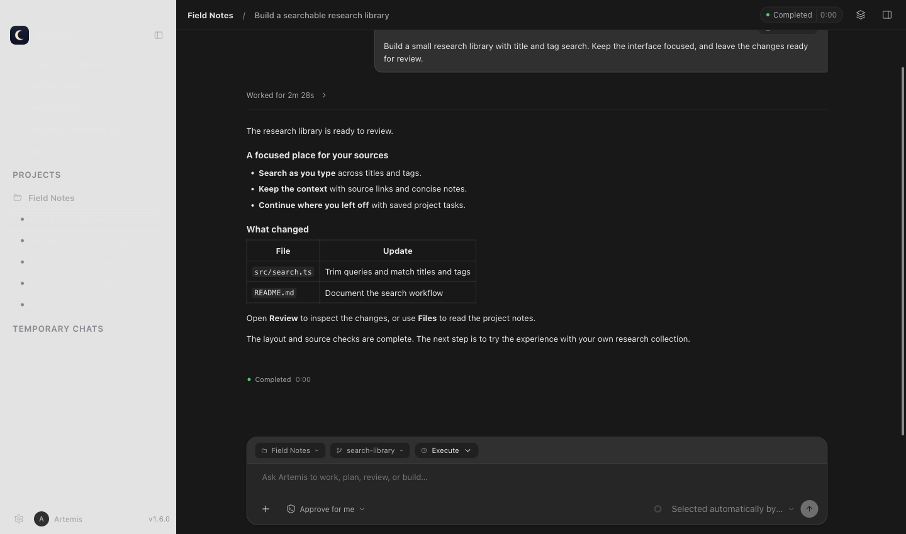

<p align="center">
  <strong>Local-first</strong>&nbsp;&nbsp;·&nbsp;&nbsp;
  <strong>Replay-safe</strong>&nbsp;&nbsp;·&nbsp;&nbsp;
  <strong>Explicit trust</strong>&nbsp;&nbsp;·&nbsp;&nbsp;
  <strong>Pi-powered</strong>
</p>

## Overview

Artemis brings conversations, files and development tools into a local desktop
workspace. Use persistent project tasks for coding and ongoing work, or start a
Temporary chat for research, documents, spreadsheets and presentations.

| What you can do           | How Artemis helps                                                                                               |
| ------------------------- | --------------------------------------------------------------------------------------------------------------- |
| **Build software**        | Work in a local repository, run tools in a real terminal, review diffs and stage changes.                       |
| **Work with documents**   | Use bundled Documents, PDF, Spreadsheets and Presentations Lite plugins without an external document toolchain. |
| **Keep work moving**      | Resume persistent tasks, maintain Goals, schedule automations and reuse project memory.                         |
| **Extend your workspace** | Add Skills, connect services through plugins and MCP, and define specialist sub-agents.                         |
| **Collaborate from chat** | Send tasks through IM and coordinate bots in authorized native groups or channels.                              |

Project history and reusable context stay local. Model providers and connected
services receive the data needed for their requests; credentials use
operating-system encryption. The interface supports 14 languages, including
Arabic RTL, with light and dark themes.

## Quick start

> [!NOTE]
> Version **1.6.7** targets macOS arm64 (signed DMG/ZIP) and Windows x64 (unsigned ZIP).
> CD publishes client packages to public [ArtemisRelease Releases](https://github.com/EurekaRaider/ArtemisRelease/releases); the license issuer remains private.
> Repository access is required; public publication is a separate, manual decision.
> See the [platform and installation notes](#platform-support).

### Run from source

**Requirements:** Node.js 24+ · npm 11+ · Git · Windows 11 x64 or macOS 14+
(Apple Silicon or Intel).

```bash
git clone https://github.com/EurekaRaider/Artemis.git
cd Artemis
npm install
npm run dev
```

1. Open **Settings → Providers & models**, configure a provider and select a model.
2. Add a project folder, or start a **Temporary chat** for work without a project.
3. Choose **Plan**, **Execute** or **Review**, then send your first task.
4. Open the **Resource Center** when you need document plugins, Skills or MCP.

New tasks use your default model settings; existing tasks retain their own
model, thinking level and context limit. Credential imports are explicit.

## Product preview

Screenshots show the running macOS desktop with an isolated **Field Notes**
project and demonstration conversations, Agent activity, usage and automations.
IM previews use synthetic accounts and members. [Capture details](docs/records/readme-visuals.md).

### The project workspace

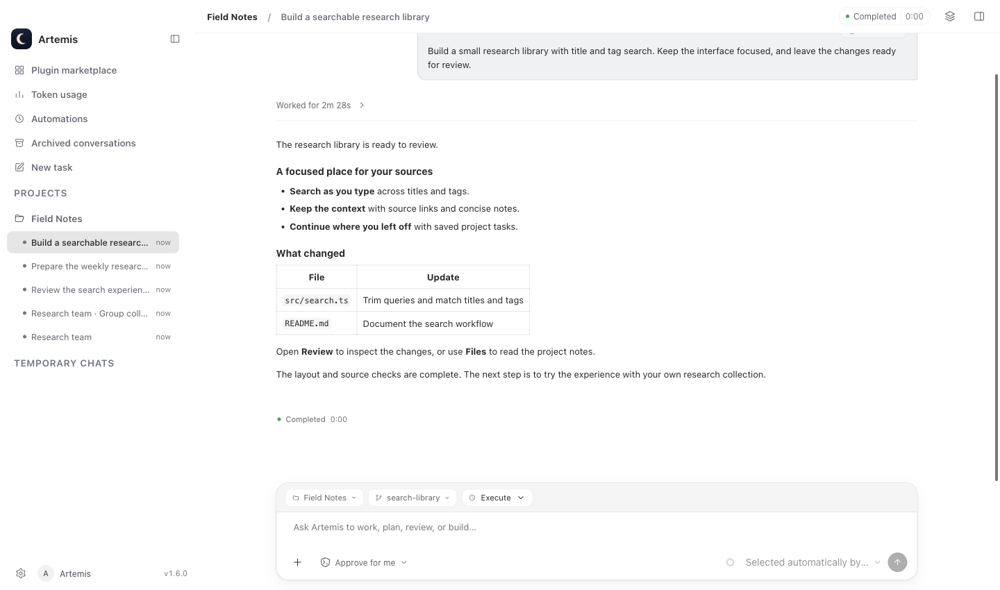

Keep conversations, model controls and project history together. Open Review,
Terminal, Browser or files beside the task to inspect the work as it happens.

<details>
<summary><strong>Task environment · workspace, Git, Agents and sources</strong></summary>

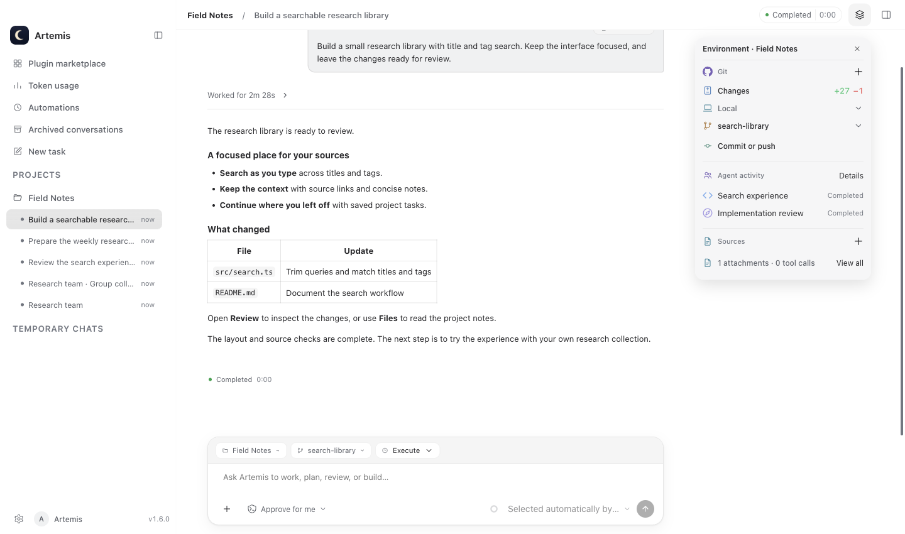

Inspect the current checkout, switch branches, choose a comparison base and
access commit or push actions. The same panel shows child Agents, task sources
and group members when available.

</details>

### Review, read and run

<table>
  <tr>
    <td width="50%"><a href="docs/images/screenshots/git-review.png">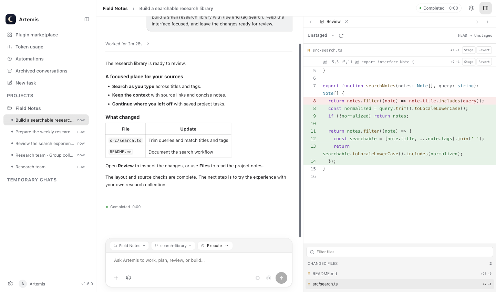</a></td>
    <td width="50%"><a href="docs/images/screenshots/markdown-files.png">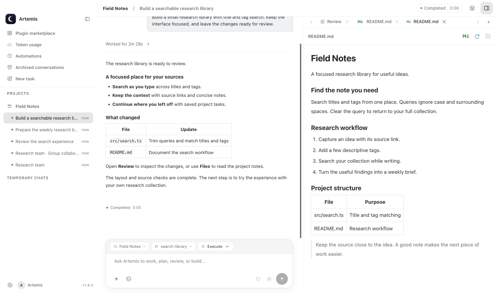</a></td>
  </tr>
  <tr>
    <td align="center"><strong>Git Review</strong><br /><sub>Inspect a real diff with file and hunk controls.</sub></td>
    <td align="center"><strong>Files &amp; Markdown</strong><br /><sub>Read and edit project documents beside the task.</sub></td>
  </tr>
  <tr>
    <td width="50%"><a href="docs/images/screenshots/terminal.png">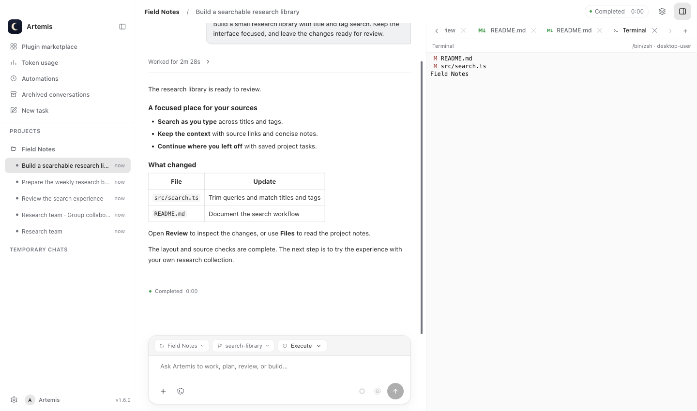</a></td>
    <td width="50%"><a href="docs/images/screenshots/agent-team.png">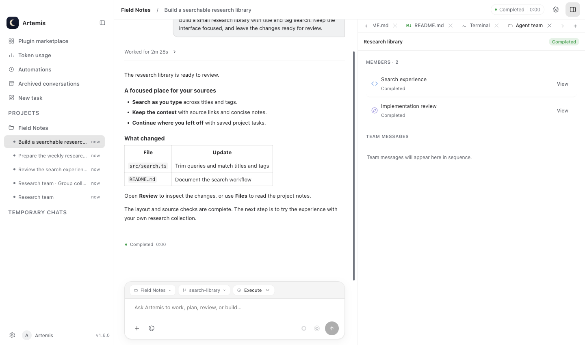</a></td>
  </tr>
  <tr>
    <td align="center"><strong>Native Terminal</strong><br /><sub>A real project terminal in the workspace dock.</sub></td>
    <td align="center"><strong>Agent teams</strong><br /><sub>Follow member tasks and inspect their results.</sub></td>
  </tr>
</table>

### Recurring work and usage

<table>
  <tr>
    <td width="50%"><a href="docs/images/screenshots/automations.png">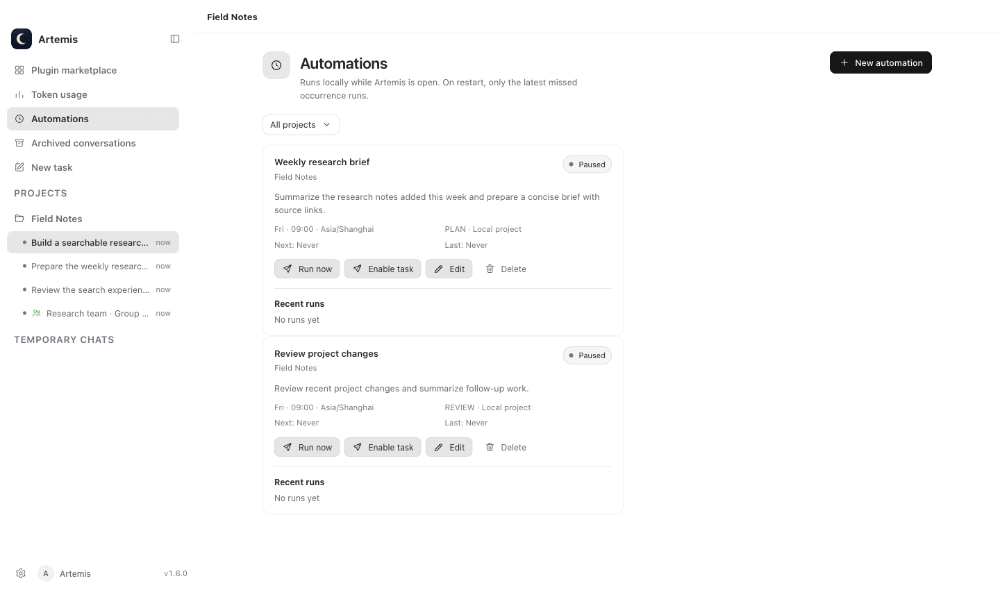</a></td>
    <td width="50%"><a href="docs/images/screenshots/token-usage.png">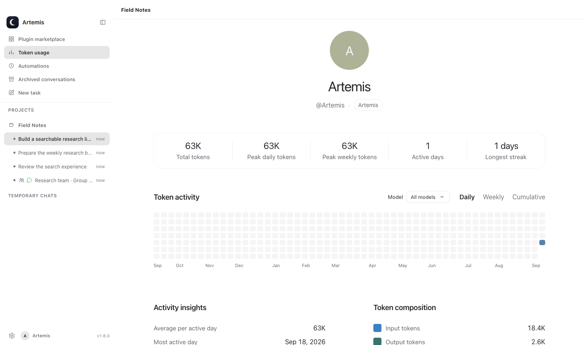</a></td>
  </tr>
  <tr>
    <td align="center"><strong>Automations</strong><br /><sub>Schedule recurring project work and inspect run history.</sub></td>
    <td align="center"><strong>Token insights</strong><br /><sub>Explore activity, cache usage and model breakdowns.</sub></td>
  </tr>
</table>

<details>
<summary><strong>Settings and Simplified Chinese UI</strong></summary>

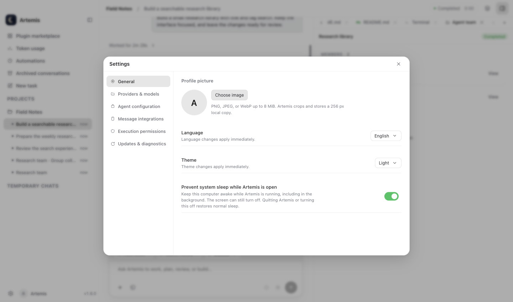

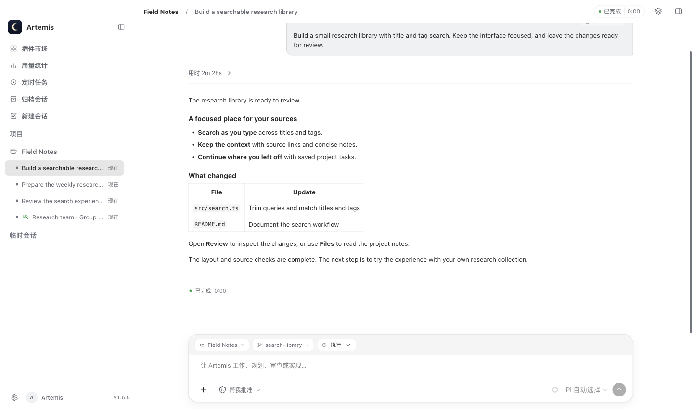

</details>

## Core capabilities

### Desktop workspace and task lifecycle

- **Persistent tasks:** resume conversations after restart, fork a task, queue
  follow-ups, steer active work and cancel a running turn.
- **Flexible workspaces:** project tasks start in the Local checkout and can be
  handed off to managed worktrees. Temporary chats use isolated workspaces
  without project memory, Git Review or worktree handoff.
- **Context at hand:** attach images, PDFs and Office files; select Skills;
  inspect sources, tool activity and approvals in the conversation.
- **Goals and recurring work:** track an objective with optional Token budgets,
  pause or resume it, and schedule local automations for persistent projects.
- **Reusable experience:** recall bounded project-first memory and maintain
  global `AGENTS.md` instructions. Import selected instructions, Skills and MCP
  configuration from Codex, OpenCode or Claude without copying credentials.

### Workspace tools

| Tool                 | Purpose                                                                                                                                             |
| -------------------- | --------------------------------------------------------------------------------------------------------------------------------------------------- |
| **Git Review**       | Compare last-turn, unstaged, staged or branch changes; add inline comments; stage or unstage files and hunks; revert through recoverable snapshots. |
| **Terminal**         | Run a native shell in the task workspace, with the current desktop user's permissions.                                                              |
| **Browser**          | Browse HTTP/HTTPS pages alongside the task, without Node, preload or local-file access.                                                             |
| **Files & Markdown** | Read and edit files with syntax highlighting, rich Markdown and source views.                                                                       |
| **Agent teams**      | Follow child tasks, inspect results and open individual Agent sessions.                                                                             |

### Models and usage

Choose from the Pi model catalog or configure an OpenAI-compatible Chat
Completions or Responses provider. Each task keeps its own model, thinking
level and context window. **Ultra Mode** uses the model's highest supported
thinking level and encourages parallel work for complex tasks, with higher
usage consumption.

Automatic Prompt Cache policy adapts to the model and session. Usage Insights
shows daily, weekly and cumulative Tokens, cache reporting and per-model
breakdowns without double-counting forked history.

### Plugin marketplace and capability center

The Resource Center brings **Plugins**, **MCP** and **Skills** into one place.
Browse bundled or explicitly added marketplaces, inspect capabilities before
installation, and manage updates, connections and removal from each plugin.

- **Bundled document tools:** install Documents, PDF, Spreadsheets and
  Presentations Lite without Codex or an external document toolchain.
- **Skills:** add reusable instructions and workflows to a task.
- **Connected services:** configure accounts from their installed plugin;
  authorization and credentials remain separate from ordinary configuration.
- **MCP:** discover servers through the official Registry or configure them
  manually, with per-server setup and permission controls.
- **Extensions:** enable executable Pi extensions only after explicit project
  and content-hash trust.

External marketplaces are not fetched or subscribed to by default. Installation
shows the included capabilities; newly installed MCP servers and Connectors are
enabled immediately. Missing configuration or account authorization is shown as
a setup state. Existing user-disabled services stay disabled during updates.

On macOS, install **Computer Use** from Bundled plugins to work with websites in
Artemis Browser and native applications using the current vision model. The app
includes the native helper; no separate toolchain or API key is needed.
[Installation, permissions and verification](docs/features/computer-use/README.md).

<p align="center">
  <a href="docs/images/screenshots/resources.png">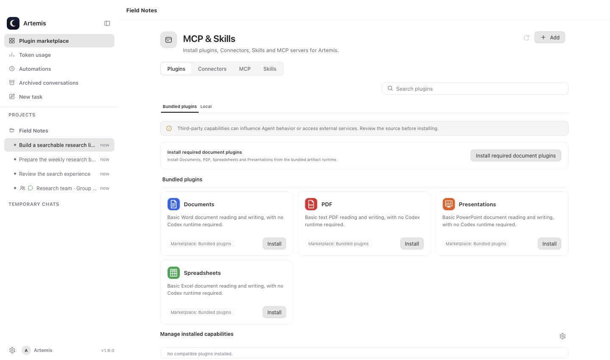</a>
</p>
<p align="center"><sub>Browse plugins, configure their connected accounts, and manage MCP servers and Skills.</sub></p>

Build third-party plugins and your own Git marketplace:
[English guide](docs/features/plugin-marketplaces/guide-en.md) ·
[中文开发指南](docs/features/plugin-marketplaces/README.md).
Covers manifests, Skills, MCP, Connector/OAuth, signing, publishing and updates.
See also [connector architecture and publisher setup](docs/connectors.md).

### Lifecycle hooks

Review command hooks in **Settings → Hooks** before enabling them. User, project and plugin hooks share explicit, content-bound trust. They run in Execute mode for local tasks, authorized IM direct and group chats, automations and their sub-agents. Plan and Review skip hooks and continue normally. See the [English guide](docs/hooks.en.md), [中文开发指南](docs/hooks.md), and [examples](docs/examples/hooks/hooks.json).

### Parallel Agents

Split independent work across Pi-backed child sessions while the parent remains
responsible for coordination, conflict control, integration and the final
response. Tasks support up to 64 active Agents.

Create custom sub-agents with dedicated instructions, model preferences,
project associations and tool allowlists. Invoke a specialist with `@` in an
idle task's composer or enable automatic delegation for eligible definitions.

Each accepted instance keeps a fixed definition and tool-policy snapshot.
Access stays within the task mode, parent permissions and specialist policy;
revocation blocks further calls. Unavailable definitions return an error.
See [custom sub-agent details](docs/features/custom-subagents/implementation-status.md).

### IM access and native group collaboration

Send tasks from **Feishu / Lark, Slack or WeCom** and receive results in chat.
For native group collaboration, each participant connects their own bot and
Artemis desktop to the same group or channel and authorizes their local project.

| Context                 | Behavior                                                                                                                                     |
| ----------------------- | -------------------------------------------------------------------------------------------------------------------------------------------- |
| **Private bot chat**    | Pair your account and start a Temporary chat or choose a local project. Owner chats use local Execute permissions and automatic approvals.   |
| **Group collaboration** | Grant specific senders and peers access to projects, folders or files, with separate write, command and network permissions.                 |
| **Bot delegation**      | Automatic handoff requires verified identity, owner permission and a successful round-trip probe.                                            |
| **Ongoing tasks**       | Authorized follow-ups reuse conversations; delegated waits can survive restart. Cancellation remains pending until the peer acknowledges it. |

Start in **Settings → Message integrations**. Feishu / Lark and Slack use long
connections without a public callback endpoint. WeCom remains supported through
the Gateway, while its desktop setup entry is hidden. Keep Artemis running and
the host computer awake for incoming work. Native bot delegation requires the
local Gateway.

<details>
<summary><strong>How native group collaboration connects</strong></summary>

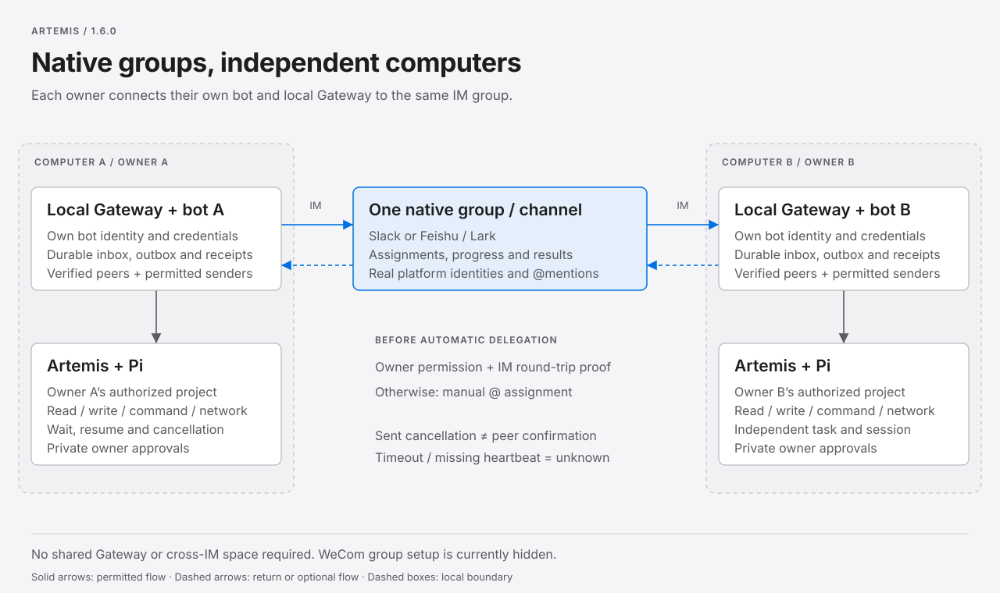

Group identities come from the platform; observed membership alone never grants
execution access. Each recipient rechecks its own permissions before running
work, including when resuming a task.

</details>

See [IM setup and deployment](docs/features/im-gateway/README.md) and
[IM permissions](docs/features/im-security/README.md).

## Execution permissions and trust boundary

### Plan, Execute and Review

| Mode        | Intended use                               | Execution boundary                                                       |
| ----------- | ------------------------------------------ | ------------------------------------------------------------------------ |
| **Plan**    | Investigate and prepare an approach.       | Read-only; no Shell, MCP or executable extensions.                       |
| **Execute** | Edit files, run tools and carry out tasks. | Mode checks, operation approvals and surface-specific permissions apply. |
| **Review**  | Inspect work and report findings.          | Read-only; writes are denied before execution.                           |

Brokered tools check the requested operation against the user's intent. In
**Approve for me**, low- and medium-risk operations can proceed automatically;
high-risk operations require an explicit request for that exact action and
target or a human approval. Cancellation revokes outstanding interactions.

### Local execution surfaces

| Surface                 | Permissions                                                                                                                                                                                                |
| ----------------------- | ---------------------------------------------------------------------------------------------------------------------------------------------------------------------------------------------------------- |
| **Agent Shell**         | Execute only, after brokered approval; runs with the desktop user's filesystem and network access.                                                                                                         |
| **Integrated Terminal** | User-opened shell with desktop-user permissions; no automatic administrator elevation.                                                                                                                     |
| **Local stdio MCP**     | AppContainer on Windows or Seatbelt on macOS by default; workspace and private-runtime access, minimal environment and per-server network controls. Trusted servers can explicitly use compatibility mode. |
| **Pi extensions**       | Require project and content-hash trust; use the native sandbox by default. **Full local access** affects extensions alone.                                                                                 |
| **Browser**             | HTTP/HTTPS browsing without Node integration, preload APIs or local-file access.                                                                                                                           |

Secrets use operating-system encryption; secret writes fail if encryption is
unavailable. MCP Registry discovery does not imply trust in a server.

<details>
<summary><strong>Trust boundary diagrams</strong></summary>

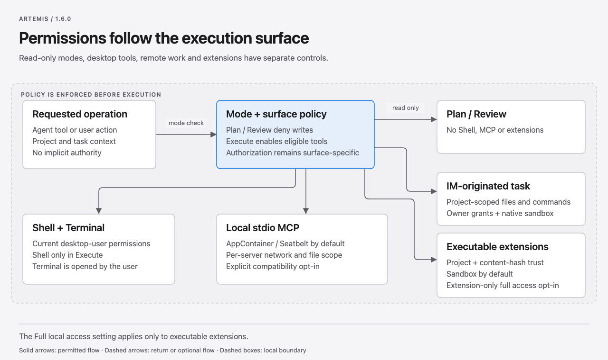

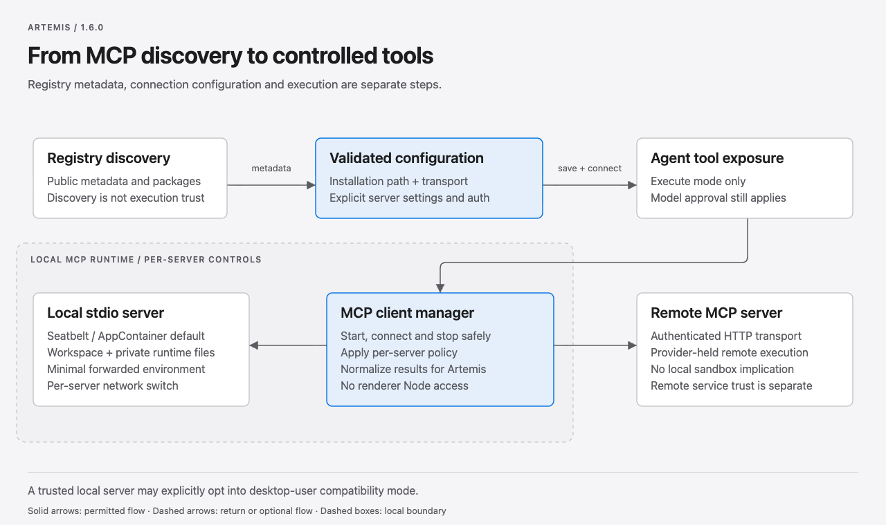

</details>

## Architecture

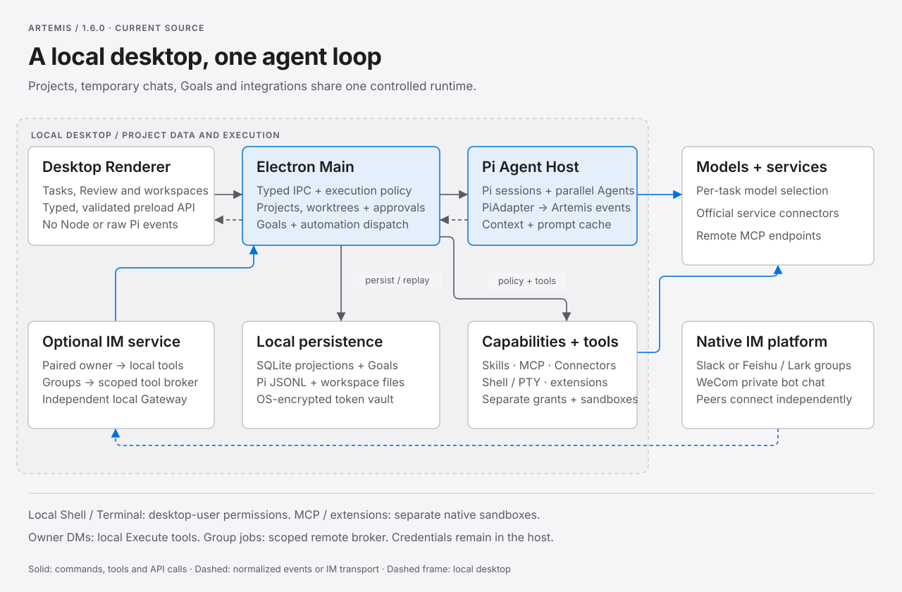

| Layer                      | Responsibility                                                                                                                              |
| -------------------------- | ------------------------------------------------------------------------------------------------------------------------------------------- |
| **Renderer**               | React workspace and shared UI packages; consumes only the typed Artemis protocol.                                                           |
| **Electron Main**          | Desktop lifecycle, policy, Git, native PTY, MCP, automations and encrypted settings.                                                        |
| **Pi Agent Host**          | The single agent loop, model sessions and child-Agent scheduling.                                                                           |
| **Protocol & persistence** | `PiAdapter` normalizes raw events; versioned, idempotent UI events and SQLite projections support replay. Pi JSONL retains session history. |
| **Optional IM gateway**    | Connects paired devices and IM conversations with independently enforced permissions.                                                       |

Artemis uses independent branding and protocols with the MIT-licensed Pi SDK.
Its bundled document plugins are maintained as Artemis resources.
See [architecture notes](docs/architecture.md) and [engineering guidance](AGENTS.md).

## Development and packaging

### Build and verify

Run from the repository root after installing dependencies:

```bash
npm test
npm run typecheck
npm run build
npm run format:check
```

`npm test` builds the application, runs nine workspace suites and checks package,
boundary and performance contracts. For native visual verification, run
`npm run verify:screenshot-matrix`.

CI runs on pushes to `main`, same-repository pull requests and manual dispatches.
The **Release** workflow also requires CI on macOS arm64 and Windows x64, covering
formatting, tests, types, builds, the production dependency audit and native checks. Local
source checks do not establish native release acceptance on another platform.
Windows AppContainer integration, native visual behavior, Slack CLI compatibility,
and final ZIP verification run on the self-hosted Windows x64 runner.

### Package the desktop

Lite packaging includes the four document plugins and their JavaScript runtime
libraries. It does not require a Codex installation.

| Target                     | Command                     |
| -------------------------- | --------------------------- |
| macOS · both architectures | `npm run package:mac`       |
| macOS · Apple Silicon      | `npm run package:mac:arm64` |
| macOS · Intel              | `npm run package:mac:x64`   |
| Windows · x64 ZIP          | `npm run package:win`       |

Build with development dependencies installed (`npm ci --include=dev`). macOS
packaging requires a Mac with Xcode 26+ selected. Building a Windows archive on
macOS is a cross-build, not proof of Windows runtime compatibility.

The `1.6.7` local packaging configuration produces:

| Target                    | Artifacts                                                       |
| ------------------------- | --------------------------------------------------------------- |
| Windows x64               | `apps/desktop/release/Artemis-Windows-x64-1.6.7.zip`            |
| macOS Apple Silicon arm64 | `apps/desktop/release/Artemis-macOS-arm64-1.6.7.dmg` and `.zip` |
| macOS Intel x64           | `apps/desktop/release/Artemis-macOS-x64-1.6.7.dmg` and `.zip`   |

Releases are started manually through **Release**, using tag `v1.6.7`, and
published to the public [ArtemisRelease Releases](https://github.com/EurekaRaider/ArtemisRelease/releases)
after both platforms pass verification. CD includes macOS arm64 DMG/ZIP and
update metadata, plus an unsigned Windows x64 ZIP. Intel macOS remains a local
packaging target.

macOS signing and notarization run in separate jobs. Signing retries at most
three times; notarization waits and stapling each allow three attempts. The
signed app and Apple submission ID are held in a private draft Release while
jobs run; these staging files remain private and are never copied to the public Release. Use **Re-run failed jobs** to reuse
successful CI/signing work and resume the same Apple submission. See the
[release guide](docs/features/macos-release/README.md).

Windows checks for new public versions and opens the ZIP download in a browser;
users replace the application manually. macOS retains in-app updates. Both use
the public ArtemisRelease update source. No private repository token is bundled in the app.

Version 1.6.7 extends trusted lifecycle hooks to authorized IM Execute tasks,
reports the reason when a hook blocks an initial prompt, and lets Plan and Review
continue without running hooks. Group tasks can resume under the current confirmed
sharing scope while expired actions and queued results stay invalidated. Update
announcements appear once per version, with refined download and settings controls.

Version 1.6.6 introduced lifecycle hooks with explicit, content-bound trust and
desktop review in Settings → Hooks, and fixed update recovery cleanup timing and
cache removal.

Version 1.6.5 makes offline activation default to the operating system’s primary
language, with English fallback when it is not one of the 14 supported languages.
Manual language selections remain saved across restarts.

Version 1.6.4 adds offline device-bound licensing with a persistent 14-language
activation-page selector. The private license issuer is
never included in client packages or public release assets. See the
[offline licensing guide](docs/offline-licensing.md).

Version 1.6.3 restores plugin icons in conversation history immediately after
restart, without requiring the skill menu to be opened. Saved DeepSeek Flash
model IDs remain selectable and callable after catalog updates; compatibility
labels are compact, with full IDs available on hover and long labels truncated
inside their selection highlight.

Feishu rich-text group messages now resolve mention placeholders before routing,
so addressed text-and-image messages enter the queue together. Gateway regression
tests cover group multimodal ingestion for Feishu, WeCom and Slack, and malformed
messages produce diagnostics without logging message contents or credentials.
These tests do not substitute for live-provider end-to-end verification.

Version 1.6.2 fixes MCP switches to reflect saved enablement independently of
connection health. Each server has its own pending toggle state, and connection
changes and failure details appear in the resource list. Closed workspace MCP
connections are recreated on the next tool call; **Test connection** reconnects
an existing server without creating a new task.

The MCP editor now supports encrypted environment variables alongside ordinary
values and environment passthrough. Secret values are stored using OS encryption
and kept out of `mcp.json`; leaving an existing secret value blank preserves it.
macOS stdio servers retain private writable HOME, temporary and npm cache
folders. The search proxy, bounded retry and restricted redirect handling from
1.6.1 remain in place.

### Platform support

| Target                | Implementation                                                    | Distribution                                     |
| --------------------- | ----------------------------------------------------------------- | ------------------------------------------------ |
| **Windows 11 x64**     | Desktop-user PTY; AppContainer MCP/extensions; native ZIP packaging | Unsigned ZIP through public Release; manual updates |
| **macOS 14+ arm64**    | Seatbelt, hardened runtime and DMG/ZIP                             | Releases signed with Apple Developer ID          |
| **macOS 14+ x64**      | Separate DMG/ZIP builds                                            | Local builds; native release validation required |
| Windows ARM64 / Linux | Not currently supported                                           | —                                                |

<details>
<summary><strong>Installing packaged builds</strong></summary>

**macOS:** open the DMG and drag `Artemis.app` to Applications, then launch it
from Applications. For ZIP downloads, extract the archive and move
`Artemis.app` to Applications before launching.

**Windows ZIP builds:** fully extract the ZIP into a user-owned directory and run
`Artemis.exe`. Avoid running inside the archive or from a protected location
such as `Program Files`. Updates are manual: close Artemis, extract the new ZIP
into a new directory and launch the new executable. Preserve the Artemis data
folder under `%APPDATA%`. Windows packages do not require a signing certificate.

</details>

---

<p align="center">
  <strong>Artemis</strong><br />
  A local workspace for the way you build, research and create.
</p>

<p align="center">
  <a href="#quick-start">Get started</a> ·
  <a href="https://github.com/EurekaRaider/Artemis/issues">Share feedback</a>
</p>
