<div align="center">


# Artemis

A local-first desktop agent for coding, research and everyday work.

<p>
  <a href="#im-access-and-native-group-collaboration"></a>
  <a href="#im-access-and-native-group-collaboration"></a>
  <a href="#parallel-agents"></a>
  <a href="#parallel-agents"></a>
</p>

<p>
  <a href="#plugin-marketplace-and-capability-center"></a>
  <a href="#recurring-work-and-usage"></a>
  <a href="#platform-support"></a>
  <a href="#platform-support"></a>
</p>

[Quick start](#quick-start) · [Preview](#product-preview) · [Features](#core-capabilities) · [Permissions](#execution-permissions-and-trust-boundary) · [Development](#development-and-packaging)

</div>

---

<p align="center"><sub>Artemis desktop · persistent project conversation · dark theme</sub></p>

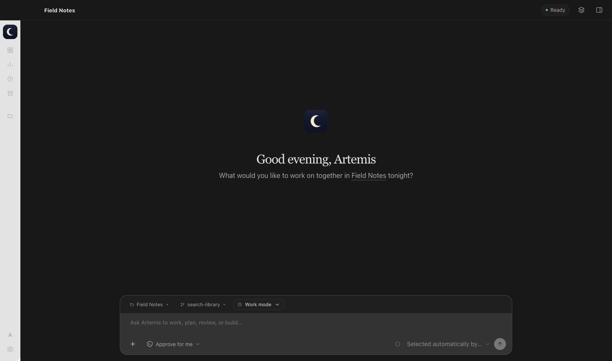

<p align="center">
  <strong>Local-first</strong>&nbsp;&nbsp;·&nbsp;&nbsp;
  <strong>Replay-safe</strong>&nbsp;&nbsp;·&nbsp;&nbsp;
  <strong>Explicit trust</strong>&nbsp;&nbsp;·&nbsp;&nbsp;
  <strong>Pi-powered</strong>
</p>

## Overview

Artemis brings conversations, files and development tools into a local desktop
workspace. Use persistent project tasks for coding and ongoing work, or start a
Temporary chat for research, documents, spreadsheets and presentations.

| What you can do           | How Artemis helps                                                                                               |
| ------------------------- | --------------------------------------------------------------------------------------------------------------- |
| **Build software**        | Work in a local repository, run tools in a real terminal, review diffs and stage changes.                       |
| **Work with documents**   | Use bundled Documents, PDF, Spreadsheets and Presentations Lite plugins without an external document toolchain. |
| **Keep work moving**      | Resume persistent tasks, maintain Goals, schedule automations and reuse project memory.                         |
| **Extend your workspace** | Add Skills, connect services through plugins and MCP, and define specialist sub-agents.                         |
| **Collaborate from chat** | Send tasks through IM and coordinate bots in authorized native groups or channels.                              |

Project history and reusable context stay local. Model providers and connected
services receive the data needed for their requests; credentials use
operating-system encryption. The interface supports 14 languages, including
Arabic RTL, with light and dark themes.

## Quick start

> Artemis is MIT-licensed and starts without activation or device registration.
> Supported targets are Windows x64 and macOS arm64. Downloads remain at
> [ArtemisRelease](https://github.com/EurekaRaider/ArtemisRelease/releases).
> See [installation](docs/install.md) and [contribution rules](CONTRIBUTING.md).

### Run from source

**Requirements:** Node.js 26 · npm 11+ · Git · Windows 11 x64 or macOS 14+
(Apple Silicon).

```bash
git clone https://github.com/EurekaRaider/Artemis.git
cd Artemis
npm install
npm run dev
```

1. Open **Settings → Providers & models**, configure a provider and select a model.
2. Add a project folder, or start a **Temporary chat** for work without a project.
3. Choose **Plan**, **Work** or **Codemode**, then send your first task.
4. Open the **Resource Center** when you need document plugins, Skills or MCP.

New tasks use your default model settings; existing tasks retain their own
model, thinking level and context limit. Credential imports are explicit.

## Product preview

Screenshots show the running macOS desktop with an isolated **Field Notes**
project and demonstration conversations, Agent activity, usage and automations.
IM previews use synthetic accounts and members. [Capture details](docs/records/readme-visuals.md).

### The project workspace

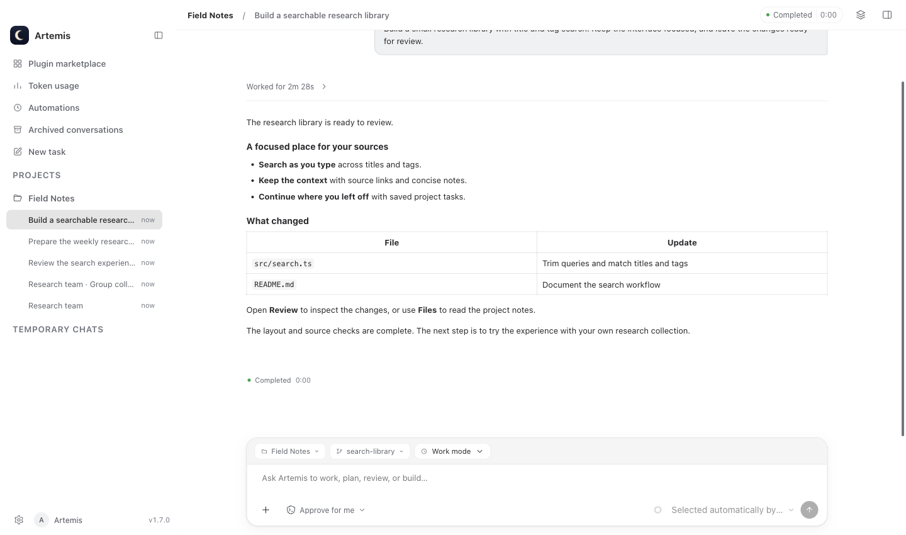

Keep conversations, model controls and project history together. Open Review,
Terminal, Browser or files beside the task to inspect the work as it happens.

<details>
<summary><strong>Task environment · workspace, Git, Agents and sources</strong></summary>

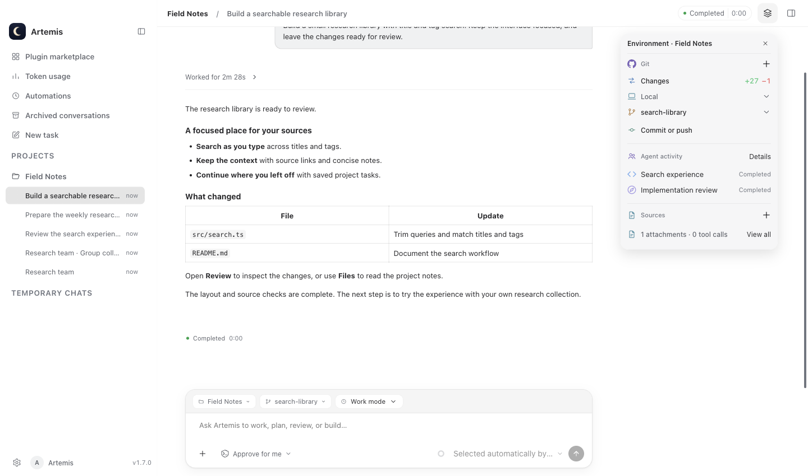

Inspect the current checkout, switch branches, choose a comparison base and
access commit or push actions. The same panel shows child Agents, task sources
and group members when available.

</details>

### Review, read and run

<table>
  <tr>
    <td width="50%"><a href="docs/assets/images/git-review.png">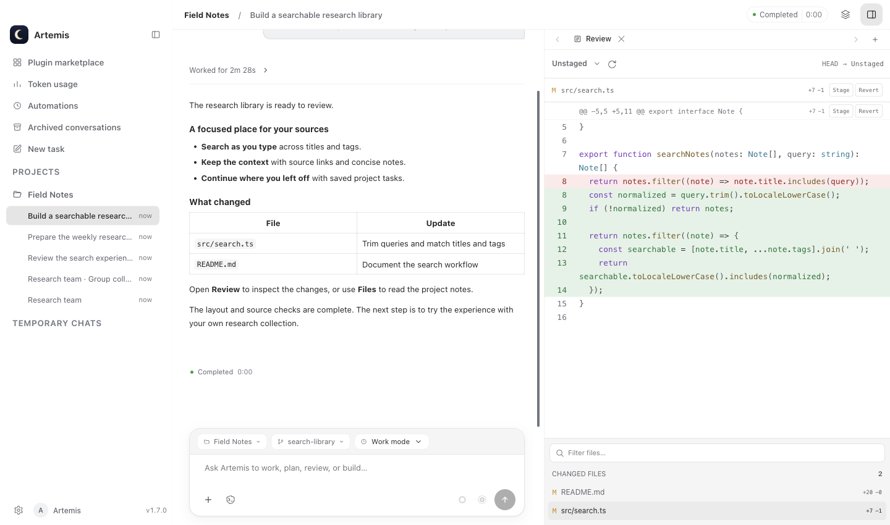</a></td>
    <td width="50%"><a href="docs/assets/images/markdown-files.png">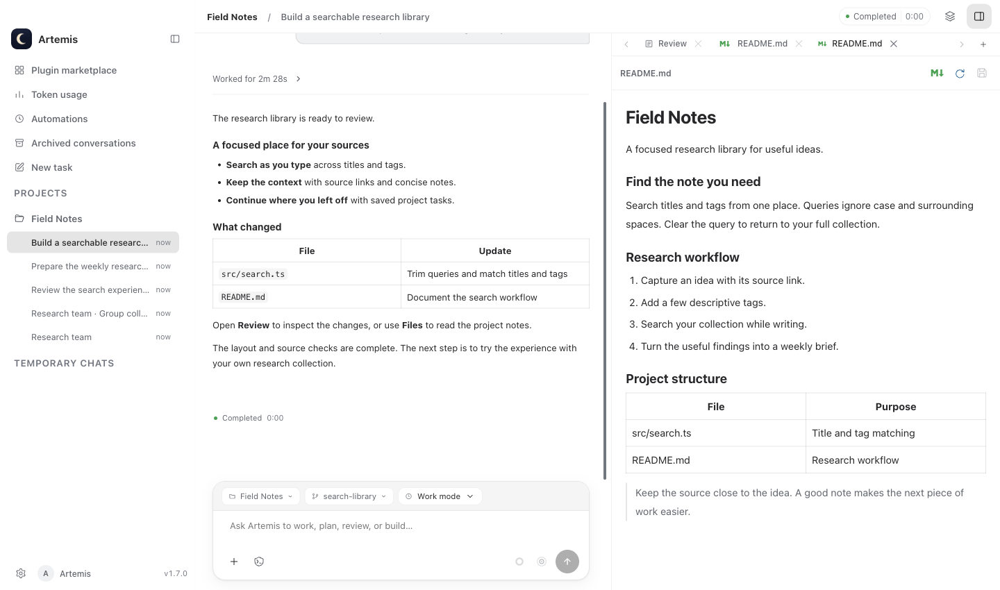</a></td>
  </tr>
  <tr>
    <td align="center"><strong>Git Review</strong><br /><sub>Inspect a real diff with file and hunk controls.</sub></td>
    <td align="center"><strong>Files &amp; Markdown</strong><br /><sub>Read and edit project documents beside the task.</sub></td>
  </tr>
  <tr>
    <td width="50%"><a href="docs/assets/images/terminal.png">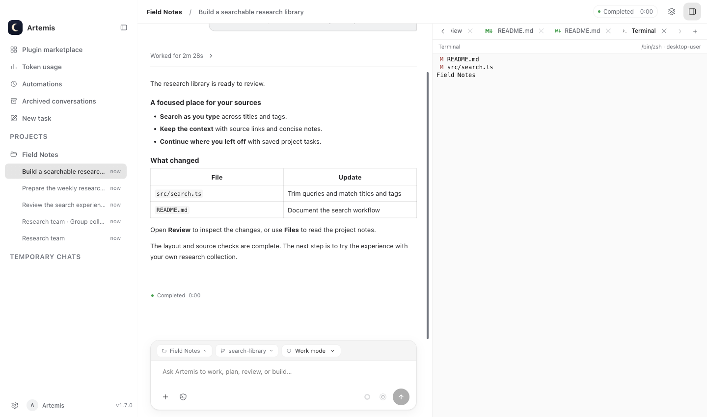</a></td>
    <td width="50%"><a href="docs/assets/images/agent-team.png">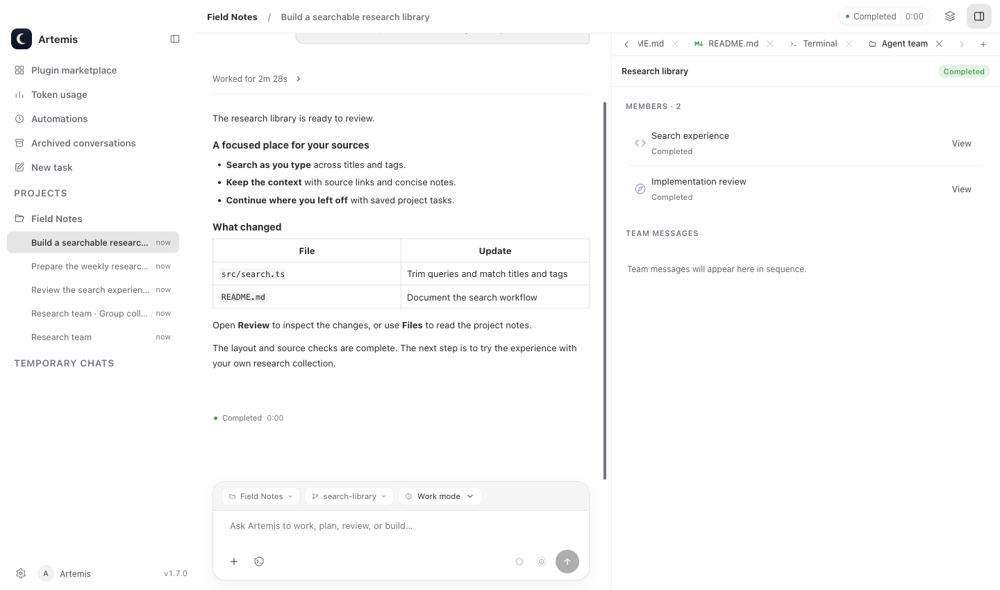</a></td>
  </tr>
  <tr>
    <td align="center"><strong>Native Terminal</strong><br /><sub>A real project terminal in the workspace dock.</sub></td>
    <td align="center"><strong>Agent teams</strong><br /><sub>Follow member tasks and inspect their results.</sub></td>
  </tr>
</table>

### Recurring work and usage

<table>
  <tr>
    <td width="50%"><a href="docs/assets/images/automations.png">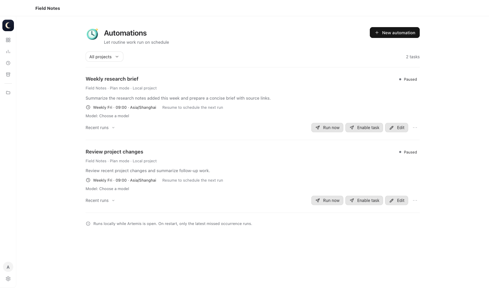</a></td>
    <td width="50%"><a href="docs/assets/images/token-usage.png">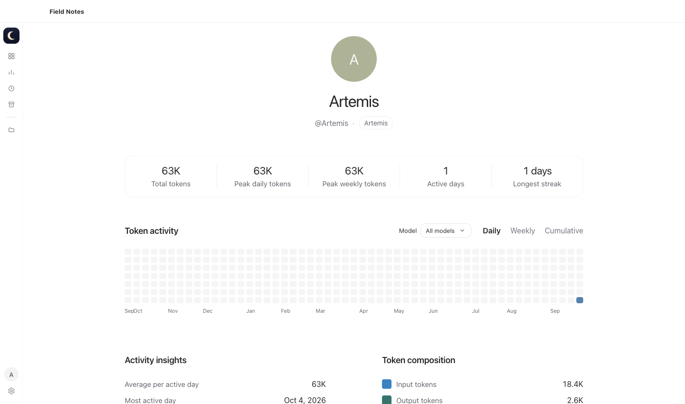</a></td>
  </tr>
  <tr>
    <td align="center"><strong>Automations</strong><br /><sub>Schedule recurring project work and inspect run history.</sub></td>
    <td align="center"><strong>Token insights</strong><br /><sub>Explore activity, cache usage and model breakdowns.</sub></td>
  </tr>
</table>

<details>
<summary><strong>Settings and Simplified Chinese UI</strong></summary>

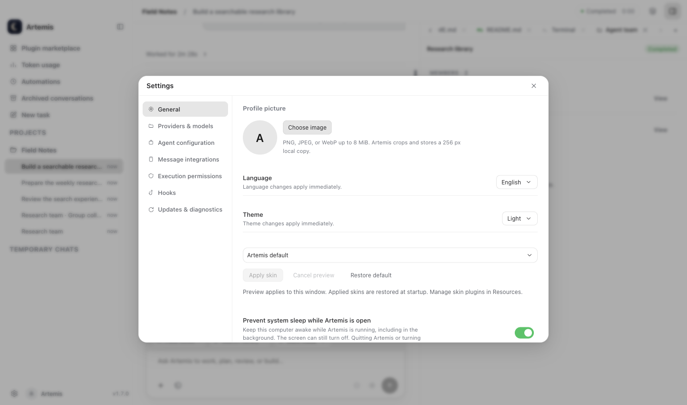

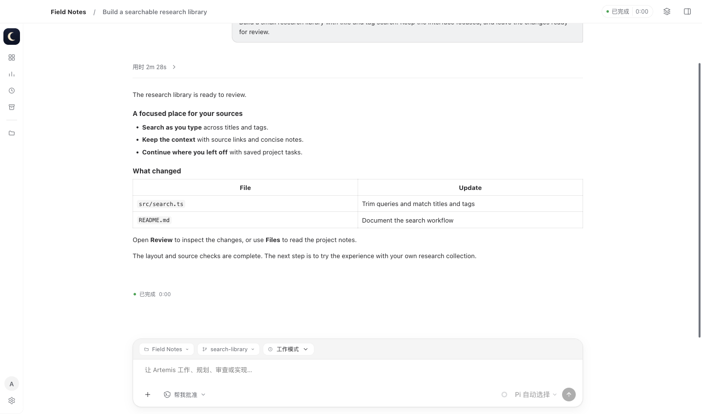

</details>

## Core capabilities

### Desktop workspace and task lifecycle

- **Persistent tasks:** resume conversations after restart, fork a task, queue
  follow-ups, steer active work and cancel a running turn.
- **Flexible workspaces:** project tasks start in the Local checkout and can be
  handed off to managed worktrees. Temporary chats use isolated workspaces
  without project memory, Git Review or worktree handoff.
- **Context at hand:** attach images, PDFs and Office files; select Skills;
  inspect sources, tool activity and approvals in the conversation.
- **Goals and recurring work:** track an objective with optional Token budgets,
  pause or resume it, and schedule local automations for persistent projects
  with their own model and reasoning settings.
- **Reusable experience:** recall bounded project-first memory and maintain
  global `AGENTS.md` instructions. Import selected instructions, Skills and MCP
  configuration from Codex, OpenCode or Claude without copying credentials.

### Workspace tools

Timeline messages preview images and animated SVGs, play local audio and video,
render Mermaid diagrams and LaTeX formulas, and show interactive local HTML.
HTML previews load scripts, styles and images from the document directory in an
isolated frame without network, Node.js or application access. Previews load
near the viewport and retain playback or interaction state as messages stream.
Office documents and PDFs appear as file cards; click a card to use the existing
right-side viewer and its capability requirements.

| Tool                 | Purpose                                                                                                                                             |
| -------------------- | --------------------------------------------------------------------------------------------------------------------------------------------------- |
| **Git Review**       | Compare last-turn, unstaged, staged or branch changes; add inline comments; stage or unstage files and hunks; revert through recoverable snapshots. |
| **Terminal**         | Run a native shell in the task workspace, with the current desktop user's permissions.                                                              |
| **Browser**          | Browse HTTP/HTTPS pages alongside the task, without Node, preload or local-file access.                                                             |
| **Files & Markdown** | Read and edit files with syntax highlighting, rich Markdown and source views.                                                                       |
| **Agent teams**      | Follow child tasks, inspect results and open individual Agent sessions.                                                                             |

### Models and usage

Choose from the Pi model catalog or configure an OpenAI-compatible Chat
Completions or Responses provider. Each task keeps its own model, thinking
level and context window. **Ultra Mode** uses the model's highest supported
thinking level and encourages parallel work for complex tasks, with higher
usage consumption.

Automatic Prompt Cache policy adapts to the model and session. Usage Insights
shows daily, weekly and cumulative Tokens, cache reporting and per-model
breakdowns without double-counting forked history.

### Plugin marketplace and capability center

The Resource Center brings **Plugins**, **MCP** and **Skills** into one place.
Browse bundled or explicitly added marketplaces, inspect capabilities before
installation, and manage updates, connections and removal from each plugin.

- **Bundled document tools:** install Documents, PDF, Spreadsheets and
  Presentations Lite without Codex or an external document toolchain.
- **Skills:** add reusable instructions and workflows to a task.
- **Connected services:** configure accounts from their installed plugin;
  authorization and credentials remain separate from ordinary configuration.
- **MCP:** discover servers through the official Registry or configure them
  manually, with per-server setup and permission controls.
- **Extensions:** enable executable Pi extensions only after explicit project
  and content-hash trust.

External marketplaces are not fetched or subscribed to by default. Installation
shows the included capabilities; newly installed MCP servers and Connectors are
enabled immediately. Missing configuration or account authorization is shown as
a setup state. Existing user-disabled services stay disabled during updates.

On macOS, install **Computer Use** from Bundled plugins to work with websites in
Artemis Browser and native applications using the current vision model. The app
includes the native helper; no separate toolchain or API key is needed.

<p align="center">
  <a href="docs/assets/images/resources.png">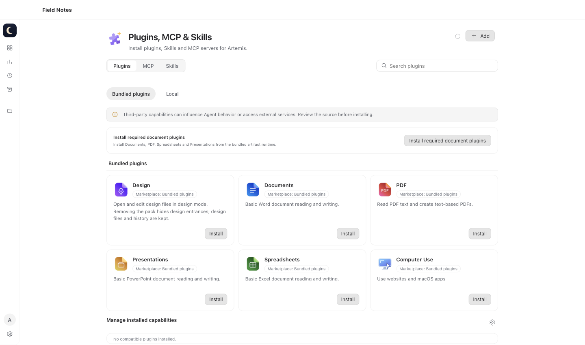</a>
</p>
<p align="center"><sub>Browse plugins, configure their connected accounts, and manage MCP servers and Skills.</sub></p>

Build third-party plugins and your own Git marketplace:
[English guide](docs/guides/plugin-marketplaces-en.md) ·
[中文开发指南](docs/guides/plugin-marketplaces.md).
Native plugins use `artemis.plugin.json`; Git marketplaces use `.artemis/marketplace.json`. Both declare `schemaVersion: 1`. Covers manifests, Skills, MCP, Connector/OAuth, signing, publishing and updates.
See also [connector architecture and publisher setup](docs/guides/connectors.md).

### Visual skins

Install a skin plugin from a marketplace or local directory, then preview, apply
or restore the default skin in **Settings**. Applied skins return after restart.
Skin v2 packages can include light/dark wallpapers, muted video backgrounds,
fonts, semantic icons and host motion presets, with high-contrast variants and
reduced-motion support. Background video pauses when the app is hidden or the
system sleeps or locks.

Create and validate packages with the [English guide](docs/guides/visual-skins-en.md),
[中文指南](docs/guides/visual-skins.md) and [examples](examples/visual-skins/README.md).

### Lifecycle hooks

Review command hooks in **Settings → Hooks** before enabling them. User, project and plugin hooks share explicit, content-bound trust. They run in Work and Codemode for local tasks, authorized IM direct and group chats, automations and their sub-agents. Plan skips hooks and continues normally. See the [English guide](docs/guides/hooks-en.md), [中文开发指南](docs/guides/hooks.md), and [examples](examples/hooks/hooks.json).

### Parallel Agents

Split independent work across Pi-backed child sessions while the parent remains
responsible for coordination, conflict control, integration and the final
response. Tasks support up to 64 active Agents.

Create custom sub-agents with dedicated instructions, model preferences,
project associations and tool allowlists. Invoke a specialist with `@` in an
idle task's composer or enable automatic delegation for eligible definitions.

Each accepted instance keeps a fixed definition and tool-policy snapshot.
Access stays within the task mode, parent permissions and specialist policy;
revocation blocks further calls. Unavailable definitions return an error.

### IM access and native group collaboration

Send tasks from **Feishu / Lark, Slack or WeCom** and receive results in chat.
For native group collaboration, each participant connects their own bot and
Artemis desktop to the same group or channel and authorizes their local project.

| Context                 | Behavior                                                                                                                                     |
| ----------------------- | -------------------------------------------------------------------------------------------------------------------------------------------- |
| **Private bot chat**    | Pair your account and start a Temporary chat or choose a local project. Owner chats use local Work permissions and automatic approvals.   |
| **Group collaboration** | Grant specific senders and peers access to projects, folders or files, with separate write, command and network permissions.                 |
| **Bot delegation**      | Automatic handoff requires verified identity, owner permission and a successful round-trip probe.                                            |
| **Ongoing tasks**       | Authorized follow-ups reuse conversations; delegated waits can survive restart. Cancellation remains pending until the peer acknowledges it. |

Start in **Settings → Message integrations**. Feishu / Lark and Slack use long
connections without a public callback endpoint. WeCom remains supported through
the Gateway, while its desktop setup entry is hidden. Keep Artemis running and
the host computer awake for incoming work. Native bot delegation requires the
local Gateway.

<details>
<summary><strong>How native group collaboration connects</strong></summary>

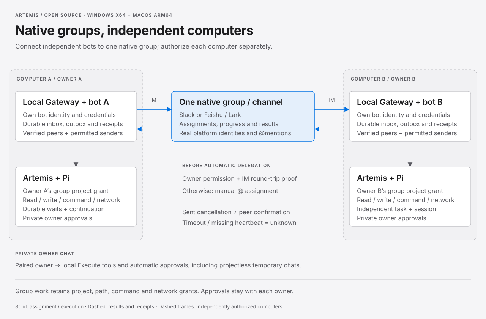

Group identities come from the platform; observed membership alone never grants
execution access. Each recipient rechecks its own permissions before running
work, including when resuming a task.

</details>

## Execution permissions and trust boundary

### Plan, Work and Codemode

| Mode | Intended use | Execution boundary |
| --- | --- | --- |
| **Plan** | Investigate, review, and submit a full plan for confirmation. | Read-only; no Shell, MCP or executable extensions. |
| **Work** | Edit files, run tools and carry out tasks. Default for new tasks. | Existing operation approvals and surface permissions apply. |
| **Codemode** | Orchestrate business tools with Pi scripts; call control tools directly. | Same permissions as Work. |

The complete Plan stays in the conversation. The composer presents choices to execute in Work, choose Codemode, or add requirements. Waiting never automatically executes. Slash commands are `/plan`, `/work` and `/codemode`; old command aliases are removed. See [mode and Pi upgrade details](docs/guides/pi-upgrade-modes.md).

Brokered tools check the requested operation against the user's intent. In
**Approve for me**, low- and medium-risk operations can proceed automatically;
high-risk operations require an explicit request for that exact action and
target or a human approval. Cancellation revokes outstanding interactions.

### Local execution surfaces

| Surface                 | Permissions                                                                                                                                                                                                |
| ----------------------- | ---------------------------------------------------------------------------------------------------------------------------------------------------------------------------------------------------------- |
| **Agent Shell**         | Work and Codemode, after brokered approval; runs with the desktop user's filesystem and network access.                                                                                                         |
| **Integrated Terminal** | User-opened shell with desktop-user permissions; no automatic administrator elevation.                                                                                                                     |
| **Local stdio MCP**     | AppContainer on Windows or Seatbelt on macOS by default; workspace and private-runtime access, minimal environment and per-server network controls. Trusted servers can explicitly use compatibility mode. |
| **Pi extensions**       | Require project and content-hash trust; use the native sandbox by default. **Full local access** affects extensions alone.                                                                                 |
| **Browser**             | HTTP/HTTPS browsing without Node integration, preload APIs or local-file access.                                                                                                                           |

Secrets use operating-system encryption; secret writes fail if encryption is
unavailable. MCP Registry discovery does not imply trust in a server.

<details>
<summary><strong>Trust boundary diagrams</strong></summary>

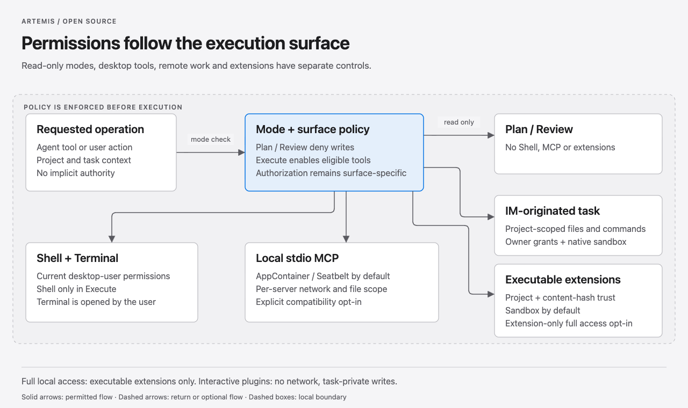

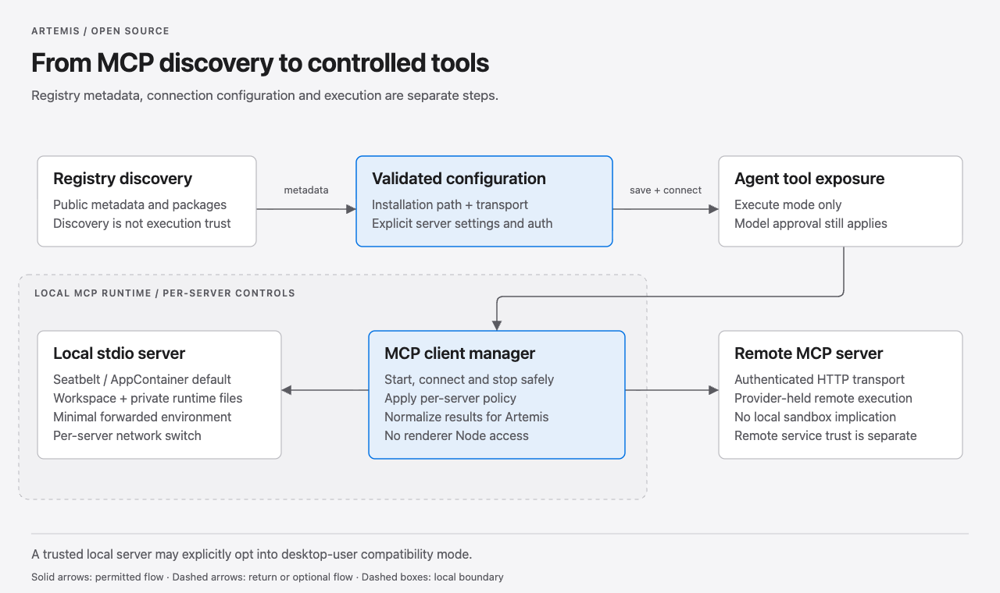

</details>

## Architecture

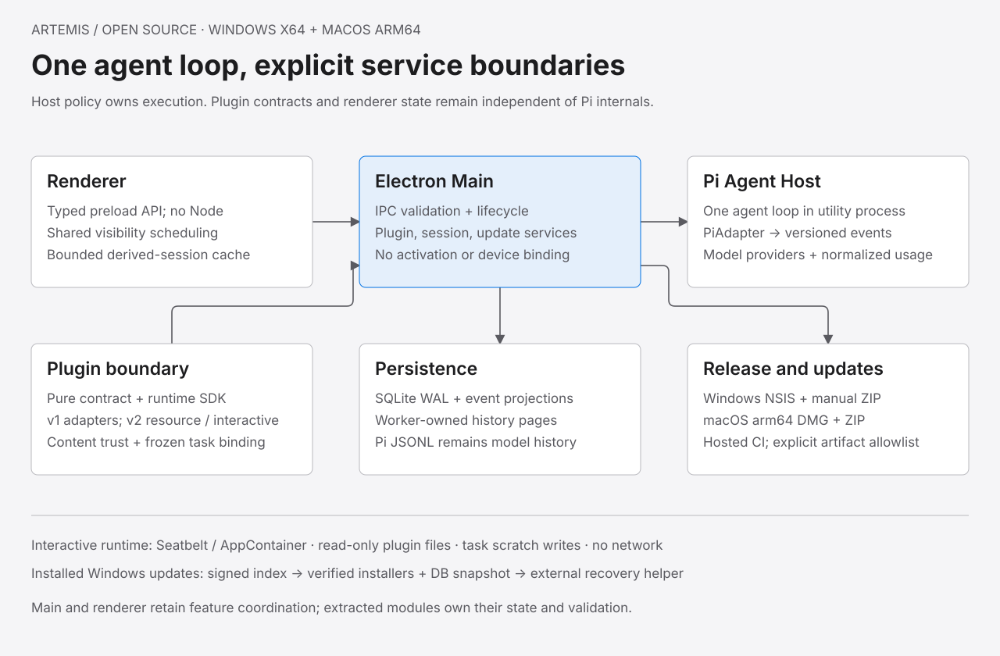

| Layer                      | Responsibility                                                                                                                              |
| -------------------------- | ------------------------------------------------------------------------------------------------------------------------------------------- |
| **Renderer**               | React workspace and shared UI packages; consumes only the typed Artemis protocol.                                                           |
| **Electron Main**          | Desktop lifecycle, policy, Git, native PTY, MCP, automations and encrypted settings.                                                        |
| **Pi Agent Host**          | The single agent loop, model sessions and child-Agent scheduling.                                                                           |
| **Protocol & persistence** | `PiAdapter` normalizes raw events; versioned, idempotent UI events and SQLite projections support replay. Pi JSONL retains session history. |
| **Optional IM gateway**    | Connects paired devices and IM conversations with independently enforced permissions.                                                       |

Artemis uses independent branding and protocols with the MIT-licensed Pi SDK.
Its bundled document plugins are maintained as Artemis resources.
See [architecture notes](docs/architecture.md) and [engineering guidance](AGENTS.md).

## Development and packaging

### Build and verify

Run from the repository root after installing dependencies:

```bash
npm test
npm run typecheck
npm run build
npm run format:check
```

`npm test` builds the application, runs nine workspace suites and checks package,
boundary and performance contracts. For native visual verification, run
`npm run verify:screenshot-matrix`.

CI runs on pushes to `main`, fork pull requests and manual dispatches, using
GitHub-hosted `windows-2025` and `macos-15`. Release requires both targets from
the same source commit. Pull request jobs have read-only permissions and no
release secrets. Native checks and actual installation evidence remain separate.

### Package the desktop

| Target | Command | Artifacts |
| --- | --- | --- |
| Windows x64 | `npm run package:win` | Per-user NSIS EXE and manual ZIP |
| macOS arm64 | `npm run package:mac` | DMG and ZIP |

The Release workflow signs and notarizes macOS packages, verifies Windows
artifacts, checks the final attachment allowlist and publishes to ArtemisRelease.
Intermediate signed macOS apps use short-lived Actions artifacts.
See the [release guide](docs/guides/release.md) for credentials and acceptance.

Installed Windows builds use an Ed25519-signed platform index, verified downloads
and an external installation/recovery helper. Recovery requires the verified
previous installer and a database snapshot. ZIP builds stay manual; install the
NSIS package once to move to the installed update channel. macOS uses its existing
in-app updater. No private repository credential is bundled in clients.

### Develop a plugin

Use `npm run plugin -- init DIR resource` or `interactive`, then `validate`,
`dev`, `pack` and `migrate`. The pure `@artemis/plugin-contract` package owns v2
metadata and JSON Schema; `@artemis/plugin-sdk` wraps runtime protocol 1.
Existing v1 plugins remain supported. Installation, enablement and authorization
remain separate; interactive plugins cannot add MCP or Hooks to escape isolation.
See the [developer guide](docs/guides/plugin-development.md) and
[examples](examples/plugins/).

### Platform support

| Target | Distribution |
| --- | --- |
| Windows x64 | Current-user NSIS installer and manual ZIP |
| macOS arm64 | Developer ID signed, notarized DMG and ZIP |
| Windows ARM64, macOS Intel, Linux | Not supported |

<details>
<summary><strong>Installing packaged builds</strong></summary>

**macOS:** open the DMG and drag `Artemis.app` to Applications, then launch it
from Applications. For ZIP downloads, extract the archive and move
`Artemis.app` to Applications before launching.

**Windows ZIP builds:** fully extract the ZIP into a user-owned directory and run
`Artemis.exe`. Avoid running inside the archive or from a protected location
such as `Program Files`. Updates are manual: close Artemis, extract the new ZIP
into a new directory and launch the new executable. Preserve the Artemis data
folder under `%APPDATA%`. Windows packages do not require a signing certificate.

</details>

---

<p align="center">
  <strong>Artemis</strong><br />
  A local workspace for the way you build, research and create.
</p>

<p align="center">
  <a href="#quick-start">Get started</a> ·
  <a href="https://github.com/EurekaRaider/Artemis/issues">Share feedback</a>
</p>
