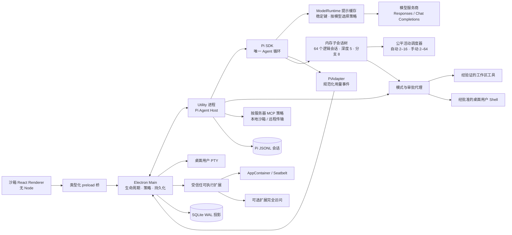

[English / 简体中文](architecture.md)

# 架构

## 运行时边界

Renderer 使用 `sandbox: true`、`contextIsolation: true` 和 `nodeIntegration: false`，只能调用 `ArtemisApi` 暴露的方法。主进程 IPC 从 SQLite 解析项目和会话 ID，不信任 Renderer 提供的路径。

Pi SDK 直接运行在 Electron Node utility 进程中，不是 CLI/RPC 辅助服务。该进程崩溃与窗口和主进程隔离。Pi SDK 负责模型／服务商行为、消息历史、压缩、Skills、提示模板、项目上下文和 JSONL 会话。根任务沿用延迟 JSONL 持久化；子 Agent 使用不可恢复的内存 Pi 会话。SQLite 保存版本化成员／团队状态迁移、消息和有界最终输出；实时活动增量以合并后的 IPC 批次投递，不持久化。

## 协议

`@artemis/protocol` 拥有所有 Renderer 可见契约：

- `RunMode`：`work | plan | codemode`。
- `WorkspaceTarget`：本地与托管 worktree；任务默认本地，用户可明确移交至托管 worktree。旧永久记录仍可读取，但不恢复永久 worktree 创建入口。
- `AgentPayload`：用户消息、流式正文／思考、工具生命周期、审批、文件变更、终端、子 Agent、完成和失败。
- `AgentEvent`：版本、事件 ID、会话／轮次 ID、序号、时间戳及负载。
- `ReviewQuery`/`ReviewMutationInput`：验证后的作用域，以及哈希寻址的文件／差异块目标。
- `TaskWorktree`/`WorktreeCommand`：持久化工作区归属和生命周期。
- `OfficeDocumentRequest`/`OfficeDocumentResult`：版本化、路径限定、规范化的 PDF、Excel、Word 和 PowerPoint 操作。

`PiAdapter` 是唯一了解 Pi 事件名的包边界，其输出与服务商无关。主进程分配权威事件 ID 和序号，先持久化，再发布给 Renderer 订阅者。Reducer 保留首次出现顺序、合并增量并忽略重复事件 ID。

## 模型运行时与提示缓存

Artemis 保持 Pi 为唯一 Agent 循环，通过包装 `ModelRuntime` 实现能力，不 fork Pi 依赖。缓存控制器对原始 Pi 会话 ID、服务商、模型、稳定系统提示及规范排序的工具 Schema 求哈希。本地诊断只记录 16 字符指纹，不记录提示正文、完整工具 Schema、原始会话 ID 或凭据。延迟 JSONL 持久化保留原始 Pi 会话 ID，因此恢复任务在其他键输入不变时保持缓存亲和性。

策略自动选择并识别端点。向 HTTPS `api.openai.com` 发送的官方 GPT-5.6 请求使用 `prompt_cache_key`、明确的 30 分钟选项及稳定系统提示断点。官方 GPT-5.5 使用长缓存策略。明确列出的旧模型为新父任务启用短缓存，持久或恢复的父任务升级为长缓存。子 Agent、未知模型、Azure 端点和兼容网关保持短缓存；Pi 压缩及其他明确请求 `none` 的单次调用保持禁用。系统提示、工具或模型变化会生成新键，不改变 Plan、Work、Codemode 的工具集合。

服务商用量在进入协议前规范化：未缓存输入、缓存读取、缓存写入和输出相加等于 `totalTokens`。可选报告标记区分明确的零和服务商未报告。可安全重放的 reducer 汇总已报告事件及策略计数，供 Token 用量页使用；本地诊断包记录有界策略原因、指纹、稳定前缀估算和每键请求率。接近每分钟 15 次请求时仅发出诊断警告，不轮换键制造冷缓存。

## 执行策略

Agent Host 提供经代理审批的文件系统工具和 Pi 内置完全本地 `bash`：

- `read`：通过词法路径和真实路径工作区校验后读取 UTF-8。
- `bash`：只在 Work/Codemode 中可用，经模型或用户代理审批后由 Pi 直接执行，使用当前桌面用户的文件系统、环境及网络权限。Plan 不接收该工具。
- `write`：在代理请求处暂停。Plan 立即拒绝；Work 或 Codemode 生成审批卡片。批准后，主进程代理再次校验路径再写入。
- `office_document`：只在 Work/Codemode 提供创建／写入／读取／修改／删除。Main 校验版本化请求和工作区路径、应用模式策略，然后调用可移植 PDF/OOXML 解析器与生成器。删除始终作为高风险单次审批。
- MCP 工具：用户启用服务器后，仅在 Work/Codemode 经配置的模型或策略审批调用。本地 stdio 默认使用 Windows AppContainer 或 macOS Seatbelt，可写任务工作区和私有运行目录，接收最小或明确转发的环境，并使用按服务器配置的网络权限。单服务器兼容选项可明确恢复桌面用户访问。
- 受信任扩展工具：验证哈希并明确授信后，在一次性原生沙箱进程中发现和调用。

用户打开的集成 PTY 使用当前桌面用户原生令牌直接启动工作区 Shell，继承该用户的文件系统、环境和网络访问，不请求管理员提权。启用 MCP 服务器是其声明工具的明确信任边界，但不是完全桌面访问授权。可执行扩展需要项目和内容哈希信任，除非启用仅作用于扩展的完全本地访问，否则每次在新的平台原生沙箱进程运行。

Review 修改不接受 Renderer 提供的补丁。Main 重算当前差异，将提交的 SHA-256 文件／差异块 ID 解析为规范补丁，再执行该作用域允许的操作。还原前先创建恢复副本。

交互任务默认使用项目 Local 检出，用户可明确移交托管 worktree。服务在全局限制最多十个（包括创建中），托管清理前保存快照。Agent cwd、Review 和审批检查均解析任务当前工作区。

长期运行的 Agent Host 通过 `DefaultResourceLoader({ noExtensions: true })` 禁用可执行 Pi 扩展；Skills、提示模板和上下文文件仍可用。受信任扩展由规范文件路径、SHA-256、明确启用／网络设置和可见清单定义。桥只支持 Pi 工具，Hook、命令、标志和快捷键报告为不支持。发现过程只读且禁网；Work/Codemode 调用须先审批，再以新沙箱进程执行。

## 持久化

Pi JSONL 是模型历史的事实来源。SQLite 保存：

- 项目与本地路径；
- UI 任务元数据与 Pi 会话文件引用；
- 精确目标的任务／项目审批授权；
- 托管 worktree 历史、分支／HEAD 状态及恢复路径；
- 可重放的规范化事件。

启用 `PRAGMA journal_mode=WAL`，存储迁移代码通过 `user_version` 跟踪 SQLite 迁移。凭据不存入 SQLite。API Key、从 Pi 导入的 OAuth 记录和 MCP bearer token 使用 Electron `safeStorage` 加密（Windows DPAPI、macOS Keychain 支持的存储）；操作系统加密不可用时拒绝凭据写入。

## 插件边界

`@artemis/plugin-contract` 拥有纯 TypeScript/Zod 定义及生成的 JSON Schema，不依赖 Electron、Pi 或宿主文件系统。v2 区分资源型与交互型清单；v1 适配保留已安装身份。`@artemis/plugin-sdk` 包装现有运行时协议，不引入第二套引擎。

资源清单明确列出 Skills、MCP/Connectors、Hooks 和 Skins。交互清单声明运行时、面板、工具与受限能力，不能声明资源 MCP/Hooks。组装和调用工具时都校验内容哈希及冻结的任务绑定。交互运行时在 Windows 使用 AppContainer、macOS 使用 Seatbelt，拥有任务私有可写临时目录、只读运行时／插件文件且不能联网。安装日志协调目录移动、MCP 配置和主插件存储，在下一次安装前恢复中断写入。

## 更新与生命周期

`bootstrap.ts` 负责特权协议注册、单实例锁、Windows 包 ACL 准备和启动错误。不存在激活服务。`ReleaseUpdateManager` 选择平台更新实现；`WindowsInstalledUpdater` 负责签名索引发现、下载校验、回滚准备及外部 PowerShell 辅助程序。ZIP 发现使用同一 Windows 专用索引，但仍为手动下载。

辅助程序位于安装树外，在旧应用退出前启动。数据库备份使用 SQLite 一致性备份 API。健康启动要求迁移、Renderer 就绪、IPC 和 agent-host 响应全部成功。失败版本会被隔离；恢复不还原项目目录，也不重放任务副作用。见[发布契约](guides/release.md)。

## 历史与 Renderer 性能

`ThreadHistoryReader` 在 worker 中执行 SQLite 和重放。可丢弃、版本化的分页投影让游标请求只解析所需页面，而非整个会话快照；Schema 变化或缓存损坏时重建。`stream-snapshot.ts` 负责实时事件去重及会话元数据更新，批次按会话只分组一次，仅含重复事件的批次保持对象身份。`history-visibility.ts` 为每个滚动容器共享滚动／IntersectionObserver 调度。派生会话缓存限制为八个会话和估算 64 MiB。

`node scripts/benchmarks/benchmark-history.mjs` 用同一合成 1,500 轮历史比较已合并基线和当前源码，在 `artifacts/benchmarks/` 记录首次加载、49 个游标页及返回字节。本地数字不代表 Windows 或公共 runner 验收。Main 和 Renderer 仍包含应用组合与功能协调；后续将服务移出入口时必须保留模块边界。
