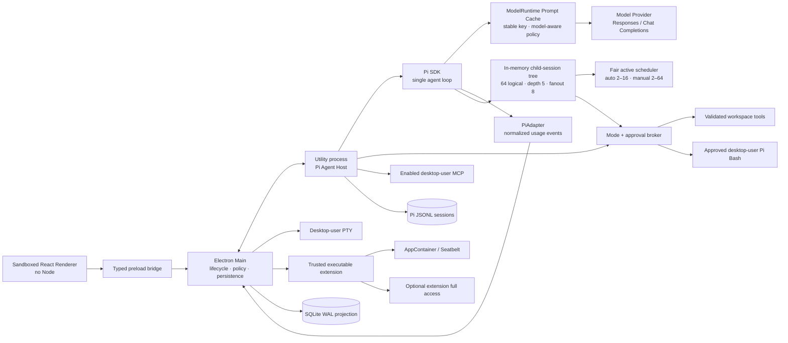

# Architecture

## Runtime boundaries

The renderer has `sandbox: true`, `contextIsolation: true`, and
`nodeIntegration: false`. It can invoke only the methods exposed by
`ArtemisApi`. Main-process IPC handlers resolve project and thread IDs from
SQLite rather than trusting renderer-supplied paths.

The Pi SDK runs directly inside an Electron Node utility process. It is not a
CLI/RPC sidecar. A utility-process crash is isolated from the window and main
process. Pi's SDK remains responsible for model/provider behavior, message
history, compaction, Skills, prompt templates, project context, and JSONL
sessions. Root task sessions retain the existing lazy JSONL persistence;
sub-agents use non-resumable in-memory Pi sessions. SQLite retains versioned
member/team transitions, messages and bounded final output, while live activity
deltas are delivered in coalesced IPC batches and omitted from persistence.

## Protocol

`@artemis/protocol` owns all renderer-visible contracts:

- `RunMode`: `execute | plan | review`
- `WorkspaceTarget`: `local | managed-worktree | permanent-worktree`; managed
  values remain for persisted-data and backend compatibility, while current
  interactive tasks use `local`
- `AgentPayload`: user messages, streamed text/thinking, tool lifecycle,
  approvals, file changes, terminals, child agents, completion, and failures
- `AgentEvent`: version, event ID, thread/turn IDs, sequence, timestamp, payload
- `ReviewQuery`/`ReviewMutationInput`: validated scopes and hash-addressed
  file/hunk targets
- `TaskWorktree`/`WorktreeCommand`: persisted workspace ownership and lifecycle
- `OfficeDocumentRequest`/`OfficeDocumentResult`: versioned, path-scoped
  normalized PDF, Excel, Word and PowerPoint operations

`PiAdapter` is the only package aware of Pi event names. Its output is
provider-independent. The main process assigns authoritative event IDs and
sequences, persists events, and then publishes them to renderer subscribers.
Reducers preserve first-seen order, merge deltas, and ignore duplicate event
IDs.

## Model runtime and Prompt Cache

Artemis keeps Pi as the only Agent loop and wraps its `ModelRuntime` rather than
forking the Pi dependency. The cache controller hashes the original Pi session
ID, Provider, model, stable System Prompt and canonically ordered tool schemas.
Only 16-character fingerprints enter local diagnostics; Prompt text, complete
tool schemas, original session IDs and credentials are not recorded there.
Lazy JSONL persistence retains the original Pi session ID so a restored task
keeps the same cache affinity when its other key inputs are unchanged.

Policy selection is automatic and endpoint-aware. Official GPT-5.6 requests to
the HTTPS `api.openai.com` endpoint use `prompt_cache_key`, explicit 30-minute
options and a stable System Prompt breakpoint. Official GPT-5.5 uses its long
policy. Exact documented legacy models begin a new parent task with short
caching and upgrade persistent or resumed parent tasks to long caching. Child
Agents, unknown models, Azure endpoints and compatible gateways remain short;
Pi compaction and other one-shot calls that explicitly request `none` stay
disabled. System Prompt, tools and model changes therefore create new keys
without changing the Plan, Review or Execute tool sets.

Provider usage is normalized before it reaches the protocol: uncached input,
cache reads, cache writes and output add up to `totalTokens`. Optional reporting
flags distinguish an explicit zero from missing Provider data. The replay-safe
reducer aggregates reported events and policy counts for Token Usage, while the
local diagnostic bundle records bounded policy reasons, fingerprints,
stable-prefix estimates and per-key request rates. Near 15 requests per minute
Artemis emits only a diagnostic warning; it does not rotate the key and create
an intentional cold cache.

## Execution policy

The Agent Host exposes brokered filesystem tools together with Pi's built-in
full local `bash` tool:

- `read`: UTF-8 reads after lexical and real-path workspace validation.
- `bash`: Execute-only direct Pi execution with the current desktop user's
  filesystem, environment, and network permissions after brokered model or user
  approval. Plan/Review do not receive the tool.
- `write`: pauses on a broker request. Plan/Review deny it immediately;
  Execute creates an approval card. An approved write is performed by the main
  broker after validating the path again.
- `office_document`: Execute-only create/write/read/modify/delete operations.
  Main validates the versioned request and workspace path, applies mode policy,
  then invokes portable PDF/OOXML parsers and generators. Delete is always
  offered as a high-risk, one-time approval.
- MCP tools: available only in Execute and auto-approved after the user enables
  the server. Local stdio servers intentionally inherit the desktop user's
  filesystem, environment, and network permissions.
- Trusted extension tools: discovered and invoked in one-shot native sandbox
  processes after hash verification and explicit trust.

The user-opened integrated PTY launches the workspace shell directly with the
current desktop user's native token. It inherits that user's filesystem,
environment, and network access, but never requests administrator elevation.
Enabling an MCP server is the explicit trust boundary for its auto-approved
tools. Trusted executable extensions instead require project and content-hash
trust and run in a fresh platform-native sandbox process unless extension-only
full local access is enabled.

Review mutations never accept renderer-supplied patches. Main recomputes the
current diff, resolves the submitted SHA-256 file/hunk ID to a canonical patch,
and then applies only the action allowed by that scope. Revert creates a
recovery copy before changing the workspace.

Interactive tasks run only in each project's Local checkout. Managed and
permanent worktree records and commands remain for legacy persisted-data and
backend compatibility, but the current product UI does not create or expose
those flows. Agent cwd, Review, and approval validation all resolve to the
task's Local workspace.

Executable Pi extensions stay disabled in the long-lived Agent Host through
`DefaultResourceLoader({ noExtensions: true })`. Skills, prompt templates, and
context files remain available. A trusted extension is a canonical file path
plus SHA-256 hash, explicit enable/network settings, and a visible inventory.
Only Pi tools are bridged; hooks, commands, flags, and shortcuts are reported as
unsupported. Discovery is read-only and network-denied, and Execute-mode calls
require approval before a fresh sandbox process executes the tool.

## Persistence

Pi JSONL is the model-history source of truth. SQLite stores:

- projects and local paths;
- UI task metadata and Pi session-file references;
- exact-target task/project approval grants;
- managed worktree history, branch/head state, and recovery paths;
- replayable normalized events.

`PRAGMA journal_mode=WAL` is enabled. SQLite migrations are tracked with
`user_version`; schema version 9 is the current baseline. Credentials are not
stored in SQLite. API keys, OAuth records imported from Pi, and MCP bearer tokens
are encrypted with Electron `safeStorage` (DPAPI on Windows and Keychain-backed
storage on macOS); if OS encryption is unavailable, credential writes fail
closed.
