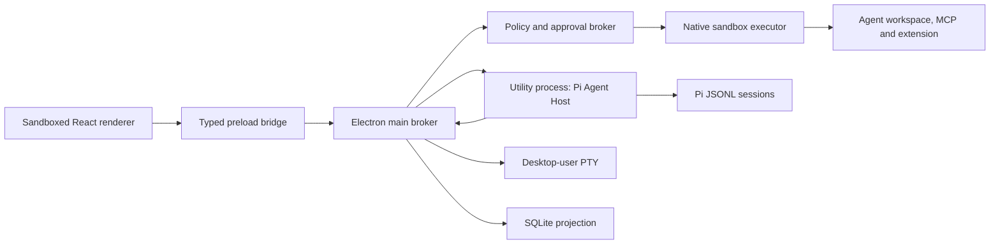

# Architecture

## Runtime boundaries

The renderer has `sandbox: true`, `contextIsolation: true`, and
`nodeIntegration: false`. It can invoke only the methods exposed by
`ArtemisApi`. Main-process IPC handlers resolve project and thread IDs from
SQLite rather than trusting renderer-supplied paths.

The Pi SDK runs directly inside an Electron Node utility process. It is not a
CLI/RPC sidecar. A utility-process crash is isolated from the window and main
process. Pi's SDK remains responsible for model/provider behavior, message
history, compaction, Skills, prompt templates, project context, and JSONL
sessions.

## Protocol

`@artemis/protocol` owns all renderer-visible contracts:

- `RunMode`: `execute | plan | review`
- `WorkspaceTarget`: `local | managed-worktree | permanent-worktree`
- `AgentPayload`: user messages, streamed text/thinking, tool lifecycle,
  approvals, file changes, terminals, child agents, completion, and failures
- `AgentEvent`: version, event ID, thread/turn IDs, sequence, timestamp, payload
- `ReviewQuery`/`ReviewMutationInput`: validated scopes and hash-addressed
  file/hunk targets
- `TaskWorktree`/`WorktreeCommand`: persisted workspace ownership and lifecycle
- `OfficeDocumentRequest`/`OfficeDocumentResult`: versioned, path-scoped
  normalized PDF, Excel, Word and PowerPoint operations

`PiAdapter` is the only package aware of Pi event names. Its output is
provider-independent. The main process assigns authoritative event IDs and
sequences, persists events, and then publishes them to renderer subscribers.
Reducers preserve first-seen order, merge deltas, and ignore duplicate event
IDs.

## Execution policy

The Agent Host exposes brokered filesystem tools together with Pi's built-in
full local `bash` tool:

- `read`: UTF-8 reads after lexical and real-path workspace validation.
- `bash`: Execute-only direct Pi execution with the current desktop user's
  filesystem, environment, and network permissions. It does not use the broker
  or approval cards. Plan/Review do not receive the tool.
- `write`: pauses on a broker request. Plan/Review deny it immediately; Code
  and Work create an approval card. An approved write is performed by the main
  broker after validating the path again.
- `office_document`: Execute-only create/write/read/modify/delete operations.
  Main validates the versioned request and workspace path, applies mode policy,
  then invokes portable PDF/OOXML parsers and generators. Delete is always
  offered as a high-risk, one-time approval.
- MCP tools: inventoried by the host, separated into read-only and mutating
  policy paths, and approved before calls with network or write risk.
- Trusted extension tools: discovered and invoked in one-shot native sandbox
  processes after hash verification and explicit trust.

The user-opened integrated PTY launches the workspace shell directly with the
current desktop user's native token. It inherits that user's filesystem,
environment, and network access, but never requests administrator elevation.
MCP tools and trusted extension tools remain behind approval policy and
platform-native sandbox processes. Pi `bash` is the explicit full-access
exception described above.

Review mutations never accept renderer-supplied patches. Main recomputes the
current diff, resolves the submitted SHA-256 file/hunk ID to a canonical patch,
and then applies only the action allowed by that scope. Revert creates a
recovery copy before changing the workspace.

Managed worktrees are created detached under application storage. Cleanup
rejects dirty worktrees unless the explicit force path first writes a binary
tracked patch, untracked-file copies, and a manifest. Local/Worktree handoff
requires matching HEADs, preflights the patch and untracked collisions, and
retains a recovery bundle. Agent cwd, Review, and approval validation all use
the task's resolved workspace.

Executable Pi extensions stay disabled in the long-lived Agent Host through
`DefaultResourceLoader({ noExtensions: true })`. Skills, prompt templates, and
context files remain available. A trusted extension is a canonical file path
plus SHA-256 hash, explicit enable/network settings, and a visible inventory.
Only Pi tools are bridged; hooks, commands, flags, and shortcuts are reported as
unsupported. Discovery is read-only and network-denied, and Code-mode calls
require approval before a fresh sandbox process executes the tool.

## Persistence

Pi JSONL is the model-history source of truth. SQLite stores:

- projects and local paths;
- UI task metadata and Pi session-file references;
- exact-target task/project approval grants;
- managed worktree history, branch/head state, and recovery paths;
- replayable normalized events.

`PRAGMA journal_mode=WAL` is enabled. SQLite migrations are tracked with
`user_version`; schema version 3 is the current baseline. Credentials are not
stored in SQLite. API keys, OAuth records imported from Pi, and MCP bearer tokens
are encrypted with Electron `safeStorage` (DPAPI on Windows and Keychain-backed
storage on macOS); if OS encryption is unavailable, credential writes fail
closed.
