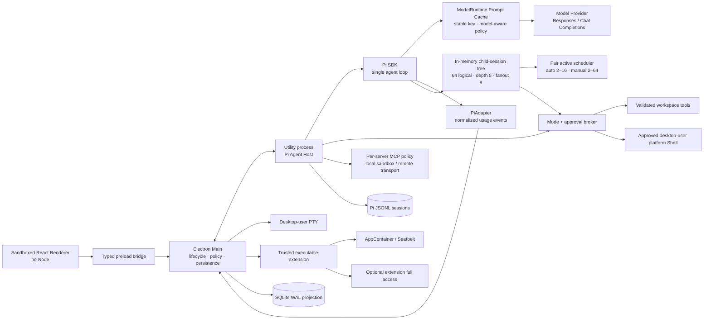

[English / 简体中文](architecture-zh-CN.md)

# Architecture

## Runtime boundaries

```mermaid
flowchart LR
  R["Sandboxed React Renderer<br/>no Node"] --> P["Typed preload bridge"]
  P --> M["Electron Main<br/>lifecycle · policy · persistence"]
  M <--> A["Utility process<br/>Pi Agent Host"]
  A --> PI["Pi SDK<br/>single agent loop"]
  PI --> PC["ModelRuntime Prompt Cache<br/>stable key · model-aware policy"]
  PC --> MP["Model Provider<br/>Responses / Chat Completions"]
  PI --> PA["PiAdapter<br/>normalized usage events"]
  PA --> M
  PI --> C["In-memory child-session tree<br/>64 logical · depth 5 · fanout 8"]
  C --> Q["Fair active scheduler<br/>auto 2–16 · manual 2–64"]
  A --> B["Mode + approval broker"]
  C --> B
  B --> W["Validated workspace tools"]
  B --> H["Approved desktop-user platform Shell"]
  A --> X["Per-server MCP policy<br/>local sandbox / remote transport"]
  M --> T["Desktop-user PTY"]
  M --> E["Trusted executable extension"]
  E --> S["AppContainer / Seatbelt"]
  E --> F["Optional extension full access"]
  M --> D[("SQLite WAL projection")]
  A --> J[("Pi JSONL sessions")]
```

The renderer has `sandbox: true`, `contextIsolation: true`, and
`nodeIntegration: false`. It can invoke only the methods exposed by
`ArtemisApi`. Main-process IPC handlers resolve project and thread IDs from
SQLite rather than trusting renderer-supplied paths.

The Pi SDK runs directly inside an Electron Node utility process. It is not a
CLI/RPC sidecar. A utility-process crash is isolated from the window and main
process. Pi's SDK remains responsible for model/provider behavior, message
history, compaction, Skills, prompt templates, project context, and JSONL
sessions. Root task sessions retain the existing lazy JSONL persistence;
sub-agents use non-resumable in-memory Pi sessions. SQLite retains versioned
member/team transitions, messages and bounded final output, while live activity
deltas are delivered in coalesced IPC batches and omitted from persistence.

## Protocol

`@artemis/protocol` owns all renderer-visible contracts:

- `RunMode`: `work | plan | codemode`
- `WorkspaceTarget`: local and managed worktree targets; tasks default to local,
  with explicit user handoff to a managed worktree. Legacy permanent records
  remain readable without restoring permanent-worktree creation controls
- `AgentPayload`: user messages, streamed text/thinking, tool lifecycle,
  approvals, file changes, terminals, child agents, completion, and failures
- `AgentEvent`: version, event ID, thread/turn IDs, sequence, timestamp, payload
- `ReviewQuery`/`ReviewMutationInput`: validated scopes and hash-addressed
  file/hunk targets
- `TaskWorktree`/`WorktreeCommand`: persisted workspace ownership and lifecycle
- `OfficeDocumentRequest`/`OfficeDocumentResult`: versioned, path-scoped
  normalized PDF, Excel, Word and PowerPoint operations

`PiAdapter` is the only package aware of Pi event names. Its output is
provider-independent. The main process assigns authoritative event IDs and
sequences, persists events, and then publishes them to renderer subscribers.
Reducers preserve first-seen order, merge deltas, and ignore duplicate event
IDs.

## Model runtime and Prompt Cache

Artemis keeps Pi as the only Agent loop and wraps its `ModelRuntime` rather than
forking the Pi dependency. The cache controller hashes the original Pi session
ID, Provider, model, stable System Prompt and canonically ordered tool schemas.
Only 16-character fingerprints enter local diagnostics; Prompt text, complete
tool schemas, original session IDs and credentials are not recorded there.
Lazy JSONL persistence retains the original Pi session ID so a restored task
keeps the same cache affinity when its other key inputs are unchanged.

Policy selection is automatic and endpoint-aware. Official GPT-5.6 requests to
the HTTPS `api.openai.com` endpoint use `prompt_cache_key`, explicit 30-minute
options and a stable System Prompt breakpoint. Official GPT-5.5 uses its long
policy. Exact documented legacy models begin a new parent task with short
caching and upgrade persistent or resumed parent tasks to long caching. Child
Agents, unknown models, Azure endpoints and compatible gateways remain short;
Pi compaction and other one-shot calls that explicitly request `none` stay
disabled. System Prompt, tools and model changes therefore create new keys
without changing the Plan, Work or Codemode tool sets.

Provider usage is normalized before it reaches the protocol: uncached input,
cache reads, cache writes and output add up to `totalTokens`. Optional reporting
flags distinguish an explicit zero from missing Provider data. The replay-safe
reducer aggregates reported events and policy counts for Token Usage, while the
local diagnostic bundle records bounded policy reasons, fingerprints,
stable-prefix estimates and per-key request rates. Near 15 requests per minute
Artemis emits only a diagnostic warning; it does not rotate the key and create
an intentional cold cache.

## Execution policy

The Agent Host exposes brokered filesystem tools together with Pi's built-in
full local `bash` tool:

- `read`: UTF-8 reads after lexical and real-path workspace validation.
- `bash`: Work/Codemode-only direct Pi execution with the current desktop user's
  filesystem, environment, and network permissions after brokered model or user
  approval. Plan do not receive the tool.
- `write`: pauses on a broker request. Plan deny it immediately;
  Work or Codemode creates an approval card. An approved write is performed by the main
  broker after validating the path again.
- `office_document`: Work/Codemode-only create/write/read/modify/delete operations.
  Main validates the versioned request and workspace path, applies mode policy,
  then invokes portable PDF/OOXML parsers and generators. Delete is always
  offered as a high-risk, one-time approval.
- MCP tools: available only in Work or Codemode and routed through the configured model
  or policy approval path after the user enables the server. Local stdio
  servers use AppContainer on Windows or Seatbelt on macOS by default, can
  write the task workspace and private runtime directory, receive a minimal or
  explicitly forwarded environment, and use a per-server network permission.
  A per-server compatibility option explicitly restores desktop-user access.
- Trusted extension tools: discovered and invoked in one-shot native sandbox
  processes after hash verification and explicit trust.

The user-opened integrated PTY launches the workspace shell directly with the
current desktop user's native token. It inherits that user's filesystem,
environment, and network access, but never requests administrator elevation.
Enabling an MCP server is the explicit trust boundary for its advertised tools,
but not a grant of full desktop access. Trusted executable extensions instead
require project and content-hash trust and run in a fresh platform-native
sandbox process unless extension-only full local access is enabled.

Review mutations never accept renderer-supplied patches. Main recomputes the
current diff, resolves the submitted SHA-256 file/hunk ID to a canonical patch,
and then applies only the action allowed by that scope. Revert creates a
recovery copy before changing the workspace.

Interactive tasks default to the project's Local checkout. Users may explicitly
hand off to a managed worktree. The service enforces a global limit of ten,
including pending creations, and preserves snapshots before managed cleanup.
Agent cwd, Review and approval checks resolve the task's current workspace.

Executable Pi extensions stay disabled in the long-lived Agent Host through
`DefaultResourceLoader({ noExtensions: true })`. Skills, prompt templates, and
context files remain available. A trusted extension is a canonical file path
plus SHA-256 hash, explicit enable/network settings, and a visible inventory.
Only Pi tools are bridged; hooks, commands, flags, and shortcuts are reported as
unsupported. Discovery is read-only and network-denied, and Work/Codemode calls
require approval before a fresh sandbox process executes the tool.

## Persistence

Pi JSONL is the model-history source of truth. SQLite stores:

- projects and local paths;
- UI task metadata and Pi session-file references;
- exact-target task/project approval grants;
- managed worktree history, branch/head state, and recovery paths;
- replayable normalized events.

`PRAGMA journal_mode=WAL` is enabled. SQLite migrations are tracked with
`user_version` in the store migration code. Credentials are not
stored in SQLite. API keys, OAuth records imported from Pi, and MCP bearer tokens
are encrypted with Electron `safeStorage` (DPAPI on Windows and Keychain-backed
storage on macOS); if OS encryption is unavailable, credential writes fail
closed.

## Plugin boundary

`@artemis/plugin-contract` owns pure TypeScript/Zod definitions and emitted JSON
Schema. It has no Electron, Pi or host filesystem dependency. v2 discriminates
resource and interactive manifests; v1 adapters retain installed identities.
`@artemis/plugin-sdk` wraps the existing runtime protocol, not a second engine.

Resource manifests explicitly list Skills, MCP/Connectors, Hooks and Skins.
Interactive manifests declare runtime, panel, tools and restricted capabilities;
they cannot declare resource MCP/Hooks. Content hashes and frozen task bindings
are checked both when tools are assembled and when they are called.
Windows uses AppContainer and macOS uses Seatbelt for the interactive runtime,
with task-private writable scratch, read-only runtime/plugin files and no network.
Installation journals coordinate directory moves, MCP configuration and the
primary plugin store, recovering interrupted writes before further installation.

## Updates and lifecycle

`bootstrap.ts` owns privileged scheme registration, the single-instance lock,
Windows package ACL preparation and startup errors. There is no activation service.
`ReleaseUpdateManager` selects the platform update implementation.
`WindowsInstalledUpdater` handles signed-index discovery, download verification,
rollback preparation and the external PowerShell helper. ZIP discovery uses the
same Windows-specific index but remains a manual download.

The helper is outside the installation tree and starts before the old application
quits. Database backup uses SQLite's consistent backup API. A healthy startup
requires migrations, renderer readiness, IPC and an agent-host response. Failed
versions are quarantined; recovery does not restore project directories or replay
task side effects. See [release contracts](guides/release.md).

## History and renderer performance

`ThreadHistoryReader` runs SQLite and replay in a worker. Disposable, versioned
page projections let cursor requests parse only the requested page rather than
an entire session snapshot. Cache data is rebuilt after schema changes or corruption.
`stream-snapshot.ts` owns live event deduplication and thread metadata updates;
batches group once by thread and duplicate-only batches retain object identity.
`history-visibility.ts` shares scroll/IntersectionObserver scheduling per scroller.
The derived-session cache is limited to eight sessions and an estimated 64 MiB.

`node scripts/benchmarks/benchmark-history.mjs` compares the merged baseline with current
source using the same synthetic 1,500-turn history. It records initial load,
49 cursor pages and returned bytes under `artifacts/benchmarks/`; local numbers
are not Windows or public-runner acceptance. Main and renderer still contain
composition and feature coordination; module boundaries must be preserved as
further services move out of these entry points.
