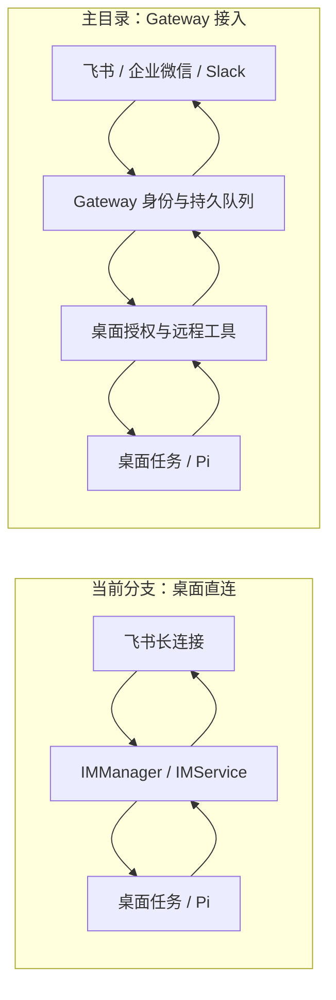
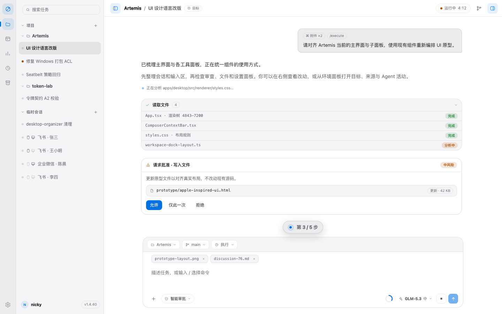
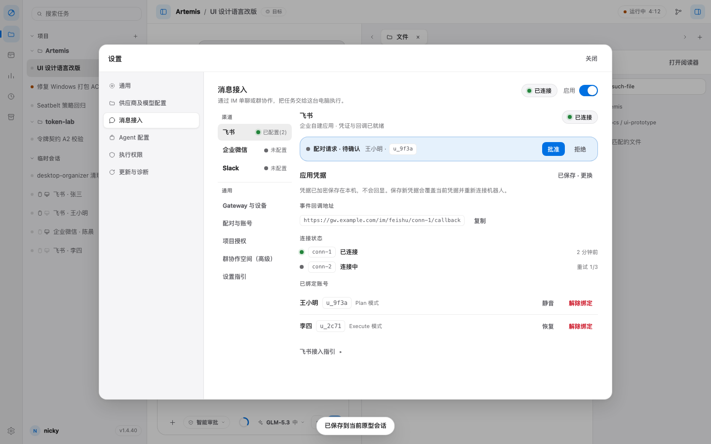

# 提案：IM 接入方案收敛与 Apple-inspired Artemis UI 改版计划

建议以当前 `main` 的 Gateway、身份与项目授权体系作为 IM 主干，将 `feat/im-feishu` 的飞书长连接和交互体验移植到该体系；UI 以本提案附件中的 `apple-inspired-ui` 为视觉与布局规格，在现有 React 组件库上分批对齐。

本文包含两部分：第一部分比较 IM 方案并提出整合路线；第二部分审查现有 Artemis UI，形成改版计划。本文是待讨论的实施提案，不表示相关改造或原生平台验收已经完成。延续 [Discussion #76：建立 Artemis 自有 UI 设计语言](https://github.com/EurekaRaider/Artemis/discussions/76)。

审查基准为 2026-09-05 的两个本地工作区，并核对了远端 `main`：

| 对象 | 基准 | 使用范围 |
| --- | --- | --- |
| `Artemis` 主目录 | `main`，`bdded70d937b54aad615f0f87de57d5fb31271b8`，1.4.62，工作区干净 | 目标产品；IM、协议、执行权限与正式 Renderer 的现状 |
| `Artemis-feat-im-feishu` 当前分支 | `feat/im-feishu`，`a3bb37ebae0b7511caa5a1c152a50ad963bf18d4`，1.4.40 | IM 直连实现与飞书体验参考 |
| 当前分支 `docs/ui-prototype` | 上述分支的**工作区快照，包含尚未提交的修改与新增文件**；README 标记 v69 | 本次 UI 视觉基准，以附件快照和文件哈希为准；不能用分支 HEAD 的 HTML 代替 |

**原型下载：**[artemis-ui-prototype-2026-09-05.zip](./artemis-ui-prototype-2026-09-05.zip)（1,569,280 字节，约 1.50 MiB）。解压后打开 `ui-prototype/apple-inspired-ui.html`；组件规范打开 `ui-prototype/components.html`。请保留整个目录，预览无需安装依赖。

附件通过独立提案资料分支的固定提交托管，Discussion 中提供直接下载链接；不需要切换开发分支或合并提案资料即可预览。

ZIP 的 SHA-256：`e11a02906e9d17778ea44ff418b9025fbad1d843661299f8332a804334b82227`。包内收录原型的 82 个文件、逐文件哈希清单、打开说明与本次检查结果。原型源文件保持原样；下文指出的规格差距也保留在快照中，便于评审追踪。

## 第一部分：两种 IM 接入方案的优劣与收敛建议

### 1. 两套实现分别解决什么问题

当前分支把飞书接到桌面：`LarkChannel` 长连接 → `IMManager` 配对、绑定与路由 → `IMService` → 既有任务启动和追加消息接口 → Pi；协议事件反向翻译成飞书消息。平台连接直接由 Electron main 管理。

主目录把渠道接到 Gateway：企业微信长连接／Slack Socket Mode／飞书 HTTP 回调 → Gateway 持久队列与身份路由 → 桌面认证拉取 → 本地授权、租约及远程工具检查 → Pi；执行结果经 Gateway 回传。Gateway 支持内置和独立部署，本身不运行模型。



实现依据：[分支适配器](https://github.com/EurekaRaider/Artemis/blob/a3bb37ebae0b7511caa5a1c152a50ad963bf18d4/packages/im/src/adapters/feishu.ts)、[分支 IMService](https://github.com/EurekaRaider/Artemis/blob/a3bb37ebae0b7511caa5a1c152a50ad963bf18d4/apps/desktop/src/main/im-service.ts)、[main IM 说明](https://github.com/EurekaRaider/Artemis/blob/bdded70d937b54aad615f0f87de57d5fb31271b8/docs/im-gateway.md)、[Gateway 路由](https://github.com/EurekaRaider/Artemis/blob/bdded70d937b54aad615f0f87de57d5fb31271b8/packages/gateway/src/router.ts)。

### 2. 能力与代价对照

以下评价针对这两个提交中的实现，不代表对应平台只能采用这一接入方式。

| 维度 | 当前分支：飞书直连 | 主目录：Gateway | 判断 |
| --- | --- | --- | --- |
| 个人上手 | App ID / Secret、长连接和桌面配对，链路短；支持 Feishu / Lark 域选择 | 内置 Gateway 已可一键启动并注册；仍需机器人、身份、项目授权；当前飞书需要可达的公网 HTTPS 回调 | 直连的飞书上手体验更轻；不能把 main 描述成所有平台都必须部署公网服务 |
| 平台范围 | 真实适配器只有飞书，另有测试用 dummy | 企业微信、飞书、Slack 已有实现 | main 更适合多平台产品；分支的 Slack 等仍是规划 |
| 运行部署 | 少一个服务层，但连接与桌面生命周期耦合 | 内置模式免独立运维；团队模式可让入口持续在线，但要维护 HTTPS、数据库、密钥和备份 | 个人优先内置；团队才暴露部署选项 |
| 身份与隔离 | 绑定主键为 adapter + channel；绑定未记录稳定账号身份 | 身份包含 channel、connectionId、tenantId、appId、userId；区分单聊、群、空间修订与设备 | main 的身份边界更完整；两者不是同构数据模型 |
| 执行授权 | 复用普通 Execute 任务路径，文档意图为固定 Ask；缺少 main 的远程授权档案 | 本机项目 grant 控制模式、shell、network、期限、预算与空间；远程 Execute 要通过原生沙箱探针 | 保留 main 的远程边界；直连不能等同于工作区沙箱 |
| 审批与澄清 | 飞书按钮卡片 + 文本审批，终态回写；summary / verbose / quiet | 一次性审批与澄清指令、本人单聊校验；多问题回答；飞书任务状态卡更新 | 吸收分支的按钮体验，继续使用 main 的身份校验和一次性决策机制 |
| 图片与产物 | 纯图片入站、消息资源下载、占位符清理、富媒体出站和 Typing 表情有具体实现及回归 | 复用桌面附件解析，支持图片及多种文档；显式 publish、哈希与限时下载；离线附件缓存 | 分支的飞书细节值得移植；产物发布继续要求明确授权 |
| 故障恢复 | 绑定持久化；manager 去重、审批等状态在内存；SDK 托管重连 | 请求、投递状态持久化；45 秒设备租约；区分 pending / sending / done / failed / uncertain；撤销时重新校验 | main 对离线、重启与不确定发送结果的建模更强；不是无限离线或高可用集群承诺 |
| 群与跨设备 | 未建立 main 同级的群成员授权及空间模型 | 管理员配置与群确认、空间修订、主人项目授权、跨设备委派和预算限制 | 团队方向沿用 main；群管理员当前由运营者核验，不是平台角色自动同步 |
| 维护成本 | 模块小、适配接缝清楚、飞书场景易迭代；扩展治理能力需继续补建 | Gateway、桌面服务、协议与 UI 共同维护，状态更多；SQLite 单实例限制需要明确 | 用 main 统一控制面，避免双路由、双绑定库和两套生命周期长期并存 |

身份和权限依据：[IM 协议](https://github.com/EurekaRaider/Artemis/blob/bdded70d937b54aad615f0f87de57d5fb31271b8/packages/protocol/src/im.ts)、[main IMService](https://github.com/EurekaRaider/Artemis/blob/bdded70d937b54aad615f0f87de57d5fb31271b8/apps/desktop/src/main/im-service.ts)、[远程沙箱](https://github.com/EurekaRaider/Artemis/blob/bdded70d937b54aad615f0f87de57d5fb31271b8/apps/desktop/src/main/im-sandbox.ts)、[分支类型与绑定](https://github.com/EurekaRaider/Artemis/blob/a3bb37ebae0b7511caa5a1c152a50ad963bf18d4/packages/im/src/types.ts)。

### 3. 直接合并前必须解决的实现差距

这几项由代码路径审查得出，现有单测通过不能代替这些专项回归。

1. **“固定 Execute + Ask”没有完整落实到分支的执行入口。** 分支 main 的 IM host 仅传入 `mode: "execute"`；共用审批路径仍读取全局 `settingsStore.approvalPolicy()`。不能把文档中的 Ask 当作已验证的远程约束，更不能把完整本机 bash 描述成受项目限制。整合时必须先建立远程任务标记与 grant，再创建任务和开放工具；测试应覆盖全局自动审批开启时，远程任务仍遵守自己的授权。依据：[分支 main](https://github.com/EurekaRaider/Artemis/blob/a3bb37ebae0b7511caa5a1c152a50ad963bf18d4/apps/desktop/src/main/main.ts#L15514)。
2. **“单活跃绑定”主要停留在设计意图。** `routeBoundInbound` 只检查当前 binding 的 `muted`，`approvePairing` 直接写入 `muted: false`，没有看到跨绑定数量拒绝；不能据此宣称运行时已强制单绑定。main 已支持更丰富的身份及会话关系，整合时直接遵循 main 的模型。依据：[分支 manager](https://github.com/EurekaRaider/Artemis/blob/a3bb37ebae0b7511caa5a1c152a50ad963bf18d4/packages/im/src/manager.ts)、[分支绑定存储](https://github.com/EurekaRaider/Artemis/blob/a3bb37ebae0b7511caa5a1c152a50ad963bf18d4/apps/desktop/src/main/im-bindings-store.ts)。
3. **审批回调缺少可继承的身份校验链。** 分支的卡片事件类型包含 operator、chatId，但 `handleCardAction` 仅转发 approvalId、decision、messageId，manager 随后按 approvalId 取待批项；文字审批也按频道取待批项。整合按钮时要校验连接、企业、操作者、会话、待批项、期限与撤销状态，再进入同一个一次性消费入口。不能原样移植回调路由。依据：[飞书回调处理](https://github.com/EurekaRaider/Artemis/blob/a3bb37ebae0b7511caa5a1c152a50ad963bf18d4/packages/im/src/adapters/feishu.ts#L269)。
4. **受理成功与实际提交成功之间存在缝隙。** manager 的 `onInboundAccepted` 返回 void；IMService 异步提交失败后只记录日志。因此 manager 外层去重回滚捕获不到这类失败。SDK 重连也不能替代桌面请求持久化。新的飞书入口必须先进入 main 的持久队列，再按现有确认语义处理；不可对结果未知的执行或发送盲目重试。依据：[分支受理回调](https://github.com/EurekaRaider/Artemis/blob/a3bb37ebae0b7511caa5a1c152a50ad963bf18d4/apps/desktop/src/main/im-service.ts#L138)、[分支去重](https://github.com/EurekaRaider/Artemis/blob/a3bb37ebae0b7511caa5a1c152a50ad963bf18d4/packages/im/src/dedup.ts)。

另外，分支配对码使用四位数字和 `Math.random()`，配对过程状态在内存中；main 使用自己的设备配对流程。迁移时不继承旧码或待审批状态，旧频道也不能自动变成已授权稳定身份。依据：[分支配对状态机](https://github.com/EurekaRaider/Artemis/blob/a3bb37ebae0b7511caa5a1c152a50ad963bf18d4/packages/im/src/pairing.ts)。

### 4. 推荐方案：统一 Gateway，增加飞书长连接传输

将飞书接入方式作为连接配置：长连接与 HTTPS 回调共用 ChannelEvent、身份模型、持久队列、投递与桌面服务。个人路径优先尝试“内置 Gateway + 飞书长连接”；团队继续支持现有 HTTPS 回调。每个连接同一时刻只启用一种入口，防止双订阅、重复消息和审批回调分流。

长连接不是另一个 Agent loop，也不直接调用 `startTaskTurn`。它只是 Gateway 的平台传输实现。现有企业微信与 Slack 路径不受影响，Pi 仍是唯一执行循环。

| 阶段 | 改造范围 | 验收出口 |
| --- | --- | --- |
| IM-0：契约与保护测试 | 固定 main 的身份、grant、队列和一次性审批契约；为上述权限、冒名、双绑、异步失败写回归 | 未授权身份不能创建任务；全局设置不扩大远程权限；Plan / Review 在执行前拒绝写入 |
| IM-1：飞书长连接 | 在 `packages/gateway` 增加传输实现及配置；复用现有凭据加密、生命周期与状态；验证 SDK 打包依赖 | 真飞书无公网完成配对与任务；断网、休眠、重启后恢复；重复投递不重复启动 |
| IM-2：飞书交互增强 | 移植消息资源图片读取、纯图及追加消息、Typing 清理、卡片按钮；接入现有审批消费机制 | 桌面与 IM 竞态只生效一次；跨身份拒绝；图片失败可诊断；卡片失败有明确降级 |
| IM-3：迁移与运维 | 旧连接配置显式导入；旧身份重新配对，项目重新授权；状态诊断覆盖传输与队列 | 不静默复制凭据或扩大授权；保留旧任务历史；切换失败可退回原回调配置 |

首期保留 main 的文本审批和澄清作为通用能力。群协作继续放在高级设置，个人首次使用不需要理解空间 JSON。产物上传继续走显式发布，不能将分支“从输出文本提取图片／文件并发送”的行为直接扩展成自动上传本地文件。

## 第二部分：以 apple-inspired-ui 为规格的 Artemis UI 改版计划

### 1. 审查结论：现有产品已具备基础，需要对齐最新原型

主目录已经有 `packages/theme-contract`、`packages/theme-artemis`、`packages/ui` 和 `apps/ui-gallery`。Renderer 入口已加载组件样式、应用布局样式与 Artemis 主题；App 已使用 ApplicationShell、ActivityBar、Conversation、Composer、Dock、Review 等正式组件。**无需再新建第二套设计系统，也不应把原型的 DOM 控制器直接塞进 React。** 依据：[Renderer 入口](https://github.com/EurekaRaider/Artemis/blob/bdded70d937b54aad615f0f87de57d5fb31271b8/apps/desktop/src/renderer/main.tsx)、[App 的组件消费](https://github.com/EurekaRaider/Artemis/blob/bdded70d937b54aad615f0f87de57d5fb31271b8/apps/desktop/src/renderer/App.tsx)、[主题定义](https://github.com/EurekaRaider/Artemis/blob/bdded70d937b54aad615f0f87de57d5fb31271b8/packages/theme-artemis/src/index.ts)。

IM 设置也已经经过 1.4.62 改造：`ImSettingsPanel` 包含向导／管理态、状态总览与启用开关；`ImNavigation` 有渠道与通用导航；`ImAccountControls` 有配对倒计时、解绑确认和焦点恢复；`ImSlackSetup` 与诊断组件独立。需要迁移的是最新原型的细节和缺失数据，不是重做三态架构。依据：[设置面板](https://github.com/EurekaRaider/Artemis/blob/bdded70d937b54aad615f0f87de57d5fb31271b8/apps/desktop/src/renderer/ImSettingsPanel.tsx)、[IM 导航](https://github.com/EurekaRaider/Artemis/blob/bdded70d937b54aad615f0f87de57d5fb31271b8/apps/desktop/src/renderer/ImNavigation.tsx)。

当前 `App.tsx` 10,428 行、Renderer `styles.css` 9,662 行，说明组合与样式仍然集中；这只是复杂度信号，不能据行数判定组件迁移尚未发生。应在每批改版中拆出对应区域的组合，并同步删除已无消费者的样式。现有 [visual-migration-ledger](https://github.com/EurekaRaider/Artemis/blob/bdded70d937b54aad615f0f87de57d5fb31271b8/docs/visual-migration-ledger.md) 含多个历史提交的记录，需要按本次候选 SHA 更新，不能把旧页首的 pending 状态或旧截图当作当前提交结论。

### 2. 目标界面与页面映射

采用附件默认的方向 A：中性分层底色、蓝色交互强调、细边框、明确的内容留白、紧凑控件，以及有层级的圆角。原型仍保留 A/B/C 评审开关，正式产品本轮以 A 为目标；保留产品现有系统主题与用户外观偏好，不因原型默认浅色而覆盖用户设置。





以上均为**附件原型截图**，不是主目录产品截图。截图里的账号、连接、设备在线状态、任务内容和版本号为演示数据。

| 区域 | 主目录现状／保留能力 | 按附件推进的改版 | 主要落点 |
| --- | --- | --- | --- |
| 主壳、活动栏、任务树 | 已使用正式 shell／sidebar；已有项目顺序与任务树键盘模型 | 对齐 46px 活动栏、252px 默认侧栏和紧凑比例；校验拖拽、搜索、选中与 IM 来源行；已有用户宽度保留并钳制 | `App.tsx`、`project-sidebar-layout.ts`、UI surfaces/navigation |
| Conversation、Timeline、Composer | 已有消息、队列、审批、复杂澄清、用量和附件能力 | 对齐阅读列宽、消息间距、工具组、计划胶囊、上下文条、1px 聚焦边界及工具栏；保留真实状态和发送语义 | `App.tsx`、`TaskPlanProgress`、`ComposerContextBar`、UI conversation/patterns |
| Dock 与专业面板 | 已有 Dock 标签、文件、Review、Terminal、Browser 等 | 用原型九类面板清单复核入口和空态；统一标签、面板头和分栏；分别校验文件脏状态、Diff 导航和焦点恢复 | `workspace-tabs.ts`、`workspace-dock-layout.ts`、WorkspaceFiles／Preview、UI workspace/workflow/professional |
| 环境、目标、来源、Agent | 已有独立业务组件及真实数据流 | 对齐 Git／Agent 活动／来源分组、目标脏状态与保存失败、团队与成员面板层次 | `EnvironmentPanel`、`GoalEditorPanel`、`SourcesPanel`、App 内团队组合 |
| 六类设置页 | 现有 SettingsPanel 与 IM 子组件已承担配置行为 | 对齐外层布局、供应商分段控件、表单密度、保存／取消与诊断入口；IM 保留三态，再对齐渠道行和设置指引 | `SettingsPanel.tsx`、`ImSettingsPanel.tsx` 及子组件、UI forms/management |
| 资源中心 | 插件、Connector、MCP、Skill 已有业务与权限流程 | 对齐分类、列表与详情、空态／错误／加载；安装和信任继续走现有服务 | `ResourceCenter.tsx`、MCP 编辑器、UI management |
| 归档、用量、定时任务 | 已有正式页面；归档支持搜索标题／目标／项目、恢复及删除 | 归档对齐细分隔列表与只读横幅；用量／自动化对齐表头、密度、图表及状态；保留本地化 | `ArchivePage`、`TokenUsagePage`、`AutomationPage`、UI data |

主窗口最低尺寸仍以产品 `980×680` 为准。原型的 768／390 宽网页布局可作为缩放和窄容器参考，不构成新增移动端产品需求。

### 3. 原型落地前要修正的语义与数据差距

| 差距 | 审查依据与影响 | 落地规则 |
| --- | --- | --- |
| 手机／电脑在线图标 | 原型四组亮暗状态来自 fixture；当前 `ImStatus`／身份协议没有手机和 PC 客户端 presence 字段 | 保留图标造型作为设计输入；首期仅显示来源类型、真实 Gateway／连接／设备会话状态。客户端在线显示“未知”或不展示，不能由机器人连接成功推断 |
| 账号名称、账号旁 Plan／Execute 与静音 | 原型有名称、模式及静音操作；main 身份以稳定 ID 表达，模式与预算属于项目 grant；现有账号组件只提供配对和解绑等操作 | 名称需真实元数据来源及稳定 ID 回退；模式明确指向选定项目或任务；账号静音必须先定义协议、作用域和恢复语义，未实现时不提供可点击入口 |
| 凭据与回调文案 | 原型写“凭据已加密保存在本机”，展示 `/im/feishu/.../callback` 示例；main 团队机器人凭据保存在 Gateway，实际路径为 `/channels/feishu/{connectionId}` | 按本机／团队显示真实存储位置；地址由后端生成。若引入长连接，隐藏无关回调字段，并按传输方式切换指引 |
| 连接健康度 | 原型“任一连接健康即绿灯”；部分连接错误会被总绿灯掩盖 | 计数与状态分开；显示“2 个连接，1 个异常”等可行动摘要。连接健康、设备可用、已配对和可执行项目分别计算 |
| 紧凑断点与指引入口 | 原型写 IM 内容区 `<720px`；main 实测条件是内容宽 `<560px` 或设置框 `<720px`。原型通用组已有“设置指引”，main 为重看引导入口 | 根据外层设置导航后的真实剩余宽度确定断点；验证常用宽度不会总是进入紧凑态；将同一引导组件放到新入口，避免复制第二份状态机 |
| 70／73 卡及历史验证口径 | 附件当前检查脚本断言 73 卡，`ui/README`、迁移清单和部分历史记录仍写 70 卡 | 在规格冻结阶段更新卡片清单与证据版本。原型控制器、结构演示、React 组件、Electron 页面分别记状态，不用同一个“已完成”覆盖 |

数据边界依据：[当前 IM 协议](https://github.com/EurekaRaider/Artemis/blob/bdded70d937b54aad615f0f87de57d5fb31271b8/packages/protocol/src/im.ts)、[账号组件](https://github.com/EurekaRaider/Artemis/blob/bdded70d937b54aad615f0f87de57d5fb31271b8/apps/desktop/src/renderer/ImAccountControls.tsx)、[实际接入说明](https://github.com/EurekaRaider/Artemis/blob/bdded70d937b54aad615f0f87de57d5fb31271b8/docs/im-gateway.md)。原型侧依据为 ZIP 内的 HTML、`workspace/fixtures.js`、`workspace/workspace.js` 及 `ui/`。

### 4. 实施顺序、交付物与验收

以下是工作量估算，不是发布日期承诺。按已有组件能够复用估计为 17–26 人日；真实 IM 接入、跨平台打包与签名验收另计，UI 的视觉工作不必等待全部 IM 后端增强完成。

| 批次 | 工作／交付物 | 估算 | 完成条件 |
| --- | --- | --- | --- |
| UI-0：冻结规格与基线 | 固定本次 ZIP；补齐 73 卡和页面／状态映射；记录上述数据差距；用隔离用户数据采集 main 的真实 Electron 基线 | 2–3 人日 | 基线提交、原型哈希、截图条件和每项差距可追踪；区分视觉变更与新增后端能力 |
| UI-1：令牌与参考切片 | 在 theme-contract／theme-artemis 映射原型 token；在现有 UI 包对齐尺寸、图标、焦点和浮层；优先任务树 + Composer + Approval | 3–5 人日 | Gallery 与真实桌面同一组 fixture 通过；不改变审批选项与默认授权；保留专业色彩例外 |
| UI-2：会话与工作区 | 时间线、工具折叠、计划、队列、九类 Dock、Review／文件、目标／环境／来源／团队 | 5–7 人日 | 流式追加不跳滚动；面板切换／关闭／重开和键盘可用；文件、目标草稿及嵌套弹层焦点不丢失 |
| UI-3：设置与 IM 体验 | 六页签视觉对齐；渠道单行计数、健康摘要、指引入口、凭据／绑定行、紧凑布局；准备传输方式字段 | 3–5 人日 | 刷新竞态、断链、保存失败、禁用原因、过期配对和解绑回焦通过；没有 fixture 假状态进入产品 |
| UI-4：次级页面与收敛 | 资源中心、归档、用量、自动化；删除已退出的旧选择器；更新 Gallery、组件契约和迁移台账 | 4–6 人日 | 中英文及现有其他 locale／RTL、深浅／高对比、缩放和减少动效通过；完成全量构建测试及原生候选验收 |

令牌按语义映射：例如原型 `--bg` → canvas、`--text` → primary text、`--accent` → primary accent；`--r-card` 不能只按同名机械替换，要区分表单控件、业务卡片和外层面板。产品已经分离强对比控件边界与弱分隔线，不能为追求“发丝线”把所有边界一起淡化。`workspace/fixtures.js` 仅供测试与展示使用；React 使用真实状态与协议事件，原型 `ui/index.js` 不成为产品第二套挂载和焦点管理机制。

每个 UI 批次交付一个可独立回退的 PR。回退仅回退该批组件和布局，保持任务、草稿、授权及旧持久化数据兼容，不通过清空用户设置实现视觉回退。

验收以以下检查为共同出口：

- 功能：消息发送／停止／追加、审批双端竞态、复杂澄清、目标及文件保存失败、归档只读与恢复、资源管理、配对／解绑、授权到期与撤销。
- 布局和无障碍：至少 1440、1280、1024、980×680，200% 实际缩放、light／dark、normal／high contrast、减少动效、中英文与现有 RTL；状态不能只靠颜色或 hover 表达。
- 性能：使用既有启动、输入、滚动、大 Diff 与 UI 性能基线；不为通过视觉检查而放宽性能预算。
- 架构：Renderer 不引入 Node／main；原始 Pi 事件止于 PiAdapter；持久 UI 事件仍使用版本信封与幂等 reducer；Browser、Terminal、MCP 与扩展权限保持既有边界；任务继续在 Local checkout 运行。
- 发布：运行适用的 `npm test`、`npm run typecheck`、`npm run build`，并复用 `verify:desktop-skin`、`verify:visual-convergence`、`verify:ui-boundaries`、`verify:ui-performance`、`verify:im`。macOS arm64／x64 和 Windows 需要各自原生候选证据；签名、公证、stapling、更新回滚及 Windows 最终安装路径 ACL 不由浏览器截图替代。

### 5. 本次审查实际完成的验证

| 检查 | 本次结果 | 证据边界 |
| --- | --- | --- |
| 当前分支 `npm run test -w @artemis/im` | 9 个测试文件、112 项通过 | 包级测试；平台调用使用替身，不能证明真实飞书部署可用 |
| main 选定测试：Gateway、IM 协议、远程工具、桌面 IMService、IM 设置 | 12 个测试文件、76 项通过 | 选择性回归；未执行本轮完整构建、真实渠道、全量 Electron 和原生打包验收 |
| 原型 `tools/library-check.mjs` | 12 项通过；包括当前 73 卡及组件契约、焦点、异步失败和离线导出 | Chromium 静态原型 |
| 原型 `tools/workspace-check.mjs` | 34 项通过；包括九类 Dock、六页设置、多个窗口尺寸和 980×680 | Chromium 静态原型；人工查看了工作台与 IM 设置截图 |
| ZIP 完整性 | 82 个原型源文件逐一比对 SHA-256，ZIP CRC 校验通过 | 证明附件快照完整，不把原型历史验证记录视作本轮重跑 |

main 选择性测试命令如下，便于复核：

```sh
./node_modules/.bin/vitest run \
  packages/gateway/test \
  packages/protocol/test/im.test.ts \
  packages/agent-host/test/im-remote-tools.test.ts \
  apps/desktop/test/im-service.test.ts \
  apps/desktop/test/im-settings-panel.test.tsx
```

本次未改产品源码，也未改原型源文件。ZIP 的 `review-evidence/` 保存本次原型机器结果；原有 `contrast/`、实现计划中的真机记录与版本日志属于历史证据，完整对比度矩阵和真实 IM 端到端没有在本轮重跑。

### 6. 本 Discussion 需要形成的决定

1. 是否采用“main Gateway 作为统一主干，飞书长连接作为新增传输”的 IM 路线，并保留现有回调方式？
2. 是否将附件快照的方向 A 作为下一轮 UI 规格，按 UI-0～UI-4 在既有 React 体系中推进？
3. 是否将手机／PC presence、账号静音与显示名补充列为独立数据能力，先按真实可用状态落地 UI？
4. 是否按 IM-0／UI-0 建立基线与保护测试后，再分别拆分实现 issue 和可独立验收的 PR？
