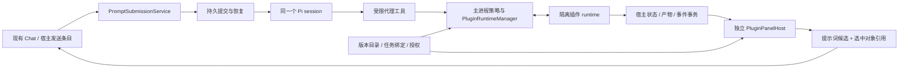

# 设计模式与插件面板：当前代码评估及完整实施方案

日期：2026-09-29。代码基线：df8b97de；Artemis 1.6.11；Pi 0.87.1；Electron 43.2.0。

状态：**供评审的实施方案，尚未实施或完成原生验证。** 本文承接原探索报告的需求，替代其中过时的“当前代码”判断。历史探索及 OpenDesign 附件继续作为参考；本文不是恢复此前缺失的 solution/plan 文件。

## 1. 审核结论

**认可“通用插件宿主 + 项目类型 + 独立面板 + 同一 Pi 会话”的方向；现存探索不能直接作为设计模式的开工规格。** 应先修正代码基线，把设计产品和插件基础能力分开交付，并在最早原型中验证权限边界、面板容器与可靠提交。

原探索正确保留了 Pi 唯一循环、Plan/Review 禁止插件执行、登记与信任分离、临时会话隔离、版本绑定和诚实的测试边界。这些原则保留。

| 优先级 | 当前材料的问题                                                        | 根据当前代码的判断                                                                                             | 本方案处理                                                                             |
| ------ | --------------------------------------------------------------------- | -------------------------------------------------------------------------------------------------------------- | -------------------------------------------------------------------------------------- |
| P1     | §3、§9 仍准备复用 DesignPanel/DesignService 并保持现行 /design        | c56bb487 已于 2026-09-12 删除设计工作流；当前源代码及页签枚举均无这套能力                                      | 作为新插件实现；旧数据兼容只在发现实际历史样本后确定，不能承诺无成本迁移               |
| P1     | §8.3 仍将跨轮次来源与有效授权传播留为未知项，而 S0 已要求自动提交闭环 | 现有普通 Execute 会话包含高权限工具；把插件文本送入普通队列不形成安全边界                                      | 类型任务自创建起固定受限执行策略，覆盖整个会话；完整权限交接成为单独、明确的用户动作   |
| P1     | §7.3 要求持久去重和事务队列，但实施落点主要描述为提取提交服务         | RecoverableTurnQueues 是进程内 Map，恢复按文本匹配；不能区分内容相同而身份不同的提交，也不能单独证明重启不双发 | 增加持久 submissionId、宿主队列与派发确认；插件请求不直接进入 Pi 的文本 follow-up 队列 |
| P2     | 基线及 S0 固定 Pi 0.85.1；Hooks 被描述为 unsupported                  | 当前依赖及本地安装均为 0.87.1；插件 Hooks 已有单独审核/信任路径；MCP 已能在安全边界刷新                        | 以当前锁定版本验证，复用现有刷新模式；禁止 项目类型插件绕过限制激活全局 Hooks/MCP      |
| P2     | 新旧版本并存、失败保留旧快照，尚无物理存储和迁移提交契约              | 现有 ArtemisPluginService 按插件目录替换安装，逻辑记录只保存一个版本                                           | 为新契约增加不可变 revision、占用引用和迁移事务，不把当前 update 当作多版本管理器      |
| P2     | 当前目录缺少 Artemis 设计产品规格                                     | OpenDesign 的交互参考不能替代本产品范围；其中多 agent 编排等方向也不适用于 Artemis                             | 明确首版 HTML/CSS 设计闭环、编辑限制、评审到实施的交接以及非目标                       |

P1 表示进入对应功能实施前必须解决的规格问题，不表示当前已上线代码已经存在该插件漏洞。

## 2. 当前代码：复用和新增的分界

以下结论来自当前源码；行号仅用于本基线定位，后续以符号为准。

| 当前模块                                                                                                                                                                  | 已有事实                                                                                | 实施动作                                                                        |
| ------------------------------------------------------------------------------------------------------------------------------------------------------------------------- | --------------------------------------------------------------------------------------- | ------------------------------------------------------------------------------- |
| [schema.ts](../../packages/protocol/src/schema.ts)，projectSchema/threadSchema，1120–1146                                                                                 | Project/Thread 无类型绑定；RunMode 只有 execute/plan/review；事件协议为 v4              | 添加可选类型绑定和明确的执行策略；不新增 design RunMode                         |
| [store.ts](../../apps/desktop/src/main/store.ts)，upsertProject/createThread，979/1040                                                                                    | 项目路径唯一；重开目录复用项目；线程写入 SQLite                                         | 添加迁移、映射和创建事务；重开路径不能覆盖原类型                                |
| [temporary-conversation.ts](../../apps/desktop/src/main/temporary-conversation.ts)                                                                                        | 临时会话有独立 workspace，仅允许 Local；fork 可复制该 workspace                         | 复用任务身份；插件私有状态另行复制，授权和运行实例不复制                        |
| [workspace-tabs.ts](../../apps/desktop/src/renderer/workspace-tabs.ts)，3–13                                                                                              | 固定页签枚举，包含 office/browser 等，无 design                                         | 增加一个通用 plugin-panel；业务 UI 留在插件内                                   |
| [runtime.ts](../../packages/agent-host/src/runtime.ts)，6255–6325                                                                                                         | noExtensions 保持 true；通过 customTools 创建一个 Pi session；存在宿主自有 Hooks bridge | 增加受限代理工具和执行前校验；不开放任意 Pi 扩展 loader                         |
| runtime.ts，refreshThreadConfiguration/refreshMcpTools，1669/6515 附近                                                                                                    | 配置更新延后到空闲/下一轮，MCP 工具可 reload                                            | 复用安全边界和当前版本测试模式，新增插件工具刷新；不声称 MCP 刷新直接支持新协议 |
| [trusted-extension-manager.ts](../../apps/desktop/src/main/trusted-extension-manager.ts)，223–396                                                                         | 单次 worker、入口 hash、60 秒超时；仍合并 process.env                                   | 复用平台沙箱构造器；常驻 runtime、包级校验、环境白名单和进程树回收需新实现      |
| [artemis-plugin-service.ts](../../apps/desktop/src/main/artemis-plugin-service.ts)，2122/3404                                                                             | 安装、更新、资源完整性和提交回滚已有实现；安装目录按插件身份替换                        | 保留一个安装入口，为 项目类型插件增加版本存储；不另建面向用户的插件商店         |
| artemis-plugin-service.ts，3030–3038                                                                                                                                      | Hooks 已识别，命令 Hook 要单独审核和信任                                                | 新的受限任务不能继承这条全局执行能力                                            |
| [main.ts](../../apps/desktop/src/main/main.ts)，startTaskTurn/queueTurn，6151/6816                                                                                        | 正常发送、运行中提交、压缩排队已有主进程入口                                            | 提取受控提交门面，保留原入口行为；增加 类型任务提交的持久调度                   |
| [recoverable-turn-queue.ts](../../apps/desktop/src/main/recoverable-turn-queue.ts)，42–96                                                                                 | 队列在内存中，reconcile 按 runtimeText 匹配                                             | 不能作为插件持久请求账本；普通任务先保持现有路径                                |
| store.ts，appendEventsAndUpdateThread，2263                                                                                                                               | 事件、线程状态、checkpoint 可同事务提交                                                 | 复用事务方式，为提交账本、插件快照及事件补充原子提交接口                        |
| [capability-pack-service.ts](../../apps/desktop/src/main/capability-pack-service.ts) / [office-session-service.ts](../../apps/desktop/src/main/office-session-service.ts) | 已有不可变包验证、版本占用、快照/版本检查等局部模式                                     | 借鉴这些模式及测试；Office 能力保持原服务，不把它迁入设计插件                   |
| main.ts，16904–16946                                                                                                                                                      | 当前主窗口限制子 frame 导航，Browser guest 禁用通用 preload/Node                        | 新面板建立独立宿主路径；不放宽现有 Browser 的导航与权限规则                     |

旧设计删除提交可用 git show c56bb487 核对。当前版本可用两个工作区 package.json 和已安装 Pi package.json 核对。源码核查不能代替实际工具热刷新或原生沙箱测试。

## 3. 产品定位与首版范围

设计模式是**一种任务工作流和项目类型**。用户在现有聊天中提出需求，在右侧工作台查看和修改设计，最后导出或交给普通编码任务实施。模型、历史、审批、队列继续由 Artemis 管理。下文的“类型任务”指已绑定插件项目类型的任务。

默认交付第一方“界面设计”插件；宿主只理解通用插件协议。第二个不同业务的测试插件用于证明解耦。

### 3.1 必须完成的用户闭环

1. 新项目选择“界面设计”，或新临时会话选择该类型；无需重启出现类型。
2. 创建任务后出现“设计工作台”页签；显示空态、示例需求、当前工作流限制。
3. 用户输入 brief；Pi 调用插件工具生成一组 HTML/CSS/本地图片文件，产生可追溯版本。
4. 面板展示预览、页面列表、版本及修改状态；聊天显示结果摘要和可定位的产物。
5. 用户选中元素，手动修改受支持的属性，或输入“把这个按钮改为深绿”，通过宿主发送条目进入当前会话。
6. 手动操作、AI 更新、撤销和外部导入均有版本冲突检查；刷新、关闭面板及应用重启后可恢复。
7. 用户从宿主界面导出指定版本；需要进一步开发时显式创建普通编码任务，携带已选定版本和实施要求。

首版包括多页静态 HTML/CSS、已导入本地图片、常用设备宽度预览、元素选取、文本/颜色/间距/图片替换、版本比较与撤销。只支持能可靠映射源码的元素；歧义时提示改用源码或 AI 修改。

### 3.2 分期边界

| 层次     | 交付范围                                                                        |
| -------- | ------------------------------------------------------------------------------- |
| 原型     | 一个最小 JSON 设计文档及两个测试插件，证明注册、隔离、工具、持久提交和撤销      |
| 首版产品 | 第一方 HTML/CSS 设计插件、有限直接编辑、版本恢复、导出、明确的编码交接          |
| 后续     | 任意框架项目、开发服务器预览、复杂布局拖拽/裁剪、更多导出格式、经授权的联网插件 |

首版不承诺任意 React/Vue 运行时 DOM 能反向映射到源码，不接入第二个 agent 编排器，不重做聊天时间线，不复制 Office 编辑器，不提供自动安装依赖或自动执行项目脚本。

创建类型任务保留用户选择的 RunMode。Plan/Review 空态说明“切换到执行后可生成设计”，由用户通过宿主控件切换，插件不能代改模式。

这是为完整闭环选择的首版范围；不是声称已经覆盖 OpenDesign 全部交互。

## 4. 总体架构及责任



- **宿主**负责身份、授权、持久化、消息提交、资源服务、进程生命周期、配额和恢复。
- **插件**负责项目类型文案、面板布局、业务工具、设计文档转换及来源明确的提示词候选。
- **Pi**负责理解需求与调用工具。插件 runtime 不访问模型凭据，不自行创建 agent session。
- **renderer**只消费 @artemis/protocol；主窗口不 import 插件 bundle，也不接收可执行主进程代码。

首版只有一种 runtime：由宿主以 stdio 启动的受限 JS worker。MCP 作为未来适配器；不同时交付两套插件运行时。

## 5. 包身份、分发和协议

### 5.1 一份显式插件契约

现有安装入口已统一为根目录 `artemis.plugin.json`（`schemaVersion: 1`），商店清单为 `.artemis/marketplace.json`，本地包和已签名商店通过 ArtemisPluginService 进入。旧包通过用户数据迁移保留身份，原生更新前停用执行能力。本方案的项目类型、面板和 worker 字段仍是新增协议示意，需要后续实现和清单版本设计。

以下是**新增协议示意**，不是现有 API：

```json
{
  "schemaVersion": 1,
  "id": "com.artemis.ui-design",
  "version": "0.1.0",
  "engines": { "artemisPluginApi": "1" },
  "projectTypes": [
    {
      "id": "ui-design",
      "title": { "zh-CN": "界面设计", "en": "UI Design" },
      "targets": ["project", "temporary"],
      "panelIds": ["studio"]
    }
  ],
  "panels": [{ "id": "studio", "entry": "panel/index.html" }],
  "runtime": { "entry": "runtime/index.mjs", "protocolVersion": 1 },
  "tools": [
    {
      "name": "replace_document",
      "inputSchema": "schemas/replace-document.json",
      "handler": "document.replace",
      "effect": "artifact-write"
    }
  ],
  "capabilities": {
    "artifactStore": "thread",
    "projectFiles": "explicit-import",
    "network": "none",
    "sessionInput": "host-user-action"
  }
}
```

宿主锁定受限执行策略，manifest 只能申请能力，不能选择更宽策略。插件不依赖 Pi SDK，因此不要求插件跟随宿主 Pi 小版本发布；宿主适配器单独对当前 0.87.1 做兼容测试。

保留三种身份：

- installationId：现有分发来源生成的安装身份。
- pluginId：发布者声明的业务身份；必须绑定安装来源与签名身份，重复或冒认官方身份拒绝。
- revision：版本号和整个包 contentHash；执行实际按 hash 固定，不能用相同版本号覆盖内容。

类型键使用 pluginId/typeId，工具名称由宿主生成稳定映射并检查供应商限制及冲突。默认一个任务只绑定一个类型插件；每包可提供多个面板。原型闭环允许先限制为一个面板，最终协议不要求业务代码改宿主。

### 5.2 安装与多版本

项目类型插件资源进入不可变的 `plugin-revisions/<installationId>/<contentHash>/`。安装过程为：下载/本地拷贝至 stage → 校验清单、所有依赖和资源 → 校验来源身份/签名 → 原子发布 revision → 更新目录。登记类型不运行任何入口，也不要求先授予执行权限；尚未授权的包显示“等待信任”，激活时才获取任务/项目与内容摘要绑定的授权。

扩展现有 PluginStore，为 项目类型插件记录 revisions 和默认 revision，保留旧插件单版本记录的读取迁移；不再把 项目类型包更新映射成覆盖旧运行目录。目录写入采用 journal 和启动恢复；只有完整包和目录记录都可校验时才登记类型。不能把“文件 rename”描述为与 SQLite 天然原子。

运行实例、任务绑定、恢复快照各自持有 revision 引用。停用立即禁止执行；卸载移除可用入口，数据与引用保持可恢复。实际回收未引用的包资源由显式清理控制，不清理仍被任务引用的 revision。

首版 项目类型插件不得同时激活全局 skills、Hooks、MCP、连接器或安装脚本；安装时明确列出不支持的声明并拒绝这种组合。以后若支持，必须把这些资源也纳入同一绑定和能力交集，不能借现有全局导入路径逃逸。

## 6. 任务模型、存储和生命周期

### 6.1 持久化结构

Project 增加可选 defaultTypeBinding；Thread 保存创建时的 typeBinding 快照及 executionProfile。绑定含 installationId、pluginId、typeId、pluginVersion、contentHash、bindingRevision。普通历史记录缺省为 general；所有新 类型任务使用 plugin-restricted-v1。

新增数据按职责存储：

| 数据               | 关键字段/约束                                                                                            |
| ------------------ | -------------------------------------------------------------------------------------------------------- |
| projects / threads | 可选绑定 JSON、明确的 profile、profileRevision；创建时事务固化                                           |
| plugin_grants      | scope、thread/project、contentHash、能力及资源引用、grantRevision、撤销时间                              |
| plugin_state_heads | threadId、pluginId、bindingRevision、stateSchemaVersion、stateRevision、snapshotId                       |
| plugin_snapshots   | 不可变 snapshotId、源文件清单及 hash、父版本、创建操作、包 revision                                      |
| prompt_submissions | submissionId、threadId、来源、原文/候选、payloadHash、顺序、状态、turnId、binding/profile/grant revision |
| plugin_operations  | operationId、请求摘要、状态、结果引用、取消与错误；重复调用返回原状态                                    |
| plugin_events      | 独立 streamId、eventId、threadId、seq、schemaVersion、payload；与状态更新同事务提交                      |

大文件使用内容寻址的私有 blob 存储；数据库保存引用，不把图片或完整 HTML 塞进每个事件。先写 stage blob 并完成校验，再事务切换 head 和事件；失败产生的无引用 blob 可稍后回收，不能发布半成品。

插件状态不能只用 threadId/pluginId/stateSchemaVersion 作为唯一存储空间：迁移必须建立独立候选快照，避免新旧包共用同一可变状态。

### 6.2 生命周期规则

| 场景                | 确定行为                                                                                              |
| ------------------- | ----------------------------------------------------------------------------------------------------- |
| 创建/重开项目       | 类型目录主进程二次验证；已存在路径返回原记录，不用表单值覆盖                                          |
| 新项目任务          | 复制默认绑定；修改项目默认值只影响之后的任务                                                          |
| 临时任务            | 绑定在 Thread；任务独立状态和授权；保留 Local-only 约束                                               |
| fork                | 复制选定提交快照；新 threadId、submissionId 空队列、新授权范围；不复制活跃 runtime                    |
| Local/worktree 交接 | 撤销旧 generation 并停止在途操作，按新 workspace 重新解析导入/导出授权；原有限额及确认规则不变        |
| 关闭页签            | 销毁面板视图；已接受的工具操作继续；重开取快照和后续事件                                              |
| 任务归档            | 拒绝新提交，回收实例；未发送内容保留为可查看状态                                                      |
| 包停用/缺失         | 禁用工具和可执行面板；宿主显示快照及修复入口；线程仍保持受限策略                                      |
| 删除任务            | 按现有删除语义清理任务状态及未引用资源，不删除已导出的项目文件                                        |
| 包更新              | 新 revision 并存；用户/策略明确迁移目标，空闲且无在途操作时迁移副本                                   |
| 迁移失败            | 旧绑定和旧 head 保持不变；候选失败单独记录                                                            |
| 迁移成功            | 同事务切换绑定和 state head；保留回滚快照；新版本产生后续修改后，回滚必须先保存这些修改，不能静默丢弃 |

已有任务不开放原地换成普通全权限任务。历史 /design 数据若存在，先做只读导入评估；没有格式样本与迁移测试前不恢复旧入口。

### 6.3 协议及应用回滚

保留既有 AgentEvent v4 的普通聊天/工具事件。插件视图使用独立的版本化 envelope 和 stream，不能把插件 seq 混入普通事件序列，也不能假定旧判别联合能跳过未知事件。renderer 仍从 @artemis/protocol 获取两类类型定义。

新增 capability handshake 和最小读取版本检查；类型任务安全依赖 profile，老应用忽略这个字段会造成权限退化。发布必须先确定支持这项检查的回滚基线；自动回滚只指向能识别 类型任务的构建。更早版本使用功能启用前备份或独立数据目录，不直接打开新库。仅增加版本字段不能约束不认识它的旧二进制。

## 7. 执行边界：固定任务策略，避免跨轮次提权

这是相对原探索的主要调整：**整个 类型任务始终受限，包括普通 composer 输入、排队消息、压缩、恢复和 fork。** 不尝试凭某一条消息的来源标记，临时判断整个混合历史是否已“干净”。

| 能力                                                | 类型任务 Execute                                     | 类型任务 Plan/Review       |
| --------------------------------------------------- | ---------------------------------------------------- | -------------------------- |
| Pi 对话、宿主澄清、结果摘要                         | 允许                                                 | 允许                       |
| 已授权导入数据、已存快照读取                        | 允许受控读取                                         | 允许宿主只读接口           |
| 插件 runtime、插件可执行 UI                         | 在包/任务信任有效时运行                              | 不启动；切模式先撤销、终止 |
| 插件私有产物写入                                    | 经宿主验证和版本检查                                 | 拒绝                       |
| 任意项目读写、Pi bash、MCP、可执行扩展、命令 Hooks  | 首版不提供                                           | 不提供                     |
| 子智能体、IM 外发、自动化、跨任务消息、Computer Use | 首版不提供，避免间接代理执行                         | 不提供                     |
| 导出至用户选定路径                                  | 宿主实际用户动作，绑定文件集合/hash/目标，受冲突检查 | 拒绝写入                   |

实际能力是宿主固定 profile、RunMode、任务绑定、包授权及操作授权的交集。工具列表过滤和实际调用入口都校验；仅 setActiveToolsByName 不构成执行边界。包含无需 broker 的本地工具、资源加载器、Hooks bridge、压缩钩子和恢复入口在内，都需要审查。

普通任务的 Pi bash、用户打开的 Terminal 和已有 MCP 权限语义保持原样。用户终端是显式人工操作，插件不能向其写入命令，也不能把它当成执行代理。Full local access 继续只影响原有可执行 Pi 扩展，不扩展到新插件 runtime。

runtime 的操作系统 sandbox 只允许私有 scratch 和包只读资源；不直接挂载整个真实项目。读取项目资料由用户显式导入副本；工具输出通过有 schema 的 artifact/state API 提交。这样插件不能先污染 package.json 或项目脚本，再等待普通任务代为执行。

环境使用明确白名单；不继承 process.env、连接器凭据、模型 key 或通用 IPC 地址。macOS/Windows 使用平台原生策略；沙箱无法建立就拒绝激活。停止先撤销能力和资源 token，再取消、回收整个进程树；不能仅 kill 父进程。撤销前已提交的版本保留并如实记录，cancelled 不等于已回滚；旧 generation 不得再提交结果。

插件生成材料依然是低信任内容。用户从宿主选择“交给编码任务”时，展示选定版本、文件和目标，作为一次新的明确交接；普通任务仍执行原有授权检查，不自动运行导出的脚本。这项交接不属于“任意恶意插件与无限权限会话全自动混用”的承诺。

首版开放范围为第一方和显式审核的插件。上表的拒绝路径仍必须测试；不从 Electron/OS 沙箱存在推导出任意恶意插件已获完整安全认证。

## 8. 面板及预览容器

选定 **WebContentsView + 独立 session** 作为面板主路径，S0 做实际窗口验证后冻结。理由是让插件文档、网络策略及生命周期脱离现有主 renderer，同时不放宽当前 Browser 的 HTTP/HTTPS 规则。若关键原生布局测试失败，应重新评审容器，而不是降级为主 renderer 直接加载包。

WebContentsView 的嵌入能力及安全选项来自 [Electron API](https://www.electronjs.org/docs/latest/api/web-contents-view) 和 [安全指南](https://www.electronjs.org/docs/latest/tutorial/security)；它本身不代替宿主授权。

具体边界：

- 每个面板实例使用独立非持久 session；Node 关闭、contextIsolation/sandbox/webSecurity 开启；不共享 Browser 登录态。
- 只使用宿主自有最小 preload 交付一次性 MessagePort；不允许包自选 preload，不暴露 ipcRenderer、shell、文件系统或通用 invoke。
- 自定义资源协议绑定 instance、generation、revision 和有效资源引用；在对应 session 注册 handler。路径、MIME、大小、包 hash 都在宿主校验。
- 默认禁网络、导航、弹窗、下载、剪贴板、设备、媒体权限及 service worker；权限检查和权限请求同时拒绝。CSP 和 session 请求规则共同约束。
- 端口由宿主保存实际 webContents/mainFrame 身份；连接上的消息不能自报其他 threadId 来换绑。刷新、关闭和撤销后旧端口失效。
- 主窗口负责准确的可见 bounds、缩放、焦点和销毁。宿主对话框、命令菜单、发送条目显示时避免原生视图遮挡；任务切换立即隐藏旧 view。关闭页签或主窗口时显式关闭所属 webContents，不能只从布局中移除 view。
- 面板文档和设计产物预览使用不同 origin；产物 iframe 不获得面板端口。交互预览中的生成 JS 属于不受信内容；编辑视图移除产物脚本/事件属性，仅运行受控选取桥。

消息端口传递与独立 session 协议注册方式已通过 Context7 核对 [MessagePorts](https://github.com/electron/electron/blob/main/docs/tutorial/message-ports.md) 和 [protocol](https://github.com/electron/electron/blob/main/docs/api/protocol.md) 文档。官方示例不直接复制成安全实现。

## 9. 双向通信、真实用户动作与可靠提交

### 9.1 工具到面板

代理工具捕获真实 toolCallId，主进程根据 thread/binding/profile 解析实例，生成 operationId。runtime 只处理获准的 tool.invoke；生命周期事件不能触发同一副作用的第二次执行。

短操作完成状态提交后才返回 success。长操作先返回 accepted + operationId，由查询/等待工具获得真实终态；取消、失败和部分结果明确区分。状态事务产生事件，面板关闭不影响提交，重新打开以快照恢复。

### 9.2 面板到当前会话

1. 面板生成候选输入及选中对象引用；runtime 如需转换，先完成 prepare。
2. **宿主控制的发送条目**展示来源、目标任务、用户输入、最终候选文本和对象版本。插件页面不能覆盖此区域。
3. 用户点击这一个发送按钮，宿主签发绑定 submissionId、payloadHash、threadId、bindingRevision、panelGeneration 的一次性动作凭证；无需再弹确认。
4. 候选变化使原凭证失效；插件不能用旧点击提交另一段文本。连接鉴权仅证明插件身份，不证明用户点击。
5. 提交服务将来源、有效策略、候选内容、附件引用和接收状态落盘，再安排执行。

有 composer 草稿时显示独立提交条目，保持草稿不变；“仅填入”只保存草稿。准备期间切任务或关闭面板，自动发送资格失效；已落盘接受的提交仍属于原任务，不能因切换焦点改投其他任务。

Plan/Review 使用宿主只读快照和原始文字输入，不启动插件转换器。只读视图显示宿主通用元数据、文本或已保存预览图，不执行快照内脚本、不直接注入插件 HTML。切回 Execute 后重新校验授权。状态或工具事件不能自动签发用户动作。

### 9.3 持久队列与崩溃窗口

类型任务的 composer 和面板共用一条持久 FIFO；普通任务先保留现有队列。首版 类型任务不提供 steer，所有忙碌时的输入等待当前完整请求及关联操作结束。这样不会让权限快照在同一执行流中途更换。

状态机：

```text
prepared -> accepted -> queued -> dispatching -> running -> completed
                         |          |             |
                      cancelled   unknown       failed/cancelled
```

- accepted/queued 与来源、request 摘要同事务提交。相同 submissionId + 相同摘要返回原状态；不同摘要拒绝。两次内容相同的独立用户动作拥有不同 ID。
- 宿主派发前固定 turnId，写 checkpoint 和 dispatching；agent-host 接收携带 submissionId 的请求，进程内按 ID 去重，记录接收与会话条目标识。
- Pi 完成当前请求后宿主再派发下一项；不借 Pi 的纯文本 follow-up 自动续跑。当前会话/sessionFile 保持同一个。若还有关联的 accepted 长操作，submission 继续等待其终态；Pi turn.completed 本身不能把这些操作标成完成。
- 若提交已落盘但尚未派发，重启后重查绑定/模式再派发；若可能已执行但缺少确认，进入 unknown 并用日志、turnId、操作账本核对。
- 无法确定执行状态时保留输入并提供核对/显式重试，不能承诺任意外部副作用 exactly-once。
- 更新、停用、切模式和授权变化使待派发项重新校验；不默默用新包、新文件版本或更高权限执行旧请求。

来源信息进入 submission、checkpoint、上下文恢复和可读历史；压缩只压缩模型材料，不删除数据库中的权限和请求事实。

### 9.4 传输及资源限制

stdio 使用长度前缀 JSON 帧；stdout 只走协议，日志走 stderr。帧含 protocolVersion、instanceId、generation、requestId、type；上下文由宿主绑定。业务提交另含 operationId 和 expectedRevision。

最小消息集合固定如下，消息名称属于本方案草案：

| 消息                                  | 方向与语义                                                 |
| ------------------------------------- | ---------------------------------------------------------- |
| hello / ready                         | 协商宿主 API、包 hash、实例 generation；完成前不接业务请求 |
| tool.invoke / tool.result             | 宿主发起已授权操作，返回 accepted/succeeded/failed         |
| panel.action / panel.reply            | 面板的业务动作交给 runtime；不能直接调用任意宿主方法       |
| artifact.propose / artifact.committed | runtime 提交候选文件/状态，宿主验证后以 CAS 发布           |
| prompt.prepare / prompt.prepared      | 只准备带来源的候选；没有宿主用户动作就不发送               |
| snapshot.get / event.subscribe        | 获取绑定任务快照并从 cursor 补事件；缺失区间重新取快照     |
| operation.cancel / operation.status   | 查询或请求取消；取消已提交操作不能伪装成回滚               |

错误至少区分未信任、模式不允许、绑定过期、版本冲突、超限和执行状态未知。宿主根据实际状态给出下一步，不接受插件自行标注“可重试”来重放副作用。

初始工程限额建议为单控制帧 256 KiB、单实例 32 个待处理请求、30 秒控制请求 deadline、大文件走 blob handle；具体值由 S0 测量后冻结。限制日志、状态、包解压、磁盘和重启频率。CPU/RSS watchdog 是异常恢复措施，不能宣传成跨平台硬资源隔离；更强限额须以原生机制和测试证明。

## 10. 第一方设计插件的文档与编辑契约

源文件快照是唯一真源；DOM 只是显示和选择投影，选中路径、工具参数或画布缓存都不是另一份设计主数据。

建议业务工具为 create_document、replace_document、apply_edit、get_snapshot、get_operation、list_versions。业务名由插件提供，宿主映射为模型工具名称。每次修改携带 documentId、expectedRevision、operationId；manual 和 AI 更新进入同一个序列化提交入口。

### 10.1 存储和变更

- 每个文档由 HTML/CSS/资产的文件清单组成，保存在任务私有产物区；原项目只通过显式导入读取。
- 新版本先校验文件完整性、引用和大小，再发布一个完整快照；预览不加载还在写一半的文件。
- supported 元素通过源码位置、标签/内容指纹和文件 hash 定位；重号、重复文本、已变化结构不能用“第一个匹配”兜底。
- 手动更改先局部预览，一个完整手势提交一条操作；颜色拖动/文字输入可防抖，焦点结束、切任务前明确处理未提交草稿。
- AI 和手动操作基于相同旧版本并发时，后提交者收到冲突。保留其草稿，读取新快照后重新操作，不自动覆盖。
- 撤销/重做产生可审计的 head 变化，不能覆盖另一来源随后提交的修改。每项操作记录 parentRevision 和受影响文件。
- 首版仅处理可稳定映射的静态 DOM；无法定位的动态元素仍可预览，通过源码/AI 请求修改，界面明确说明。

### 10.2 交互布局与验收

保留现有聊天布局。右侧一个插件页签内部使用页面列表、中央预览、可折叠属性栏；窄面板时属性改抽屉/分段切换，不能挤压到无法使用。选中元素与聊天请求引用互相定位。

工作台区分“预览”“编辑”“向 AI 提问”：手动编辑不调用模型；提问只建立候选，由宿主发送。变更待提交、已保存、冲突和失败使用不同状态。设备宽度切换只改变预览 viewport。

OpenDesign 可采用的内容是：结果优先、操作和产物分离、错误给出有效下一步、手动编辑不自动调 AI、以源码和版本控制变更。其多 agent substrate、整套聊天重构、复杂拖拽和历史排期不纳入本次交付。

不能沿用“生成过文件就算成功”的宽泛判定：工具执行终态、产物存在、结构验证、实际预览和用户验收分别记录。任务失败时可保留有效版本并提供继续入口，状态仍如实显示失败/部分完成。

### 10.3 导出和编码交接

导出由宿主拥有的动作触发，固定 snapshotId、文件集合和目标目录。默认创建新目录；覆盖已有文件需展示具体差异，带目标 expectedHash 检查。路径穿越、链接逃逸和目标被外部修改时拒绝覆盖。

需要编码时，用户点“在项目中实现”，宿主展示交接摘要；以明确动作创建普通任务并附选定设计和验收要求。交接内容作为有来源的材料保留，不能将插件文字升级成系统指令。创建失败不重复建任务；沿用 submissionId 式幂等处理。

## 11. 代码落点与改动范围

下列新文件/符号是计划，不是对当前代码存在性的声明。按职责增量拆分，不以此为由重构整个 main.ts、App.tsx。

| 落点                                                                    | 变更                                                                    |
| ----------------------------------------------------------------------- | ----------------------------------------------------------------------- |
| packages/protocol/src/plugin.ts（新增）                                 | manifest、绑定、profile、请求/事件/快照 schema                          |
| packages/protocol/src/schema.ts、host-messages.ts、reducer.ts、index.ts | 导出类型，线程绑定、宿主命令及必要的显示元数据；保持普通事件兼容        |
| apps/desktop/src/main/store.ts                                          | 新列、新表、映射、submission/状态事务、迁移及版本检查                   |
| apps/desktop/src/main/artemis-plugin-service.ts                         | 项目类型包静态解析、revision 安装、统一展示和停用入口                   |
| main/plugin-registry.ts（新增）                                         | 按来源和 revision 维护可用类型、面板、绑定校验及目录 revision           |
| main/plugin-runtime-manager.ts（新增）                                  | worker 生命周期、授权、generation、stdio、取消与占用                    |
| main/plugin-panel-host.ts、preload/plugin-panel.ts（新增）              | 隔离视图、资源协议、受限端口、bounds 和释放                             |
| main/plugin-artifact-store.ts（新增）                                   | 通用 blob/snapshot/head/CAS；不放设计业务判断                           |
| main/prompt-submission-service.ts（新增）                               | 类型任务接收、持久调度、来源、动作凭证和崩溃恢复                        |
| packages/agent-host/src/runtime.ts                                      | 类型任务 profile 工具集、执行前 guard、安全边界刷新及受限恢复           |
| main/main.ts、shared/api.ts、preload/preload.ts                         | 窄 IPC、服务装配、创建/fork/handoff/归档/停止衔接                       |
| renderer/workspace-tabs.ts、App.tsx 及创建表单                          | 通用页签、类型选项、宿主发送条目、缺包只读态                            |
| apps/desktop/resources 下的第一方设计插件（新增）                       | manifest、独立面板、业务 runtime、schema 和资源；按既有资源打包流程接入 |
| packages/platform 的沙箱/原生 helper                                    | 私有工作目录、最小环境、进程树撤销、平台证据；按实际缺口修改            |

身份、授权、原生进程和导出属于 main；插件定义的 HTML 编辑规则和设计工具属于插件。宿主代码不得按 com.artemis.ui-design 写业务分支。

## 12. 实施顺序与可验证出口

不采用旧参考材料中的“6 天”排期。工作量取决于原生视图和进程撤销验证；先以阶段出口管理风险，S0 后再给可用工期。

| 阶段              | 交付                                                                  | 必须通过后才能进入下一阶段                                                                                          |
| ----------------- | --------------------------------------------------------------------- | ------------------------------------------------------------------------------------------------------------------- |
| S0 决策原型       | 两个最小包；独立面板；受限工具；持久提交原型；旧策略拒绝测试          | 同一 Pi session 完成闭环；模拟插件提示词/脚本诱导无法调用全权限工具；视图焦点/弹层/缩放可用；三种崩溃窗口不盲目重发 |
| S1 契约与数据     | 正式 schema、SQLite 迁移、版本存储、任务绑定、profile、目录刷新       | 旧数据正常读；新任务重启不丢绑定；同目录重开不覆盖；缺包也不解除限制；回滚基线已确定                                |
| S2 运行时与隔离   | 包级信任、常驻 worker、执行前校验、状态事务、热刷新、撤销             | 双任务/双插件隔离；模式变更和撤销无新副作用；沙箱失败拒绝；进程树和旧端口确实关闭                                   |
| S3 面板与可靠输入 | 正式 PanelHost、宿主发送条目、类型任务 composer FIFO、checkpoint 对账 | 草稿、同文双提交、重试、切任务、关闭面板、压缩和应用重启全部符合契约                                                |
| S4 设计产品闭环   | HTML/CSS 生成、选中、有限编辑、预览、版本、导出与编码交接             | AI/手动冲突不覆盖；重复文本不误改；撤销重做可靠；导出文件可重新打开；用户流程可独立验收                             |
| S5 更新与发布     | 包迁移/回滚、第二业务插件、限额、最终原生产物                         | 同一应用构建无重启安装/停用两个不同业务插件；macOS/Windows 承诺范围分别有证据                                       |

S0 使用最小实现以验证后续契约；成功后收敛为正式模块，不长期保留第二套临时运行通路。安全关键测试先于能力开放。

## 13. 测试、发布和完成标准

### 13.1 针对性验证矩阵

| 测试层      | 必须覆盖                                                                                                       |
| ----------- | -------------------------------------------------------------------------------------------------------------- |
| schema/迁移 | 旧库、坏 manifest、未知 API、重复身份、跨目录资源、内容变化、所有创建/fork/恢复路径                            |
| 策略        | Plan/Review 拒绝、Execute profile 拒绝、工具列表和直接入口、全局 Hook/MCP/子代理旁路、Full local access 不扩散 |
| 调度        | 相同 ID 重试、不同 ID 同文、队列顺序、待派发撤销、已派发未确认、turn 完成前崩溃、压缩后恢复                    |
| 状态        | operation 去重、CAS 冲突、snapshot/event 原子性、迁移失败、迁移后编辑再回滚、丢失包只读恢复                    |
| 视图        | 身份伪造、旧 generation、恶意导航/网络、产物 iframe 访问面板、系统权限、弹层遮挡、缩放、键盘、IME              |
| 设计        | 重复元素/文字的唯一定位、相邻内容不变、手动/AI 并发、一个手势一条历史、撤销重做、窄面板、多语言/RTL            |
| 原生        | 真正子进程及后代、句柄/连接回收、环境凭据不可见、资源超限、休眠恢复、打包资源路径和平台权限                    |
| 产品        | 从新建到生成、修改、关页签、重启恢复、导出、重新打开、显式编码交接的一次完整验收                               |

实现阶段运行相关协议/main/runtime/renderer 测试及 npm test、npm run typecheck、npm run build、格式检查；有 UI/组件改动时运行对应 UI 边界和主题契约检查。现有测试可参考 artemis-plugin-service、trusted-extension-manager、recoverable-turn-queue、compaction-queue、capability-pack-service、office-session-service 测试族。

macOS 完成须覆盖 arm64/x64 打包，以及相关 PTY、Seatbelt、签名、公证、stapling、更新和回滚；Windows 验证最终用户运行路径、实际 ACL、AppContainer 与进程树。只完成一个平台的验证时，仅声明该平台和对应能力完成。

### 13.2 分开记录的完成结论

1. **架构解耦通过**：固定宿主构建加载两个不同业务插件，类型、工具、面板和输入均工作，停用一方不影响另一方。
2. **执行边界通过**：已定义 profile 的直接和间接拒绝用例通过，并有对应原生证据。
3. **设计产品通过**：HTML/CSS 闭环、编辑正确性、状态恢复和导出结果达到约定验收。
4. **发布通过**：支持平台的最终包、安装/更新/回滚及资源完整性有实测记录。

任一结果不能替代其他结果。原型通过不代表全部插件兼容；生成文件不代表预览正确；预览正确不代表用户认可设计。

## 14. 开工前需要冻结的决策

本方案推荐直接采用以下默认值，评审只需对存在异议的项调整：

- 设计属于项目/任务类型，RunMode 仍为三态。
- 使用单一通用插件宿主；第一方设计插件也走公开契约。
- 首版类型任务固定受限 profile，真实项目通过显式导入/导出交接。
- 采用 WebContentsView 作为面板主路径，S0 原生验收是定型门槛。
- 采用持久宿主队列调度，同一 Pi session，首版 类型会话不提供 steer。
- 以 HTML/CSS 的完整闭环为首版产品；动态框架反向编辑另行立项。
- 更新固定包 revision，迁移副本后原子切换；回滚和数据库兼容单独验收。

本次工作只核查代码、形成文档并检查文档一致性；没有修改运行时、运行插件原型、执行产品测试或进行发布。
